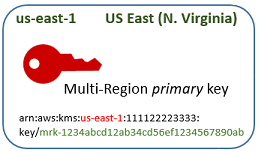
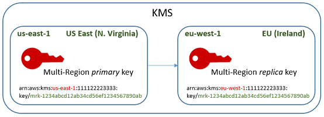
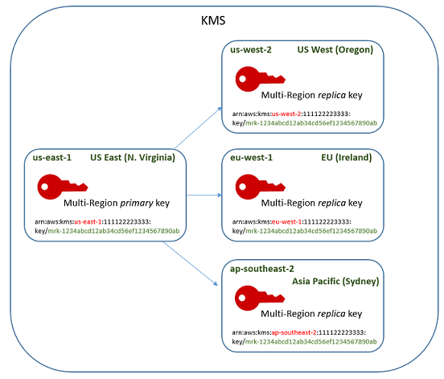

# How multi-Region keys work

You begin by creating a symmetric or asymmetric [multi-Region primary key](multi-region-keys-overview.md#mrk-primary-key "multi-region-keys-overview.md#mrk-primary-key") in an AWS Region that AWS KMS supports, such as
US East (N. Virginia). You decide whether a key is single-Region or multi-Region only when
you create it; you can't change this property later. As with any KMS key, you set a
key policy for the multi-Region key, and you can create grants, and add aliases and tags
for categorization and authorization. (These are [independent properties](multi-region-keys-overview.md#mrk-sync-properties "multi-region-keys-overview.md#mrk-sync-properties") that aren't shared or synchronized with other keys.)
You can use your multi-Region primary key in cryptographic operations for encryption or
signing.

You can [create a multi-Region primary key](create-primary-keys.md "create-primary-keys.md")
in the AWS KMS console or by using the [CreateKey](../APIReference/API_CreateKey.md "../APIReference/API_CreateKey.md") API with the `MultiRegion` parameter set to
`true`. Notice that multi-Region keys have a distinctive key ID that
begins with `mrk-`. You can use the `mrk-` prefix to identify MRKs
programmatically.


If you choose, you can [replicate](multi-region-keys-overview.md#replicate "multi-region-keys-overview.md#replicate") the multi-Region
primary key into one or more different AWS Regions in the same [AWS partition](../../../general/latest/gr/aws-arns-and-namespaces.md "../../../general/latest/gr/aws-arns-and-namespaces.md"), such as
Europe (Ireland). When you do, AWS KMS creates a [replica
key](multi-region-keys-overview.md#mrk-replica-key "multi-region-keys-overview.md#mrk-replica-key") in the specified Region with the same key ID and other [shared properties](multi-region-keys-overview.md#mrk-sync-properties "multi-region-keys-overview.md#mrk-sync-properties") as the primary key. Then it
securely transports the key material across the Region boundary and associates it with
the new KMS key in the destination Region, all within AWS KMS. The result is two
_related_ multi-Region keys — a primary key
and a replica key — that can be used interchangeably.

You can [create a multi-Region replica
key](multi-region-keys-replicate.md "multi-region-keys-replicate.md") in the AWS KMS console or by using the [ReplicateKey](../APIReference/API_ReplicateKey.md "../APIReference/API_ReplicateKey.md") API.


The resulting [multi-Region replica key](multi-region-keys-overview.md#mrk-replica-key "multi-region-keys-overview.md#mrk-replica-key") is a
fully-functional KMS key with the same [shared
properties](multi-region-keys-overview.md#mrk-sync-properties "multi-region-keys-overview.md#mrk-sync-properties") as the primary key. In all other respects, it is an independent
KMS key with its own description, key policy, grants, aliases, and tags. Enabling or
disabling a multi-Region key has no effect on related multi-Region keys. You can use the
primary and replica keys independently in cryptographic operations or coordinate their
use. For example, you can encrypt data with the primary key in the US East (N. Virginia)
Region, move the data to the Europe (Ireland) Region and use the replica key to
decrypt the data.

Related multi-Region keys have the same key ID. Their key ARNs (Amazon Resource Names)
differ only in the Region field. For example, the multi-Region primary key and replica
keys might have the following example key ARNs. The key ID – the last element in the key
ARN – is identical. Both keys have the distinctive key ID of multi-Region keys, which
begins with **mrk-**.

```
Primary key: arn:aws:kms:`us-east-1`:111122223333:key/**mrk-1234abcd12ab34cd56ef12345678990ab**
Replica key: arn:aws:kms:`eu-west-1`:111122223333:key/**mrk-1234abcd12ab34cd56ef12345678990ab**
```

Having the same key ID is required for interoperability. When encrypting, AWS KMS binds
the key ID of the KMS key to the ciphertext so the ciphertext can be decrypted only
with that KMS key or a KMS key with the same key ID. This feature also makes related
multi-Region keys easy to recognize, and it makes it easier to use them interchangeably.
For example, when using them in an application, you can refer to related multi-Region
keys by their shared key ID. Then, if necessary, specify the Region or ARN to
distinguish them.

As your data needs change, you can replicate the primary key to other AWS Regions in
the same partition, such as US West (Oregon) and Asia Pacific (Sydney). The result
is four _related_ multi-Region keys with the same key
material and key IDs, as shown in the following diagram. You manage the keys
independently. You can use them independently or in a coordinated fashion. For example,
you can encrypt data with the replica key in Asia Pacific (Sydney), move the data to
US West (Oregon), and decrypt it with the replica key in US West (Oregon).


Other considerations for multi-Region keys include the following.

_Synchronizing shared properties_ — If a [shared property](multi-region-keys-overview.md#mrk-sync-properties "multi-region-keys-overview.md#mrk-sync-properties") of the multi-Region keys
changes, AWS KMS automatically synchronizes the change from the [primary key](multi-region-keys-overview.md#mrk-primary-key "multi-region-keys-overview.md#mrk-primary-key") to all of its [replica keys](multi-region-keys-overview.md#mrk-replica-key "multi-region-keys-overview.md#mrk-replica-key"). You cannot request or force a
synchronization of shared properties. AWS KMS detects and synchronizes all changes for
you. However, you can audit synchronization by using the [SynchronizeMultiRegionKey](ct-synchronize-multi-region-key.md "ct-synchronize-multi-region-key.md") event in
CloudTrail logs.

For example, if you enable automatic key rotation on a symmetric multi-Region primary
key, AWS KMS copies that setting to all of its replica keys. When the key material is
rotated, the rotation is synchronized among all of the related multi-Region keys, so
they continue to have the same current key material, and access to all older versions of
the key material. If you create a new replica key, it has the same current key material
of all related multi-Region keys and access to all previous versions of the key
material. For details, see [Rotating multi-Region keys](rotate-keys.md#multi-region-rotate "rotate-keys.md#multi-region-rotate").

_Changing the primary key_ — Every set of
multi-Region keys must have exactly one primary key. The [primary key](multi-region-keys-overview.md#mrk-primary-key "multi-region-keys-overview.md#mrk-primary-key") is the only key that can be replicated. It's also the source of
the shared properties of its replica keys. But you can change the primary key to a
replica and promote one of the replica keys to primary. You might do this so you can
delete a multi-Region primary key from a particular Region, or locate the primary key in
a Region closer to project administrators. For details, see [Change the primary key in a set of multi-Region
keys](multi-region-update.md "multi-region-update.md").

_Deleting multi-Region keys_ — Like all
KMS keys, you must schedule the deletion of multi-Region keys before AWS KMS deletes
them. While the key is pending deletion, you cannot use it in any cryptographic
operations. However, AWS KMS will not delete a multi-Region primary key until all of its
replica keys are deleted. For details, see [Deleting multi-Region keys](deleting-keys.md#deleting-mrks "deleting-keys.md#deleting-mrks").
