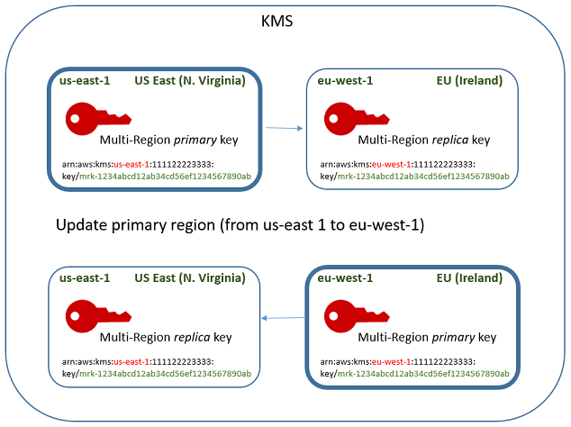

# Change the primary key in a set of multi-Region

keys

Every set of related multi-Region keys must have a primary key. But you can change the
primary key. This action, known as _updating the primary
Region_, converts the current primary key to a replica key and converts one of
the related replica keys to the primary key. You might do this if you need to delete the
current primary key while maintaining the replica keys, or to locate the primary key in the
same Region as your key administrators.

You can select any related replica key to be the new primary key. Both the primary key and
the replica key must be in the `Enabled`
[key state](key-state.md "key-state.md") when the operation starts.

**The
`Updating` key state**

Even after the `UpdatePrimaryRegion` operation completes, the process of updating the primary
Region might still be in progress for a few more seconds. During this time, the
old and new primary keys have a transient key state of [Updating](#update-primary-keystate "#update-primary-keystate"). While the key state is
`Updating`, you can use the keys in cryptographic operations, but
you cannot replicate the new primary key or perform certain management
operations, such as enabling or disabling these keys. Operations such as [DescribeKey](../APIReference/API_DescribeKey.md "../APIReference/API_DescribeKey.md") might display
both the old and new primary keys as replicas. The `Enabled` key
state is restored when the update is complete.

For information about the effect of the `Updating` key state, see
[Key states of AWS KMS keys](key-state.md "key-state.md").

**How it works**

Suppose you have a primary key in US East (N. Virginia) (us-east-1) and a replica key in
Europe (Ireland) (eu-west-1). You can use the update feature to change the primary key in
US East (N. Virginia) (us-east-1) to a replica key and change the replica key in
Europe (Ireland) (eu-west-1) to the primary key.



When the update process completes, the multi-Region key in the Europe (Ireland)
(eu-west-1) Region is a multi-Region primary key and the key in the US East (N. Virginia)
(us-east-1) Region is its replica key. If there are other related replica keys, they become
replicas of the new primary key. The next time that AWS KMS synchronizes the shared properties
of the multi-Region keys, it will get the [shared
properties](multi-region-keys-overview.md#mrk-sync-properties "multi-region-keys-overview.md#mrk-sync-properties") from the new primary key and copy them to its replica keys, including
the former primary key.

The update operation has no effect on the [key ARN](concepts.md#key-id-key-ARN "concepts.md#key-id-key-ARN") of
any multi-Region key. It also has no effect on shared properties, such as the key material,
or on independent properties, such as the key policy. However, you might want to [update the key policy](key-policy-modifying.md "key-policy-modifying.md") of the new primary key. For
example, you might want to add [kms:ReplicateKey](../APIReference/API_ReplicateKey.md "../APIReference/API_ReplicateKey.md") permission for trusted principals to the new primary key and
remove it from the new replica key.

## Update the primary Region

You can convert a replica key to a primary key, which changes the former primary key
into a replica. To update the primary Region, you need [kms:UpdatePrimaryRegion](../APIReference/API_UpdatePrimaryRegion.md "../APIReference/API_UpdatePrimaryRegion.md")
permission in both Regions.

You can update the primary Region in the AWS KMS console or by using the [UpdatePrimaryRegion](../APIReference/API_UpdatePrimaryRegion.md "../APIReference/API_UpdatePrimaryRegion.md")
operation.

You can update the primary key in the AWS KMS console. Start on the key details
page for the current primary key.

1. Sign in to the AWS Management Console and open the AWS Key Management Service (AWS KMS) console at [https://console.aws.amazon.com/kms](https://console.aws.amazon.com/kms "https://console.aws.amazon.com/kms").
2. To change the AWS Region, use the Region selector in the upper-right corner of the page.
3. In the navigation pane, choose **Customer managed keys**.
4. Select the key ID or alias of the [multi-Region primary key](multi-region-keys-overview.md#mrk-primary-key "multi-region-keys-overview.md#mrk-primary-key"). This opens the key details page
   for the primary key.

To identify a multi-Region primary key, use the tool icon in the upper
right corner to add the **Regionality** column to the
table. 5. Choose the **Regionality** tab. 6. In the **Primary key** section, choose
**Change primary Region**. 7. Choose the Region of the new primary key. You can choose only one
Region from the menu.

The **Change primary Regions** menu includes only
Regions that have a related multi-Region key. You might not have [permission to update the primary
Region](multi-region-keys-auth.md#mrk-auth-update "multi-region-keys-auth.md#mrk-auth-update") in all of the Regions on the menu. 8. Choose **Change primary Region**.
To change the primary key in a set of related multi-Region keys, use the
[UpdatePrimaryRegion](../APIReference/API_UpdatePrimaryRegion.md "../APIReference/API_UpdatePrimaryRegion.md") operation.

Use the `KeyId` parameter to identify the current primary key. Use
the `PrimaryRegion` parameter to indicate the AWS Region of the new
primary key. If the primary key doesn't already have a replica in the new
primary Region, the operation fails.

The following example changes the primary key from the multi-Region key in the
`us-west-2` Region to its replica in the `eu-west-1`
Region. The `KeyId` parameter identifies the current primary key in
the `us-west-2` Region. The `PrimaryRegion` parameter
specifies the AWS Region of the new primary key,
`eu-west-1`.

```
`$` aws kms update-primary-region \
      --key-id arn:aws:kms:us-west-2:111122223333:key/mrk-1234abcd12ab34cd56ef1234567890ab \
      --primary-region eu-west-1
```

When successful, this operation doesn't return any output; just the HTTP
status code. To see the effect, call the [DescribeKey](../APIReference/API_DescribeKey.md "../APIReference/API_DescribeKey.md") operation on
either of the multi-Region keys. You might want to wait until the key state
returns to `Enabled`. While the key state is [Updating](#update-primary-keystate "#update-primary-keystate"), the values for the key
might still be in flux.

For example, the following `DescribeKey` call gets the details
about the multi-Region key in the `eu-west-1` Region. The output
shows that the multi-Region key in the `eu-west-1` Region is now the
primary key. The related multi-Region key (same key ID) in the
`us-west-2` Region is now a replica key.

```
`$` aws kms describe-key \
      --key-id arn:aws:kms:eu-west-1:111122223333:key/mrk-1234abcd12ab34cd56ef1234567890ab \

`{
 "KeyMetadata": {
 "AWSAccountId": "111122223333",
 "KeyId": "mrk-1234abcd12ab34cd56ef1234567890ab",
 "Arn": "arn:aws:kms:eu-west-1:111122223333:key/mrk-1234abcd12ab34cd56ef1234567890ab",
 "CreationDate": 1609193147.831,
 "Enabled": true,
 "Description": "multi-region-key",
 "KeySpec": "SYMMETRIC_DEFAULT",
 "KeyState": "Enabled",
 "KeyUsage": "ENCRYPT_DECRYPT",
 "Origin": "AWS_KMS",
 "KeyManager": "CUSTOMER",
 "CustomerMasterKeySpec": "SYMMETRIC_DEFAULT",
 "EncryptionAlgorithms": [
 "SYMMETRIC_DEFAULT"
 ],
 "MultiRegion": true,
 "MultiRegionConfiguration": {
 "MultiRegionKeyType": "PRIMARY",
 "PrimaryKey": {
 "Arn": "arn:aws:kms:eu-west-1:111122223333:key/mrk-1234abcd12ab34cd56ef1234567890ab",
 "Region": "eu-west-1"
 },
 "ReplicaKeys": [
 {
 "Arn": "arn:aws:kms:us-west-2:111122223333:key/mrk-1234abcd12ab34cd56ef1234567890ab",
 "Region": "us-west-2"
 }
 ]
 }
 }
}`
```
