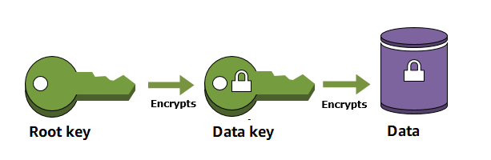
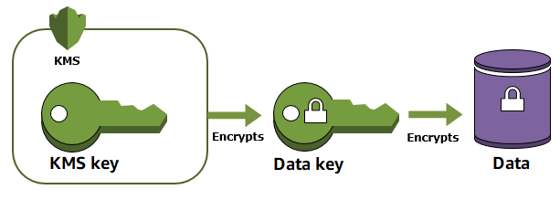

# AWS Key Management Service

AWS Key Management Service (AWS KMS) is an AWS managed service that makes it easy for you to create and
control the keys used to encrypt and sign your data. The AWS KMS keys that you
create in AWS KMS are protected by [FIPS 140-3 Security Level 3
validated hardware security modules (HSM)](https://csrc.nist.gov/projects/cryptographic-module-validation-program/certificate/4884 "https://csrc.nist.gov/projects/cryptographic-module-validation-program/certificate/4884"). They never leave AWS KMS unencrypted. To use
or manage your KMS keys, you interact with AWS KMS.

## Why use AWS KMS?

When you encrypt data, you need to protect your encryption key. If you encrypt your key,
you need to protect its encryption key. Eventually, you must protect the highest level
encryption key (known as a _root key_) in the hierarchy that
protects your data. That's where AWS KMS comes in.

AWS KMS protects your root keys. KMS keys are created, managed, used, and deleted
entirely within AWS KMS. They never leave the service unencrypted. To use or manage your
KMS keys, you call AWS KMS.

Additionally, you can create and manage [key
policies](key-policies.md "key-policies.md") in AWS KMS, ensuring that only trusted users have access to
KMS keys.

## AWS KMS in AWS Regions

The AWS Regions in which AWS KMS is supported are listed in [AWS Key Management Service Endpoints and Quotas](../../../general/latest/gr/kms.md "../../../general/latest/gr/kms.md"). If an
AWS KMS feature is not supported in an AWS Region that AWS KMS supports, the regional difference
is described in the topic about the feature.

## AWS KMS pricing

As with other AWS products, using AWS KMS does not require contracts or minimum purchases.
For more information about AWS KMS pricing, see [AWS Key Management Service
Pricing](https://aws.amazon.com/kms/pricing/ "https://aws.amazon.com/kms/pricing/").

## AWS KMS service level agreement

AWS Key Management Service is backed by a [service level
agreement](https://aws.amazon.com/kms/sla/ "https://aws.amazon.com/kms/sla/") that defines our service availability policy.
