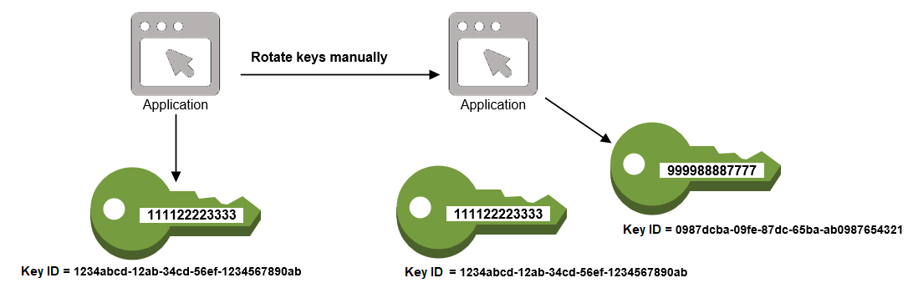

# Rotate keys manually

You might want to create a new KMS key and use it in place of a current KMS key
instead of using automatic or on-demand key rotation. When the new KMS key has
different cryptographic material than the current KMS key, using the new KMS key has
the same effect as changing the key material in an existing KMS key. The process of
replacing one KMS key with another is known as _manual key
rotation_.


Manual rotation is a good choice when you want to rotate KMS keys that are not
eligible for automatic or on-demand key rotation, such as asymmetric KMS keys, HMAC
KMS keys, and KMS keys in [custom key
stores](key-store-overview.md#custom-key-store-overview "key-store-overview.md#custom-key-store-overview").

###### Note

When you begin using the new KMS key, be sure to keep the original KMS key
enabled so that AWS KMS can decrypt data that the original KMS key encrypted.

When you rotate KMS keys manually, you also need to update references to the
KMS key ID or key ARN in your applications. [Aliases](kms-alias.md "kms-alias.md"),
which associate a friendly name with a KMS key, can make this process easier. Use an
alias to refer to a KMS key in your applications. Then, when you want to change the
KMS key that the application uses, instead of editing your application code, change
the target KMS key of the alias. For details, see [Learn how to use aliases in your applications](alias-using.md "alias-using.md").

###### Note

Aliases that point to the latest version of a manually rotated KMS key are a
good solution for [DescribeKey](../APIReference/API_DescribeKey.md "../APIReference/API_DescribeKey.md"), [GetPublicKey](../APIReference/API_GetPublicKey.md "../APIReference/API_GetPublicKey.md") and cryptographic operations like [DeriveSharedSecret](../APIReference/API_DeriveSharedSecret.md "../APIReference/API_DeriveSharedSecret.md"),
[Encrypt](../APIReference/API_Encrypt.md "../APIReference/API_Encrypt.md"), [GenerateDataKey](../APIReference/API_GenerateDataKey.md "../APIReference/API_GenerateDataKey.md"), [GenerateDataKeyPair](../APIReference/API_GenerateDataKeyPair.md "../APIReference/API_GenerateDataKeyPair.md"),
[GenerateMac](../APIReference/API_GenerateMac.md "../APIReference/API_GenerateMac.md"), [VerifyMac](../APIReference/API_VerifyMac.md "../APIReference/API_VerifyMac.md"), [Sign](../APIReference/API_Sign.md "../APIReference/API_Sign.md") and [Verify](../APIReference/API_Verify.md "../APIReference/API_Verify.md"). Aliases are not permitted in
operations that manage KMS keys, such as [DisableKey](../APIReference/API_DisableKey.md "../APIReference/API_DisableKey.md") or [ScheduleKeyDeletion](../APIReference/API_ScheduleKeyDeletion.md "../APIReference/API_ScheduleKeyDeletion.md").

When calling the [Decrypt](../APIReference/API_Decrypt.md "../APIReference/API_Decrypt.md")
operation on manually rotated symmetric encryption KMS keys, omit the
`KeyId` parameter from the command. AWS KMS automatically uses the
KMS key that encrypted the ciphertext.

The `KeyId` parameter is required when calling `Decrypt` or
[Verify](../APIReference/API_Verify.md "../APIReference/API_Verify.md") with an asymmetric
KMS key, or calling [VerifyMac](../APIReference/API_VerifyMac.md "../APIReference/API_VerifyMac.md")
with an HMAC KMS key. These requests fail when the value of the `KeyId`
parameter is an alias that no longer points to the KMS key that performed the
cryptographic operation, such as when a key is manually rotated. To avoid this
error, you must track and specify the correct KMS key for each operation.

To change the target KMS key of an alias, use [UpdateAlias](../APIReference/API_UpdateAlias.md "../APIReference/API_UpdateAlias.md") operation in the AWS KMS
API. For example, this command updates the `alias/TestKey` alias to point to
a new KMS key. Because the operation does not return any output, the example uses the
[ListAliases](../APIReference/API_ListAliases.md "../APIReference/API_ListAliases.md") operation to show
that the alias is now associated with a different KMS key and the
`LastUpdatedDate` field is updated. The ListAliases commands use the
[`query` parameter](../../../cli/latest/userguide/cli-usage-filter.md#cli-usage-filter-client-side-specific-values "../../../cli/latest/userguide/cli-usage-filter.md#cli-usage-filter-client-side-specific-values") in the AWS CLI to get only the
`alias/TestKey` alias.

```
`$` `aws kms list-aliases --query 'Aliases[?AliasName==`alias/TestKey`]'`
`{
 "Aliases": [
 {
 "AliasArn": "arn:aws:kms:us-west-2:111122223333:alias/TestKey",
 "AliasName": "alias/TestKey",
 **"TargetKeyId": "1234abcd-12ab-34cd-56ef-1234567890ab",**
 "CreationDate": 1521097200.123,
 "LastUpdatedDate": 1521097200.123
 },
 ]
}`


`$` `aws kms update-alias --alias-name alias/TestKey --target-key-id 0987dcba-09fe-87dc-65ba-ab0987654321`

`$` `aws kms list-aliases --query 'Aliases[?AliasName==`alias/TestKey`]'`
`{
 "Aliases": [
 {
 "AliasArn": "arn:aws:kms:us-west-2:111122223333:alias/TestKey",
 "AliasName": "alias/TestKey",
 **"TargetKeyId": "0987dcba-09fe-87dc-65ba-ab0987654321",**
 "CreationDate": 1521097200.123,
 "LastUpdatedDate": 1604958290.722
 },
 ]
}`
```
