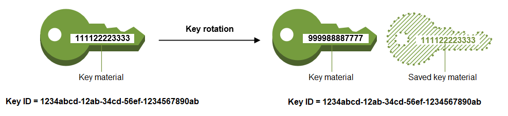

# Rotate AWS KMS keys

To create new cryptographic material for your [customer managed keys](concepts.md#customer-mgn-key "concepts.md#customer-mgn-key"), you can create new KMS keys, and then change your applications or
aliases to use the new KMS keys. Or, you can rotate the key material associated with an
existing KMS key by enabling automatic key rotation or performing on-demand rotation.

By default, when you enable _automatic key rotation_ for
a KMS key, AWS KMS generates new cryptographic material for the KMS key every year. You
can also specify a custom [rotation-period](#rotation-period "#rotation-period") to define the number of days
after you enable automatic key rotation that AWS KMS will rotate your key material, and the
number of days between each automatic rotation thereafter. If you need to immediately
initiate key material rotation, you can perform _on-demand
rotation_, regardless of whether or not automatic key rotation is enabled.
On-demand rotations do not change existing automatic rotation schedules.

You can [track the rotation](#monitor-key-rotation "#monitor-key-rotation") of key material for your
KMS keys in Amazon CloudWatch, AWS CloudTrail, and the AWS Key Management Service console. You can also use [GetKeyRotationStatus](../APIReference/API_GetKeyRotationStatus.md "../APIReference/API_GetKeyRotationStatus.md") operation
to verify whether automatic rotation is enabled for a KMS key and identify any in progress
on-demand rotations. You can use [ListKeyRotations](../APIReference/API_ListKeyRotations.md "../APIReference/API_ListKeyRotations.md") operation to view the details of completed rotations.

Key rotation changes only the _current key material_, which is
the cryptographic secret that is used in encryption operations. When you use the rotated KMS key
to decrypt ciphertext, AWS KMS uses the key material that was used to encrypt it. You cannot select
a particular key material for decrypt operations, AWS KMS automatically chooses the correct key material.
Because AWS KMS transparently decrypts with the appropriate key material, you can safely use a rotated
KMS key in applications and AWS services without code changes.

The KMS key is the same
logical resource, regardless of whether or how many times its key material changes. The
properties of the KMS key do not change, as shown in the following image.

You might decide to create a new KMS key and use it in place of the original KMS key.
This has the same effect as rotating the key material in an existing KMS key, so it's
often thought of as [manually rotating the key](rotate-keys-manually.md "rotate-keys-manually.md").
Manual rotation is a good choice when you want to rotate KMS keys that are not eligible
for automatic or on-demand key rotation, including [asymmetric
KMS keys](symmetric-asymmetric.md "symmetric-asymmetric.md"), [HMAC KMS keys](hmac.md "hmac.md"), KMS keys in [custom key stores](key-store-overview.md#custom-key-store-overview "key-store-overview.md#custom-key-store-overview"), and multi-Region KMS keys with [imported key material](importing-keys.md "importing-keys.md").

###### Note

Key rotation has no effect on the data that the KMS key protects. It does not rotate the
data keys that the KMS key generated or re-encrypt any data protected by the KMS key. Key rotation
will not mitigate the effect of a compromised data key.

###### Key rotation and pricing

AWS KMS charges a monthly fee for first and second rotation of key material maintained
for your KMS key. This price increase is capped at the second rotation, and any
subsequent rotations will not be billed. For details, see [AWS Key Management Service Pricing](https://aws.amazon.com/kms/pricing/ "https://aws.amazon.com/kms/pricing/").

###### Note

You can use the [AWS Cost Explorer Service](../../../cost-management/latest/userguide/ce-what-is.md "../../../cost-management/latest/userguide/ce-what-is.md")
to view a breakdown of your key storage charges. For example, you can filter your view to see the total charges for keys billed as current and rotated
KMS keys by specifying `$REGION-KMS-Keys` for the **Usage Type** and grouping the data by
**API Operation**.

You might still see instances of the legacy `Unknown` API operation for historical dates.

###### Key rotation and quotas

Each KMS key counts as one key when calculating key resource quotas, regardless of
the number of rotated key material versions.

For detailed information about key material and rotation, see
[AWS Key Management Service Cryptographic Details](../cryptographic-details.md "../cryptographic-details.md").

###### Topics

- [Why rotate KMS keys?](#rotating-kms-keys "#rotating-kms-keys")
- [How key rotation works](#rotate-keys-how-it-works "#rotate-keys-how-it-works")
- [Enable automatic key rotation](rotating-keys-enable.md "rotating-keys-enable.md")
- [Disable automatic key rotation](rotating-keys-disable.md "rotating-keys-disable.md")
- [Perform on-demand key
  rotation](rotating-keys-on-demand.md "rotating-keys-on-demand.md")
- [List rotations and key materials](list-rotations.md "list-rotations.md")
- [Rotate keys manually](rotate-keys-manually.md "rotate-keys-manually.md")
- [Change the primary key in a set of multi-Region
  keys](multi-region-update.md "multi-region-update.md")

## Why rotate KMS keys?

Cryptographic best practices discourage extensive reuse of keys that encrypt data
directly, such as the [data keys](data-keys.md "data-keys.md") that AWS KMS generates.
When 256-bit data keys encrypt millions of messages they can become exhausted and begin
to produce ciphertext with subtle patterns that clever actors can exploit to discover
the bits in the key. It's best to use data keys once, or just a few times, to mitigate
this key exhaustion.

However, KMS keys are most often used as _wrapping
keys_, also known as _key-encryption
keys_. Instead of encrypting data, wrapping keys encrypt the data keys
that encrypt your data. As such, they are used far less often than data keys, and are
almost never reused enough to risk key exhaustion.

Despite this very low exhaustion risk, you might be required to rotate your KMS keys
due to business or contract rules or government regulations. When you are compelled to
rotate KMS keys, we recommend that you use automatic key rotation where it is
supported, use on-demand rotation if automatic rotation is not supported, and
manual key rotation when neither automatic nor on-demand key rotation is supported.

You might consider performing on-demand rotations to demonstrate key material rotation
capabilities or to validate automation scripts. We recommend using on-demand rotations
for unplanned rotations, and using automatic key rotation with a custom [rotation period](#rotation-period "#rotation-period") whenever possible.

## How key rotation works

AWS KMS key rotation is designed to be transparent and easy to use. AWS KMS supports
optional automatic and on-demand key rotation only for [customer managed keys](concepts.md#customer-mgn-key "concepts.md#customer-mgn-key").

**Automatic key rotation**

AWS KMS rotates the KMS key automatically on the next rotation date
defined by your rotation period. You don't need to remember or schedule the
update.

Automatic key rotation is supported only on symmetric encryption KMS keys with key
material that AWS KMS generates (`AWS_KMS` origin).

Automatic rotation is optional for customer managed KMS keys. AWS KMS always rotates
the key material for AWS managed KMS keys every year. Rotation of AWS owned KMS keys
is managed by the AWS service that owns the key.

**On-demand rotation**

Immediately initiate rotation of the key material associated with your
KMS key, regardless of whether or not automatic key rotation is
enabled.

On-demand key rotation is supported on symmetric encryption KMS keys with key
material that AWS KMS generates (`AWS_KMS` origin) and single-Region,
symmetric encryption KMS keys with imported key material (`EXTERNAL`
origin).

**Manual rotation**

Neither automatic nor on-demand key rotation is supported for the following types of KMS keys,
but you can [rotate these KMS keys manually](rotate-keys-manually.md "rotate-keys-manually.md").

- [Asymmetric
  KMS keys](symmetric-asymmetric.md "symmetric-asymmetric.md")
- [HMAC KMS keys](hmac.md "hmac.md")
- KMS keys in [custom key
  stores](key-store-overview.md#custom-key-store-overview "key-store-overview.md#custom-key-store-overview")
- Multi-Region KMS keys with [imported key
  material](importing-keys.md "importing-keys.md")

**Managing key material**

AWS KMS retains all key material for a KMS key with `AWS_KMS` origin, even
if key rotation is disabled. AWS KMS deletes key material only when you delete the
KMS key.

You manage the key materials for symmetric encryption keys with `EXTERNAL`
origin. You can delete any key material using the
[DeleteImportedKeyMaterial](../APIReference/API_DeleteImportedKeyMaterial.md "../APIReference/API_DeleteImportedKeyMaterial.md")
operation or set an expiration time when importing the material. The KMS key becomes unusable
as soon as any of its materials expires or is deleted.

**Using key material**

When you use a rotated KMS key to encrypt data, AWS KMS uses the current
key material. When you use the rotated KMS key to decrypt ciphertext,
AWS KMS uses the same version of the key material that was used to encrypt it.
You cannot select a particular version of the key material for decrypt
operations, AWS KMS automatically chooses the correct version.

**Rotation
period**

Rotation period defines the number of days after you enable automatic key
rotation that AWS KMS will rotate your key material, and the number of days
between each automatic key rotation thereafter. If you do not specify a
value for `RotationPeriodInDays` when you enable automatic key
rotation, the default value is 365 days.

You can use the [kms:RotationPeriodInDays](conditions-kms.md#conditions-kms-rotation-period-in-days "conditions-kms.md#conditions-kms-rotation-period-in-days") condition key to further constrain the
values that principals can specify in the `RotationPeriodInDays`
parameter.

**Rotation
date**

Rotation date reflects the date when the current key material for a KMS key
was updated either as a result of automatic (scheduled) rotation or an on-demand
key rotation.

**Rotation date**

AWS KMS automatically rotates the KMS key on the rotation date defined by
your rotation period. The default rotation period is 365 days.

**Customer managed keys**

Because automatic key rotation is optional on [customer managed keys](concepts.md#customer-mgn-key "concepts.md#customer-mgn-key") and can be enabled
and disabled at any time, the rotation date depends on the date
that rotation was most recently enabled. The date can change if
you modify the rotation period for a key that you previously
enabled automatic key rotation on. The rotation date can change
many times over the life of the key.

For example, if you create a customer managed key on January 1, 2022,
and enable automatic key rotation with the default rotation
period of 365 days on March 15, 2022, AWS KMS rotates the key
material on March 15, 2023, March 15, 2024, and every 365 days
thereafter.

The following examples assume that automatic key rotation was
enabled with the default rotation period of 365 days. These
examples demonstrate special cases that might impact a key's
rotation period.

- Disable key rotation — If you [disable automatic
  key rotation](rotating-keys-disable.md "rotating-keys-disable.md") at any point, the KMS key
  continues to use the version of the key material it was
  using when rotation was disabled. If you enable
  automatic key rotation again, AWS KMS rotates the key
  material based on the new rotation-enable date.
- Disabled KMS keys — While a KMS key is
  disabled, AWS KMS does not rotate it. However, the key
  rotation status does not change, and you cannot change
  it while the KMS key is disabled. When the KMS key
  is re-enabled, if the key material is past its last
  scheduled rotation date , AWS KMS rotates it immediately.
  If the key material has not missed its last scheduled
  rotation date, AWS KMS resumes the original key rotation
  schedule.
- KMS keys pending deletion — While a KMS key
  is pending deletion, AWS KMS does not rotate it. The key
  rotation status is set to `false` and you
  cannot change it while deletion is pending. If deletion
  is canceled, the previous key rotation status is
  restored. If the key material is past its last scheduled
  rotation date, AWS KMS rotates it immediately. If the key
  material has not missed its last scheduled rotation
  date, AWS KMS resumes the original key rotation
  schedule.

**AWS managed keys**

AWS KMS automatically rotates AWS managed keys every year
(approximately 365 days). You cannot enable or disable key
rotation for [AWS managed keys](concepts.md#aws-managed-key "concepts.md#aws-managed-key").

The key material for an AWS managed key is first rotated one
year after its creation date, and every year (approximately 365
days from the last rotation) thereafter.

###### Note

In May 2022, AWS KMS changed the rotation schedule for
AWS managed keys from every three years (approximately 1,095 days) to
every year (approximately 365 days).

**AWS owned keys**

You cannot enable or disable key rotation for
AWS owned keys. The [key rotation](rotate-keys.md "rotate-keys.md") strategy for an AWS owned key is
determined by the AWS service that creates and manages the key. For details, see the
_Encryption at Rest_ topic
in the user guide or developer guide for the service.

**Rotating multi-Region keys**

You can enable and disable automatic rotation and perform on-demand
rotation of the key material in symmetric encryption [multi-Region keys](multi-region-keys-overview.md "multi-region-keys-overview.md") with
`AWS_KMS` origin. Key
rotation is a [shared property](multi-region-keys-overview.md#mrk-sync-properties "multi-region-keys-overview.md#mrk-sync-properties") of
multi-Region keys.

You enable and disable automatic key rotation only on the primary key. You
initiate on-demand rotation only on the primary key.

- When AWS KMS synchronizes the multi-Region keys, it copies the key
  rotation property setting from the primary key to all of its related
  replica keys.
- When AWS KMS rotates the key material, it creates new key material
  for the primary key and then copies the new key material across
  Region boundaries to all related replica keys. The key material
  never leaves AWS KMS unencrypted. This step is carefully controlled to
  ensure that key material is fully synchronized before any key is
  used in a cryptographic operation.
- AWS KMS does not encrypt any data with the new key material until
  that key material is available in the primary key and every one of
  its replica keys.
- When you replicate a primary key that has been rotated, the new
  replica key has the current key material and all previous versions
  of the key material for its related multi-Region keys.

This pattern ensures that related multi-Region keys are fully
interoperable. Any multi-Region key can decrypt any ciphertext encrypted by
a related multi-Region key, even if the ciphertext was encrypted before the
key was created.

**AWS services**

You can enable automatic key rotation on the [customer managed keys](concepts.md#customer-mgn-key "concepts.md#customer-mgn-key") that you use for server-side encryption in AWS
services. The annual rotation is transparent and compatible with AWS
services.

**Monitoring key rotation**

When AWS KMS rotates the key material for an [AWS managed key](concepts.md#aws-managed-key "concepts.md#aws-managed-key") or [customer managed key](concepts.md#customer-mgn-key "concepts.md#customer-mgn-key"), it writes a
`KMS CMK Rotation` event to Amazon EventBridge and a
[RotateKey event](ct-rotatekey.md "ct-rotatekey.md") to your AWS CloudTrail
log. You can use these records to verify that the KMS key was
rotated.

You can use the AWS Key Management Service console to view the number of remaining
on-demand rotations and a list of all completed key material rotations for a
KMS key.

You can use [ListKeyRotations](../APIReference/API_ListKeyRotations.md "../APIReference/API_ListKeyRotations.md") operation to view the details of completed
rotations.

**Eventual consistency**

Key rotation is subject to the same eventual consistency effects as other
AWS KMS management operations. There might be a slight delay before the new
key material is available throughout AWS KMS. However, rotating key material
does not cause any interruption or delay in cryptographic operations. The
current key material is used in cryptographic operations until the new key
material is available throughout AWS KMS. When key material for a multi-Region
key is automatically rotated, AWS KMS uses the current key material until the
new key material is available in all Regions with a related multi-Region
key.
