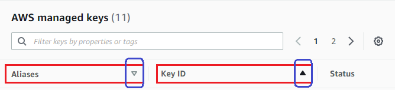
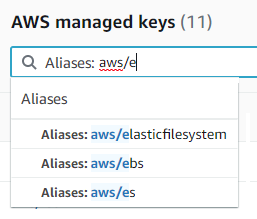

# Customize your console view

You can customize the view of the AWS KMS console to make it easier to find your KMS keys.
Customize the tables that appear on the **AWS managed keys** and
**Customer managed keys** pages to display the information that you need the
most, or sort and filter the KMS keys returned in the tables.

###### Topics

- [Sort and filter your KMS keys](#viewing-console-filter "#viewing-console-filter")
- [Customize your KMS key tables](#console-customize-tables "#console-customize-tables")

## Sort and filter your KMS keys

To make it easier to find your KMS keys in the console, you can sort and filter the
key tables.

**Sort**

You can sort KMS keys in ascending or descending order by their column values.
This feature sorts all KMS keys in the table, even if they don't appear on the
current table page.

Sortable columns are indicated by an arrow beside the column name. On the
**AWS managed keys** page, you can sort by
**Aliases** or **Key ID**. On the
**Customer managed keys** page, you can sort by
**Aliases**, **Key ID**, or **Key
type**.

To sort in ascending order, choose the column heading until the arrow points
upward. To sort in descending order, choose the column heading until the arrow points
downward. You can sort by only one column at a time.

For example, you can sort KMS keys in ascending order by key ID, instead of
aliases, which is the default.

When you sort KMS keys on the **Customer managed keys** page in
ascending order by **Key type**, all asymmetric keys are displayed
before all symmetric keys.

**Filter**

You can filter KMS keys by their property values or tags. The filter applies to
all KMS keys in the table, even if they don't appear on the current table page. The
filter is not case-sensitive.

Filterable properties are listed in the filter box. On the
**AWS managed keys** page, you can filter by alias and key ID.
On the **Customer managed keys** page, you can filter by the alias, key ID,
and key type properties, and by tags.

- On the **AWS managed keys** page, you can filter by alias
  and key ID.
- On the **Customer managed keys** page, you can filter by tags, or
  by the alias, key ID, key type, or regionality properties.

To filter by a property value, choose the filter, choose the property name, and
then choose from the list of actual property values. To filter by a tag, choose the
tag key, and then choose from the list of actual tag values. After choosing a property
or tag key, you can also type all or part of the property value or tag value. You'll
see a preview of the results before you make your choice.

For example, to display KMS keys with an alias name that contains
`aws/e`, choose the filter box, choose **Alias**, type
`aws/e`, and then press `Enter` or `Return` to add
the filter.

### Suggested KMS key table filters

**Filter for asymmetric KMS keys**

To display only asymmetric KMS keys on the
**Customer managed keys** page, click the filter box, choose
**Key type** and then choose **Key type:
Asymmetric**. The **Asymmetric** option appears only
when you have asymmetric KMS keys in the table.

**Filter for multi-Region keys**

To display only multi-Region keys, on the **Customer managed keys**
page, choose the filter box, choose **Regionality** and then choose
**Regionality: Multi-Region**. The
**Multi-Region** option appears only when you have multi-Region
keys in the table.

**Filter for tags**

To display only KMS keys with a particular tag, choose the filter box, choose
the tag key, and then choose from among the actual tag values. You can also type all
or part of the tag value.

The resulting table displays all KMS keys with the chosen tag. However, it
doesn't display the tag. To see the tag, choose the key ID or alias of the KMS key
and on its detail page, choose the **Tags** tab. The tabs appear
below the **General configuration** section.

This filter requires both the tag key and tag value. It won't find KMS keys by
typing only the tag key or only its value. To filter tags by all or part of the tag
key or value, use the [ListResourceTags](../APIReference/API_ListResourceTags.md "../APIReference/API_ListResourceTags.md") operation to get tagged KMS keys, then use the
filtering features of your programming language.

**Filter by text**

To search for text, in the filter box, type all or part of an alias, key ID, key
type, or tag key. (After you select the tag key, you can search for a tag value ).
You'll see a preview of the results before you make your choice.

For example, to display KMS keys with `test` in its tag keys or
filterable properties, type `test` in the filter box. The preview shows
the KMS keys that the filter will select. In this case, `test` appears
only in the **Alias** property.

## Customize your KMS key tables

You can customize the tables that appear on the **AWS managed keys**
and **Customer managed keys** pages in the AWS Management Console to suit your needs. You can
choose the table columns, the number of AWS KMS keys on each page (**Page
size**), and the text wrap. The configuration you choose is saved when you
confirm it and reapplied whenever you open the pages.

###### To customize your KMS key tables

1. On the **AWS managed keys** or
   **Customer managed keys** page, choose the settings icon (
   
   ) in the upper-right corner of the page.
2. On the **Preferences** page, choose your preferred settings, and
   then choose **Confirm**.

Consider using the **Page size** setting to increase the number of
KMS keys displayed on each page, especially if you typically use a device that's easy to
scroll.

The data columns that you display might vary depending on the table, your job role, and
the types of KMS keys in the account and Region. The following table offers some suggested
configurations. For descriptions of the columns, see [Using the AWS KMS console](finding-keys.md#viewing-console-details "finding-keys.md#viewing-console-details").

### Suggested KMS key table configurations

You can customize the columns that appear in your KMS key table to display the
information you need about your KMS keys.

**AWS managed keys**

By default, the **AWS managed key** table displays the
**Aliases**, **Key ID**, and
**Status** columns. These columns are ideal for most use
cases.

**Symmetric encryption KMS keys**

If you use only symmetric encryption KMS keys with key material generated by
AWS KMS, the **Aliases**, **Key ID**,
**Status**, and **Creation date** columns are
likely to be the most useful.

**Asymmetric KMS keys**

If you use asymmetric KMS keys, in addition to the
**Aliases**, **Key ID**, and
**Status** columns, consider adding the **Key
type**, **Key spec**, and **Key usage**
columns. These columns will show you whether a KMS key is symmetric or asymmetric,
the type of key material, and whether the KMS key can be used for encryption or
signing.

**HMAC KMS keys**

If you use HMAC KMS keys, in addition to the **Aliases**,
**Key ID**, and **Status** columns, consider
adding the **Key spec** and **Key usage** columns.
These columns will show you whether a KMS key is an HMAC key. Because you can't
sort KMS keys by key spec or key usage, use aliases and tags to identify your HMAC
keys and then use the [filter features](#viewing-console-filter "#viewing-console-filter")
of the AWS KMS console to filter by aliases or tags.

**Imported key material**

If you have KMS keys with [imported key
material](importing-keys.md "importing-keys.md"), consider adding the **Origin** and
**Expiration date** columns. These columns will show you whether
the key material in a KMS key is imported or generated by AWS KMS and when the key
material expires, if at all. The **Creation date** field displays
the date that the KMS key was created (without key material). It doesn't reflect
any characteristic of the key material.

**Keys in custom key stores**

If you have KMS keys in [custom key
stores](key-store-overview.md#custom-key-store-overview "key-store-overview.md#custom-key-store-overview"), consider adding the **Origin** and
**Custom key store ID** columns. These columns show that the
KMS key is in a custom key store, display the custom key store type, and identify
the custom key store.

**Multi-Region keys**

If you have [multi-Region keys](multi-region-keys-overview.md "multi-region-keys-overview.md"),
consider adding the **Regionality** column. This shows whether a
KMS key is a single-Region key, a [multi-Region
primary key](multi-region-keys-overview.md#mrk-primary-key "multi-region-keys-overview.md#mrk-primary-key") or a [multi-Region replica
key](multi-region-keys-overview.md#mrk-replica-key "multi-region-keys-overview.md#mrk-replica-key").
