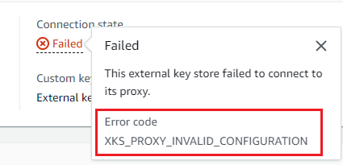

# Connect and disconnect external key

stores

New external key stores are not connected. To create and use AWS KMS keys in your
external key store, you need to connect your external key store to its [external key store proxy](keystore-external.md#concept-xks-proxy "keystore-external.md#concept-xks-proxy"). You can connect and
disconnect your external key store at any time, and [view
its connection state](view-xks-keystore.md "view-xks-keystore.md").

While your external key store is disconnected, AWS KMS cannot communicate with your external
key store proxy. As a result, you can view and manage your external key store and its
existing KMS keys. However, you cannot create KMS keys in your external key store, or
use its KMS keys in cryptographic operations. You might need to disconnect your external
key store at some point, such as when editing its properties, but plan accordingly.
Disconnecting the key store might disrupt the operation of AWS services that use its
KMS keys.

You are not required to connect your external key store. You can leave an external key
store in a disconnected state indefinitely and connect it only when you need to use it.
However, you might want to test the connection periodically to verify that the settings are
correct and it can be connected.

When you disconnect a custom key store, the KMS keys in the key store become unusable
right away (subject to eventual consistency). However, resources encrypted with [data keys](data-keys.md "data-keys.md") protected by the KMS key are not affected until
the KMS key is used again, such as to decrypt the data key. This issue affects
AWS services, many of which use data keys to protect your resources. For details, see
[How unusable KMS keys affect data keys](unusable-kms-keys.md "unusable-kms-keys.md").

###### Note

External key stores are in a `DISCONNECTED` state only when the key store has never been connected
or you explicitly disconnect it. A `CONNECTED` state does not indicate that external key store or its supporting components are operating
efficiently. For information about the performance of your external key store components, see the graphs in **Monitoring** section
of the detail page for each external key store. For details, see [Monitor external key stores](xks-monitoring.md "xks-monitoring.md").

Your external key manager might provide additional
methods of stopping and restarting communication between your AWS KMS external key store
and your external key store proxy, or between your external key store
proxy and external key manager. For details, see your external key manager documentation.

###### Topics

- [Connection state](#xks-connection-state "#xks-connection-state")
- [Connect an external key store](about-xks-connecting.md "about-xks-connecting.md")
- [Disconnect an external key store](about-xks-disconnecting.md "about-xks-disconnecting.md")

## Connection state

Connecting and disconnecting changes the _connection
state_ of your custom key store. Connection state values are the same for AWS CloudHSM key stores and
external key stores.

To view the connection state of your custom key store, use the [DescribeCustomKeyStores](../APIReference/DescribeCustomKeyStores.md "../APIReference/DescribeCustomKeyStores.md") operation
or AWS KMS console. **Connection state**
appears in each custom key store table, in the **General
configuration** section of the detail page for each custom key store,
and on the **Cryptographic configuration** tab of KMS keys in a custom key store. For details,
see [View an AWS CloudHSM key store](view-keystore.md "view-keystore.md") and [View external key stores](view-xks-keystore.md "view-xks-keystore.md").

An custom key store can have one of the following connection states:

- `CONNECTED`: The custom key store is connected to its backing key store. You can create
  and use KMS keys in the custom key store.

The _backing key store_ for an AWS CloudHSM key store is its
associated AWS CloudHSM cluster. The _backing key store_ for an
external key store is external key store proxy and the external key manager that it
supports.

A CONNECTED state means that a connection succeeded and the custom key store has not
been intentionally disconnected. It does not indicate that the connection is operating
properly. For information
about the status of the AWS CloudHSM cluster associated with your AWS CloudHSM key store, see [Getting CloudWatch metrics for AWS CloudHSM](../../../cloudhsm/latest/userguide/hsm-metrics-cw.md "../../../cloudhsm/latest/userguide/hsm-metrics-cw.md") in
the AWS CloudHSM User Guide. For information about the status and operation of your external key store,
see the graphs in the **Monitoring** section of the
detail page for each external key store. For details, see [Monitor external key stores](xks-monitoring.md "xks-monitoring.md").

- `CONNECTING`: The process of connecting an custom key store is in progress.
  This is a transient state.
- `DISCONNECTED`: The custom key store has never been connected to its
  backing, or it was intentionally disconnected by using the AWS KMS console or the [DisconnectCustomKeyStore](../APIReference/DisconnectCustomKeyStores.md "../APIReference/DisconnectCustomKeyStores.md")
  operation.
- `DISCONNECTING`: The process of disconnecting an custom key store is in
  progress. This is a transient state.
- `FAILED`: An attempt to connect the custom key store failed. The
  `ConnectionErrorCode` in the [DescribeCustomKeyStores](../APIReference/DescribeCustomKeyStores.md "../APIReference/DescribeCustomKeyStores.md") response
  indicates the problem.

To connect an custom key store, its connection state must be
`DISCONNECTED`. If the connection state is `FAILED`, use the
`ConnectionErrorCode` to identify and resolve the problem. Then
disconnect the custom key store before trying to connect it again. For help with
connection failures, see [External key store connection errors](xks-troubleshooting.md#fix-xks-connection "xks-troubleshooting.md#fix-xks-connection"). For help responding to a
connection error code, see [Connection error codes for external key
stores](xks-troubleshooting.md#xks-connection-error-codes "xks-troubleshooting.md#xks-connection-error-codes").

To view the connection error code:

- In the [DescribeCustomKeyStores](../APIReference/API_DescribeCustomKeyStores.md "../APIReference/API_DescribeCustomKeyStores.md") response, view the value of the
  `ConnectionErrorCode` element. This element appears in the
  `DescribeCustomKeyStores` response only when the
  `ConnectionState` is `FAILED`.
- To view the connection error code in the AWS KMS console, on detail page for the
  external key store and hover over the **Failed** value.

