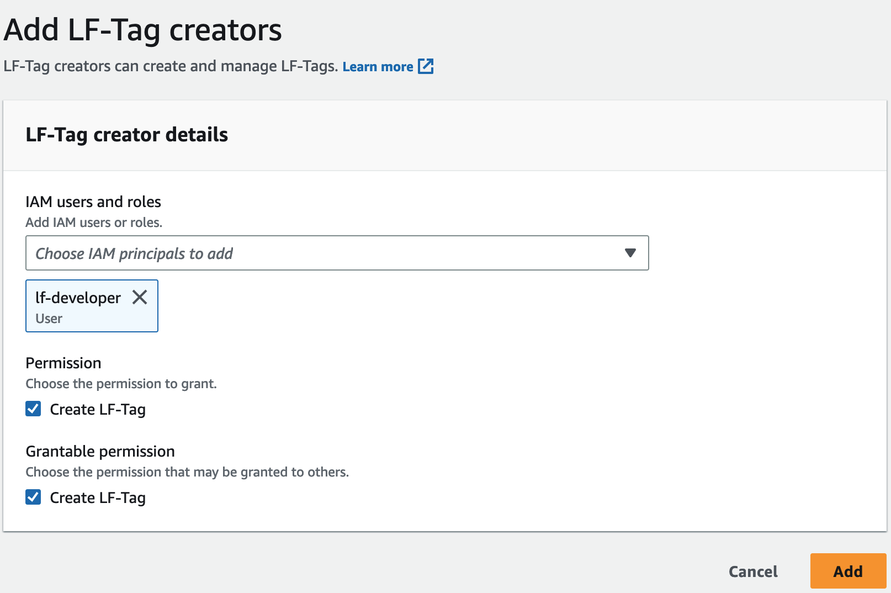

# Adding LF-Tag creators

By default, data lake administrators can create, update, and delete LF-Tags, assign tags
to Data Catalog objects, and grant tag permissions to principals. If you wish to delegate the tag
creation and management operations to non-admin principals, the data lake administrator can
create LF-Tag creator roles and grant Lake Formation `Create LF-Tag` permission to the roles.
With grantable `Create LF-Tag` permission, LF-Tag creators can delegate tag
creation and maintenance tasks to other non-administrative principals.

For data lake administrators to assign LF-Tags to Data Catalog resources,
they are required to grant themselves associate permissions on LF-Tags that were not created by them.

###### Note

Cross-account permission grants can include only `Describe` and
`Associate` permissions. You can't grant `Create LF-Tag`,
`Drop`, `Alter`, and `Grant with LFTag expressions`
permissions to principals in a different account.

###### Topics

- [IAM permissions required to create LF-Tags](#tag-creator-permissions "#tag-creator-permissions")
- [Add LF-Tag creators](#add-lf-tag-creator "#add-lf-tag-creator")

###### See also

- [Managing LF-Tag value
  permissions](TBAC-granting-tags.md "TBAC-granting-tags.md")
- [Granting data lake permissions using the
  LF-TBAC method](granting-catalog-perms-TBAC.md "granting-catalog-perms-TBAC.md")
- [Lake Formation tag-based access control](tag-based-access-control.md "tag-based-access-control.md")

## IAM permissions required to create LF-Tags

You must configure permissions to allow a Lake Formation principal to create LF-Tags.
Add the following statement to the permissions policy for the principal that needs to be a
LF-Tag creator.

###### Note

Although data lake administrators have implicit Lake Formation permissions to create, update, and delete LF-Tags, to assign LF-Tags to resources, and to grant LF-Tags to principals, data lake administrators also need the following IAM permissions.

For more information, see [Lake Formation personas and IAM permissions reference](permissions-reference.md "permissions-reference.md").

```
{
"Sid": "Transformational",
"Effect": "Allow",
    "Action": [
        "lakeformation:AddLFTagsToResource",
        "lakeformation:RemoveLFTagsFromResource",
        "lakeformation:GetResourceLFTags",
        "lakeformation:ListLFTags",
        "lakeformation:CreateLFTag",
        "lakeformation:GetLFTag",
        "lakeformation:UpdateLFTag",
        "lakeformation:DeleteLFTag",
        "lakeformation:SearchTablesByLFTags",
        "lakeformation:SearchDatabasesByLFTags"
     ]
 }

```

Principals who assign LF-Tags to resources and grant LF-Tags to principals must have the
same permissions, except for the `CreateLFTag`, `UpdateLFTag`, and
`DeleteLFTag` permissions.

## Add LF-Tag creators

A LF-Tag creator can create a LF-Tag, update tag key and values, delete tags,
associate tags to Data Catalog resources, and grant permissions on Data Catalog resources to
principals using LF-TBAC method. The LF-Tag creator can also grant these permissions
to principals.

You can create LF-Tag creator roles by using the AWS Lake Formation console, the API, or the
AWS Command Line Interface (AWS CLI).

console

###### To add a LF-Tag creator

1. Open the Lake Formation console at
   [https://console.aws.amazon.com/lakeformation/](https://console.aws.amazon.com/lakeformation/ "https://console.aws.amazon.com/lakeformation/").

Sign in as a datalake administrator. 2. In the navigation pane, under **Permissions**, choose
**LF-Tags and permissions**.

On the **LF-Tags and permissions** page, choose
**LF-Tag creators** section and choose **Add LF-Tag
creators**.

 3. On the **Add LF-Tag creators** page, choose an IAM role or user who has the required permissions to create LF-Tags. 4. Enable `Create LF-Tag` permission check box. 5. (Optional) To enable the selected principals to grant `Create
 LF-Tag` permission to principals, choose Grantable `Create
 LF-Tag` permission. 6. Choose **Add**.

AWS CLI

```
aws lakeformation grant-permissions --cli-input-json file://grantCreate
{
    "Principal": {
        "DataLakePrincipalIdentifier": "arn:aws:iam::123456789012:user/tag-manager"
    },
    "Resource": {
        "Catalog": {}
    },
    "Permissions": [
        "CreateLFTag"
    ],
    "PermissionsWithGrantOption": [
        "CreateLFTag"
    ]
}

```

The following are the permissions available for a LF-Tag creator role:

| Permission                     | Description                                                                                                                                                                                                                       |
| ------------------------------ | --------------------------------------------------------------------------------------------------------------------------------------------------------------------------------------------------------------------------------- |
| `Drop`                         | A principal with this permission on a LF-Tag can delete a<br>LF-Tag from the data lake. The principal gets implicit `Describe`<br>permission on all tag values of a LF-Tag resource.                                              |
| `Alter`                        | A principal with this permission on a LF-Tag can add or remove tag<br>value from a LF-Tag. The principal gets implicit `Alter`<br>permission on all tag values of a LF-Tag.                                                       |
| `Describe`                     | A principal with this permission on a LF-Tag can view the<br>LF-Tag and its values when they assign LF-Tags to resources or grant<br>permissions on LF-Tags. You can grant `Describe` on all key<br>values or on specific values. |
| `Associate`                    | A principal with this permission on a LF-Tag can assign the<br>LF-Tag to a Data Catalog resource. Granting `Associate` implicitly<br>grants `Describe`.                                                                           |
| `Grant with LF-Tag expression` | A principal with this permission on a LF-Tag can grant permissions on<br>a Data Catalog resources using the LF-Tag key and values. Granting `Grant<br>with LF-Tag expression` implicitly grants `Describe`.                       |

These permissions are grantable. A principal who has been granted these permissions
with the grant option can grant them to other principals.
