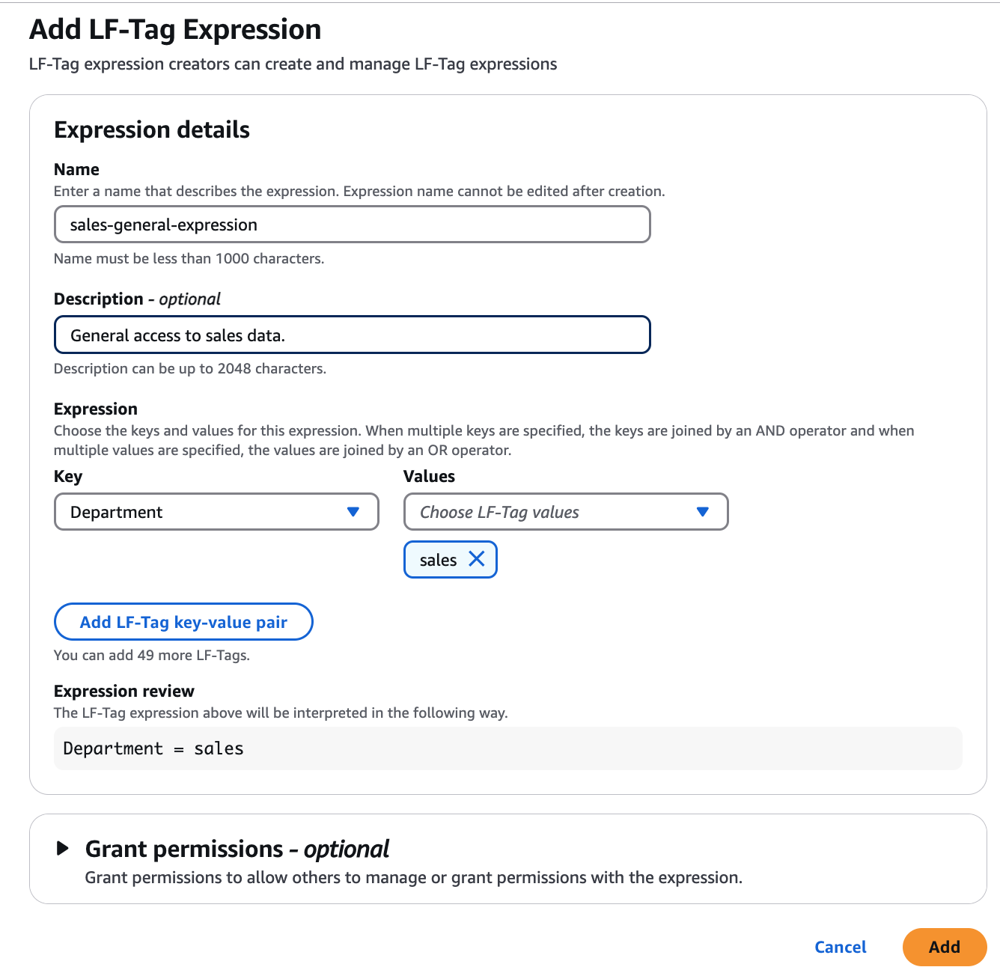
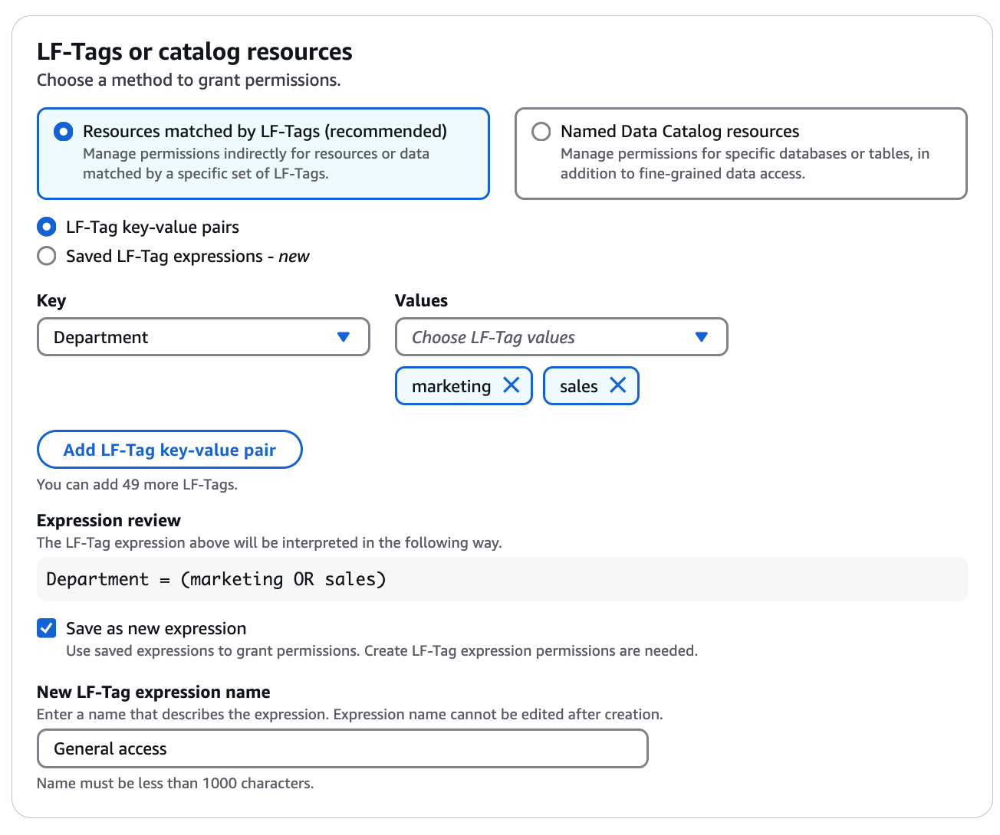
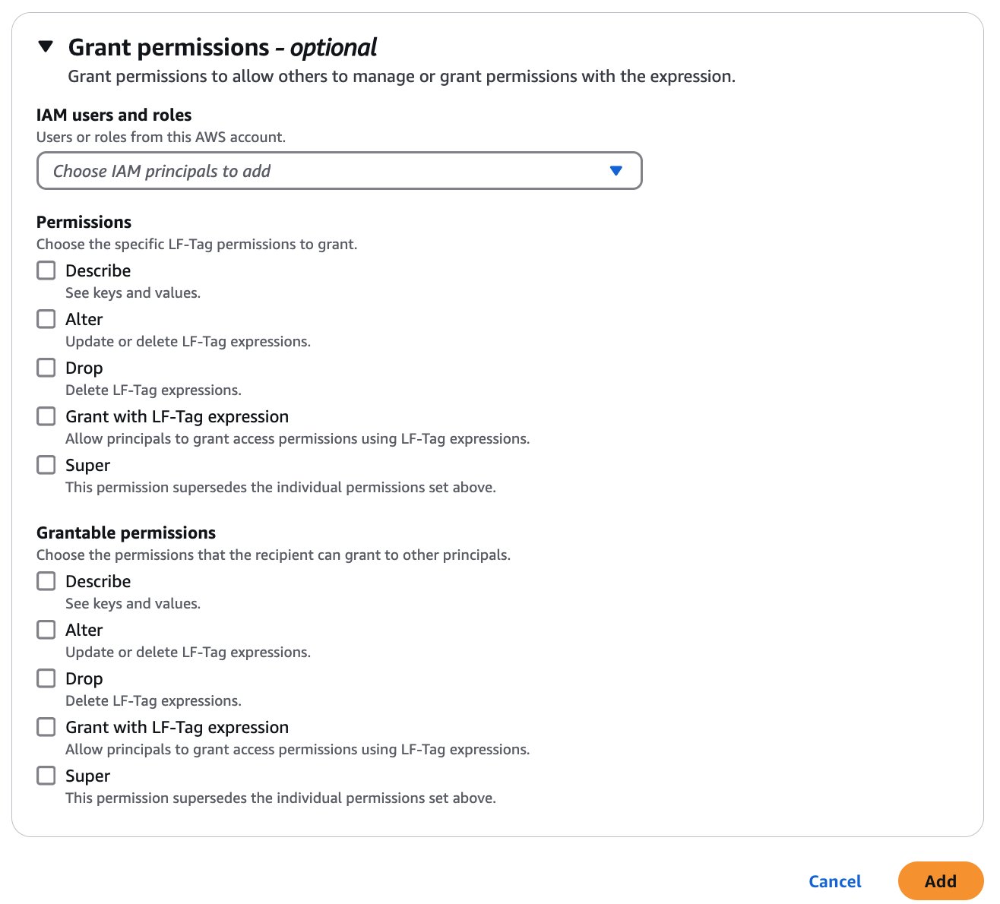

# Creating LF-Tag expressions

You need to define all LF-Tags in Lake Formation, and assign them to Data Catalog resources
before they can be used to create expressions. An LF-Tag expression consists of one
more keys and one or more possible values for each key.

After the data lake administrator has set up the required IAM permissions and Lake Formation
permissions for the LF-Tag expression creator role, the principal can create reusable
LF-Tag expressions. The LF-Tag expression creator gets implicit permissions to update
the expression body, and delete the LF-Tag expression.

You can create LF-Tag expressions by using the AWS Lake Formation console, the API, or the AWS Command Line Interface
(AWS CLI).

Console

###### To create an LF-Tag expression

1. Open the Lake Formation console at
   [https://console.aws.amazon.com/lakeformation/](https://console.aws.amazon.com/lakeformation/ "https://console.aws.amazon.com/lakeformation/").

Sign in as a principal with LF-Tag expression creator permissions or as data lake administrator. 2. In the navigation pane, under **Permissions\*\***, choose LF-Tags and permissions**. 3. Choose **LF-Tag expressions**. The **Add
LF-Tag expressions\*\* page appears.

 4. Enter the following information:

    * Name – Enter a unique name for the expression. You can't update the
     expression name.
    * Description – Provide an optional description for the expression with
     the details of the expression.
    * Expression – Create the expression by specifying tag keys and their
     associated values. You can add up to 50 keys per expression. You must have
     `Grant with LF-Tags` Lake Formation permission on all tags in
     expression body.


     Each key must have at least one value. To enter multiple values, either enter a
     comma-delimited list and then press **Enter**, or enter one value
     at a time and choose **Add** after each one. The maximum number of
     values permitted per key is 1000.


     Lake Formation uses the AND/OR logic to combine multiple keys and values in an expression.
     Within a single (key : list of values) pair, the values are combined using the logical OR operator.
     For example, if the pair is (Department : [Sales, Marketing]), it means the tag matches if the resource has the Department tag with value Sales OR Marketing.


     When you specify multiple keys, the keys are joined by an AND logical operator. So if the full expression is (Department : [Sales, Marketing]) AND (Location : [US, Canada]), it matches resources that have the Department tag with value Sales OR Marketing, AND also have the Location tag with value US OR Canada.
     The following is another example with multiple keys and values:


    LF-Tag expression: (ContentType : [Video, Audio]) AND (Region : [Europe, Asia]) AND (Department : [Engineering, ProductManagement]).


    This expression would match resources that have: - The ContentType tag with value Video OR Audio AND - The Region tag with value Europe OR Asia AND - The Department tag with value Engineering OR ProductManagement.

You can also save a tag expression when granting data lake permissions using LF-Tags.
Choose the key and value pairs and choose the **Save as new expression** option. Enter a name that describes the expression.

 5. (Optional) Next, choose the users/roles, and the permissions on the expression
that you want to grant to them in the account. You can also choose grantable
permissions that allows the users to grant these permissions to other users in the
account. You can't grant cross account permissions on the tag expressions.

 6. Choose **Add** .

AWS CLI

###### To create an LF-Tag expression

- Enter a `create-lf-tag-expression` command.

The following example creates an LF-Tag expression with the tag
`Department` with values `Sales` and `Marketing`,
AND the tag `Location` with the value `US`.

```
aws lakeformation create-lf-tag-expression \
-- name "my-tag-expression" \
-- catalog-id "123456789012" \
-- expression '{"Expression":[{"TagKey":"Department","TagValues":["Sales","Marketing"]},{"TagKey":"Location","TagValues":["US"]}]}'
```

This CLI command creates a new LF-Tag expression in the AWS Glue Data Catalog.
The expression can be used grant permissions to Data Catalog resources such as databases, tables, views or columns based on their associated tags.

In this example, the expression will match resources that have the `Department` key with values `Sales` or `Marketing`, and the `Location` key with the value `US`.

As a tag expression creator , the principal gets `Alter` permission on this
LF-Tag expression and can update or remove the expression. The LF-Tag expression
creator principal can also grant `Alter` permission to another principal to update
and remove this expression.
