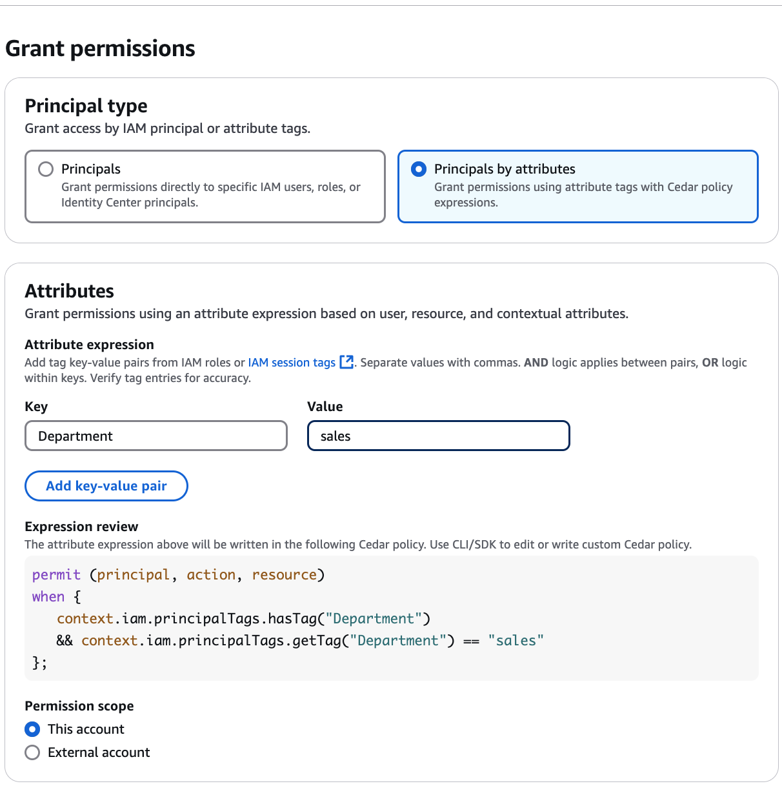

# Granting permissions using attribute-based access control

This topic describes the steps you need to follow to grant attribute-based access permissions on Data Catalog resources.
You can use the Lake Formation console or the AWS Command Line Interface (AWS CLI).

1. Open the Lake Formation console at [https://console.aws.amazon.com/lakeformation/](https://console.aws.amazon.com/lakeformation/ "https://console.aws.amazon.com/lakeformation/"),
   and sign in as a data lake administrator, the resource creator, or an IAM user
   who has **Grantable permissions** on the resource.
2. Do one of the following:
   - In the navigation pane, under **Permissions**,
     choose **Data lake permissions**. Then choose **Grant**.
   - In the navigation pane, choose **Catalogs** under
     **Data Catalog**. Then, choose a catalog object (catalogs,
     databases, tables, and data filters), and from the **Actions**
     menu under **Permissions**, and choose
     **Grant**.

3. On the **Grant permissions** page, choose **Principals by attribute**.
4. Specify the attribute key and value(s). If you choose more than one value, you are creating an
   attribute expression with an `OR` operator. This means that if any of the
   attribute tag values assigned to an IAM role or user match, the role/user gains
   access permissions on the resource.

If you specify more than one attribute tag, you are creating an attribute expression
with an `AND` operator. The principal is granted permissions on a Data Catalog
resource only if the IAM role/user was assigned a matching tag for each attribute
tag in the attribute expression.

Review the resulting Cedar policy expression shown in the console.

 5. Choose the permission scope. If the grantees belong to an external account, choose **External account** and enter the AWS account ID. 6. Next, choose the Data Catalog account or in external accounts. You must have corresponding grantable
permissions on the resources to successfully complete the permission grants. 7. Specify which actions you want to allow for principals (users or roles) that have matching attributes
perform. Access is granted to IAM entities that have been assigned tags and values that match at least one of your
specified attribute expressions. Review the Cedar policy expression in the console. For more information about Cedar,
see [What is Cedar? | Cedar Policy Language Reference GuideLink](https://docs.cedarpolicy.com/ "https://docs.cedarpolicy.com/"). 8. Next choose the Data Catalog resources to grant access. you can define these permissions for
various Data Catalog resources, including catalogs, databases, tables, and data
filters. 9. Choose **Grant**.

This approach allows you to control access based on attributes, ensuring that
only users or roles with the appropriate tags can perform specific actions on the designated resources.
The following example shows an attribute expression that must be met for receiving
all available permissions on the resource. You can alternatively specify individual
permissions such as `Select`, `Describe`, or `Drop`. The
expression uses Cedar policy expression. For more information about Cedar, see [What is Cedar? | Cedar Policy Language Reference
GuideLink](https://docs.cedarpolicy.com/ "https://docs.cedarpolicy.com/").

This condition checks if the IAM principal has a `department` tag,
and the `department` tag value equals `sales`.

```
aws lakeformation grant-permissions
--principal '{"DataLakePrincipalIdentifier": "`111122223333`:IAMPrincipals"}' \
--resource '{"Database": {"CatalogId": `111122223333`, "Name": "`abac-db`"}}' \
--permissions `ALL` \
--condition '{"Expression": "context.iam.principalTags.hasTag(\"`department`\") \
   && context.iam.principalTags.getTag(\"`department`\") == \"`sales`\""}'
```
