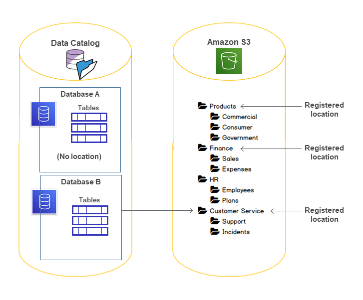

# Underlying data access control

When an integrated AWS service requests access to data in an Amazon S3 location that is
access-controlled by AWS Lake Formation, Lake Formation supplies temporary credentials to access the
data.

To enable Lake Formation to control access to underlying data at an Amazon S3 location, you _register_ that location with Lake Formation.

After you register an Amazon S3 location, you can start granting the following Lake Formation
permissions:

- Data access permissions (`SELECT`, `INSERT`, and
  `DELETE)` on Data Catalog tables that point to that location.
- Data location permissions on that location.
  Lake Formation
  data location permissions control the ability to create Data Catalog resources that
  point to particular Amazon S3 locations. Data location permissions provide an extra layer of
  security to locations within the data lake. When you grant the `CREATE_TABLE` or
  `ALTER` permission to a principal, you also grant data location permissions to
  limit the locations for which the principal can create or alter metadata tables.

Amazon S3 locations are buckets or prefixes under a bucket, but not individual Amazon S3
objects.

You can grant data location permissions to a principal by using the Lake Formation console, the
API, or the AWS CLI. The general form of a grant is as follows:

```
grant DATA_LOCATION_ACCESS to `principal` on `S3 location` [with grant option]
```

If you include `with grant option`, the grantee can grant the permissions to
other principals.

Recall that Lake Formation permissions always work in combination with AWS Identity and Access Management (IAM)
permissions for fine-grained access control. For read/write permissions on underlying Amazon S3
data, IAM permissions are granted as follows:

When you register a location, you specify an IAM role that grants read/write
permissions on that location. Lake Formation assumes that role when supplying temporary credentials to
integrated AWS services. A typical role might have the following policy attached, where
the registered location is the bucket `awsexamplebucket`.

JSON

```
`{
 "Version":"2012-10-17",
 "Statement": [
 {
 "Effect": "Allow",
 "Action": [
 "s3:PutObject",
 "s3:GetObject",
 "s3:DeleteObject"
 ],
 "Resource": [
 "arn:aws:s3:::amzn-s3-demo-bucket/*"
 ]
 },
 {
 "Effect": "Allow",
 "Action": [
 "s3:ListBucket"
 ],
 "Resource": [
 "arn:aws:s3:::amzn-s3-demo-bucket"
 ]
 }
 ]
}`

```

Lake Formation provides a service-linked role that you can use during registration to
automatically create policies like this. For more information, see [Using service-linked roles for Lake Formation](service-linked-roles.md "service-linked-roles.md").

Therefore, registering an Amazon S3 location grants the required IAM `s3:`
permissions on that location, where the permissions are specified by the role used to
register the location.

###### Important

Avoid registering an Amazon S3 bucket that has **Requester pays** enabled.
For buckets registered with Lake Formation, the role used to register the bucket is always viewed as
the requester. If the bucket is accessed by another AWS account, the bucket owner is
charged for data access if the role belongs to the same account as the bucket
owner.

For read/write access to underlying data, in addition to Lake Formation permissions, principals
also need the `lakeformation:GetDataAccess` IAM permission. With this permission, Lake Formation grants the request for temporary credentials to access the
data.

JSON

```
`{
 "Version":"2012-10-17",
 "Statement": [
 {
 "Effect": "Allow",
 "Action": "lakeformation:GetDataAccess",
 "Resource": "*"
 }
 ]
}`

```

In the above policy, you must set the Resource parameter to '\*' (all. Specifying any other resource for this permission is not supported.
This configuration ensures that Lake Formation can manage data access across your entire data lake environment efficiently.

###### Note

Amazon Athena requires the user to have the
`lakeformation:GetDataAccess` permission. Other integrated services require their underlying execution role to have the `lakeformation:GetDataAccess` permission.

This permission is included in the suggested policies in the [Lake Formation personas and IAM permissions reference](permissions-reference.md "permissions-reference.md").

To summarize, to enable Lake Formation principals to read and write underlying data with access
controlled by Lake Formation permissions:

- Register the Amazon S3 locations that contain the data with Lake Formation.
- Principals who create Data Catalog tables that point to underlying data locations must
  have data location permissions.
- Principals who read and write underlying data must have Lake Formation data access permissions
  on the Data Catalog tables that point to the underlying data locations.
- Principals who read and write underlying data must have the
  `lakeformation:GetDataAccess` IAM permission when the underlying data location is registered with Lake Formation.

###### Note

The Lake Formation permissions model doesn't prevent access to Amazon S3 locations through the Amazon S3
API or console if you have access to them through IAM or Amazon S3 policies. You can attach
IAM policies to principals to block this access.

###### More on data location permissions

Data location permissions govern the outcome of create and update operations on
Data Catalog databases and tables. The rules are as follows:

- A principal must have explicit or implicit data location permissions on an Amazon S3
  location to create or update a database or table that specifies that location.
- The explicit permission `DATA_LOCATION_ACCESS` is granted using the
  console, API, or AWS CLI.
- Implicit permissions are granted when a database has a location property that points
  to a registered location, the principal has the `CREATE_TABLE` permission on
  the database, and the principal tries to create a table at that location or a child
  location.
- If a principal is granted data location permissions on a location, the principal has
  data location permissions on all child locations.
- A principal does not need data location permissions to perform read/write operations
  on the underlying data. It is sufficient to have the `SELECT` or
  `INSERT` data access permissions. Data location permissions apply only to
  creating Data Catalog resources that point to the location.
  Consider the scenario shown in the following diagram.


In this diagram:

- The Amazon S3 buckets `Products`, `Finance`, and
  `Customer Service` are registered with Lake Formation.
- `Database A` has no location property, and `Database B` has a
  location property that points to the `Customer Service`
  bucket.
- User `datalake_user` has `CREATE_TABLE` on both
  databases.
- User `datalake_user` has been granted data location permissions only on
  the `Products` bucket.
  The following are the results when user `datalake_user` tries to create a
  catalog table in a particular database at a particular location.

| Location where `datalake_user` tries to create a table | Database and Location | Succeeds or Fails                                    | Reason                                                                                                                                                                                                                                                                                                                                                                    |
| ------------------------------------------------------ | --------------------- | ---------------------------------------------------- | ------------------------------------------------------------------------------------------------------------------------------------------------------------------------------------------------------------------------------------------------------------------------------------------------------------------------------------------------------------------------- |
| Database A at `Finance/Sales`                          | Fails                 | No data location permission                          |
| Database A at `Products`                               | Succeeds              | Has data location permission                         |
| Database A at `HR/Plans`                               | Succeeds              | Location is not registered                           |
| Database B at `Customer Service/Incidents`             | Succeeds              | Database has location property at `Customer Service` | For more information, see the following: <br>• [Adding an Amazon S3 location to your data lake](register-data-lake.md "register-data-lake.md") <br>• [Lake Formation permissions reference](lf-permissions-reference.md "lf-permissions-reference.md") <br>• [Lake Formation personas and IAM permissions reference](permissions-reference.md "permissions-reference.md") |
