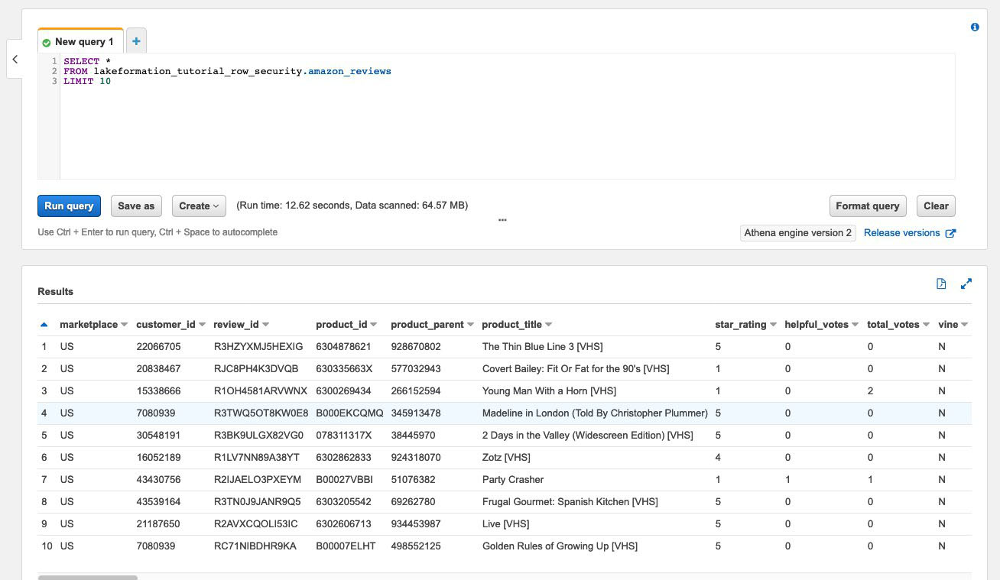
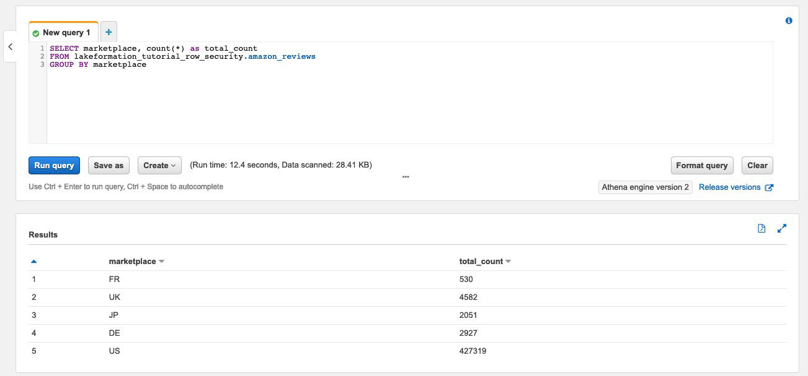
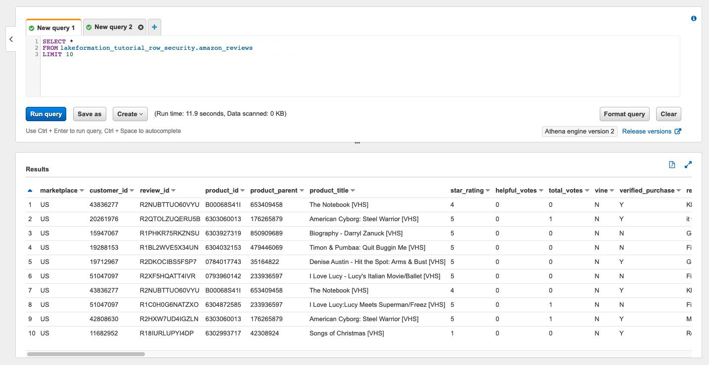

# Securing data lakes with row-level access control

AWS Lake Formation row-level permissions allow you to provide access to specific rows in a table
based on data compliance and governance policies. If you have large tables storing billions of
records, you need a way to enable different users and teams to access only the data they are
allowed to see. Row-level access control is a simple and performant way to protect data, while
giving users access to the data they need to perform their job. Lake Formation provides centralized
auditing and compliance reporting by identifying which principals accessed what data, when, and
through which services.

In this tutorial, you learn how row-level access controls work in Lake Formation, and how to set them up.

This tutorial includes an AWS CloudFormation template for quickly set up the required resources. You can review and customize it to suit your needs.

###### Topics

- [Intended audience](#tut-cbac-roles-tutorial "#tut-cbac-roles-tutorial")
- [Prerequisites](#tut-cbac-prereqs "#tut-cbac-prereqs")
- [Step 1: Provision your resources](#set-up-cbac-resources "#set-up-cbac-resources")
- [Step 2: Query without data filters](#query-without-filters "#query-without-filters")
- [Step 3: Set up data filters and grant permissions](#setup-data-filters "#setup-data-filters")
- [Step 4: Query with data filters](#query-with-filters "#query-with-filters")
- [Step 5: Clean up AWS resources](#cbac-clean-up "#cbac-clean-up")

## Intended audience

This tutorial is intended for data stewards, data engineers, and data analysts. The following table lists the roles and responsibilities of a data owner and a data consumer.

| Role                    | Description                                                                                                                                                                                                                                                                                                      |
| ----------------------- | ---------------------------------------------------------------------------------------------------------------------------------------------------------------------------------------------------------------------------------------------------------------------------------------------------------------- | --------------------------------------------------------------------------------------------------------------------------------------------------------------------------------------------------------------------------------------------------------------------------------------------------------------------------------------------------------------------------------------------------------------------------------------------------------------------------------------------------------------------------------------------------------------------------------------------------------------------------------------------------------------------------------------------------------------------------------------------------------------------------------------------------------------------------------------------------------------------------------------------------------------------------------------------------------------------------------------------------------------------------------------------------------------------------------------------------------------------------------------------------------------------------------------------------------------------------------------------------------------------------------------------------------------------------------------------------------------------------------------------------------------------------------------------------------------------------------------------------------------------------------------------------------------------------------------------------------------------------------------------------------------------------------------------------------------------------------------------------------------------------------------------------------------------------------------------------------------------------------------------------------------------------------------------------------------------------------------------------------------------------------------------------------------------------------------------------------------------------------------------------------------------------------------------------------------------------------------------------------------------------------------------------------------------------------------------------------------------------------------------------------------------------------------------------------------------------------------------------------------------------------------------------------------------------------------------------------------------------------------------------------------------------------------------------------------------------------------------------------------------------------------------------------------------------------------------------------------------------------------------------------------------------------------------------------------------------------------------------------------------------------------------------------------------------------------------------------------------------------------------------------------------------------------------------------------------------------------------------------------------------------------------------------------------------------------------------------------------------------------------------------------------------------------------------------------------------------------------------------------------------------------------------------------------------------------------------------------------------------------------------------------------------------------------------------------------------------------------------------------------------------------------------------------------------------------------------------------------------------------------------------------------------------------------------------------------------------------------------------------------------------------------------------------------------------------------------------------------------------------------------------------------------------------------------------------------------------------------------------------------------------------------------------------------------------------------------------------------------------------------------------------------------------------------------------------------------------------------------------------------------------------------------------------------------------------------------------------------------------------------------------------------------------------------------------------------------------------------------------------------------------------------------------------------------------------------------------------------------------------------------------------------------------------------------------------------------------------------------------------------------------------------------------------------------------------------------------------------------------------------------------------------------------------------------------------------------------------------------------------------------------------------------------------------------------------------------------------------------------------------------------------------------------------------------------------------------------------------------------------------------------------------------------------------------------------------------------------------------------------------------------------------------------------------------------------------------------------------------------------------------------------------------------------------------------------------------------------------------------------------------------------------------------------------------------------------------------------------------------------------------------------------------------------------------------------------------------------------------------------------------------------------------------------------------------------------------------------------------------------------------------------------------------------------------------------------------------------------------------------------------------------------------------------------------------------------------------------------------------------------------------------------------------------------------------------------------------------------------------------------------------------------------------------------------------------------------------------------------------------------------------------------------------------------------------------------------------------------------------------------------------------------------------------------------------------------------------------------------------------------------------------------------------------------------------------------------------------------------------------------------------------------------------------------------------------------------------------------------------------------------------------------------------------------------------------------------------------------------------------------------------------------------------------------------------------------------------------------------------------------------------------------------------------------------------------------------------------------------------------------------------------------------------------------------------------------------------------------------------------------------------------------------------------------------------------------------------------------------------------------------------------------------------------------------------------------------------------------------------------------------------------------------------------------------------------------------------------------------------------------------------------------------------------------------------------------------------------------------------------------------------------------------------------------------------------------------------------------------------------------------------------------------------------------------------------------------------------------------------------------------------------------------------------------------------------------------------------------------------------------------------------------------------------------------------------------------------------------------------------------------------------------------------------------------------------------------------------------------------------------------------------------------------------------------------------------------------------------------------------------------------------------------------------------------------------------------------------------------------------------------------------------------------------------------------------------------------------------------------------------------------------------------------------------------------------------------------------------------------------------------------------------------------------------------------------------------------------------------------------------------------------------------------------------------------------------------------------------------------------------------------------------------------------------------------------------------------------------------------------------------------------------------------------------------------------------------------------------------------------------------------------------------------------------------------------------------------------------------------------------------------------------------------------------------------------------------------------------------------------------------------------------------------------------------------------------------------------------------------------------------------------------------------------------------------------------------------------------------------------------------------------------------------------------------------------------------------------------------------------------------------------------------------------------------------------------------------------------- |
| IAM Administrator       | A user who can create users and roles and Amazon Simple Storage Service (Amazon S3) buckets. Has the `AdministratorAccess` AWS managed policy.                                                                                                                                                                   |
| Data lake administrator | A user responsible for setting up the data lake, creating data filters, and granting permissions to data analysts.                                                                                                                                                                                               |
| Data analyst            | A user who can run queries against the data lake. Data analysts residing in different countries (for our use case, the US and Japan) can only analyze product reviews for customers located in their own country and for compliance reasons, should not be able to see customer data located in other countries. | ## Prerequisites Before you start this tutorial, you must have an AWS account that you can use to sign in as an administrative user with correct permissions. For more information, see [Complete initial AWS configuration tasks](getting-started-setup.md#initial-aws-signup "getting-started-setup.md#initial-aws-signup"). The tutorial assumes that you are familiar with IAM. For information about IAM, see the [IAM User Guide](../../../IAM/latest/UserGuide/introduction.md "../../../IAM/latest/UserGuide/introduction.md"). ###### Change Lake Formation settings ###### Important Before launching the AWS CloudFormation template, disable the option **Use only IAM access control for new databases/tables** in Lake Formation by following the steps below: 1. Sign into the Lake Formation console at [https://console.aws.amazon.com/lakeformation/](https://console.aws.amazon.com/lakeformation/ "https://console.aws.amazon.com/lakeformation/") in the US East (N. Virginia) region or US West (Oregon) region. 2. Under Data Catalog, choose **Settings**. 3. Deselect **Use only IAM access control for new databases** and **Use only IAM access control for new tables in new databases**. 4. Choose **Save**. ## Step 1: Provision your resources This tutorial includes an AWS CloudFormation template for a quick setup. You can review and customize it to suit your needs. The AWS CloudFormation template generates the following resources:  • Users and policies for: + DataLakeAdmin + DataAnalystUS + DataAnalystJP  • Lake Formation data lake settings and permissions  • A Lambda function (for Lambda-backed AWS CloudFormation custom resources) used to copy sample data files from the public Amazon S3 bucket to your Amazon S3 bucket  • An Amazon S3 bucket to serve as our data lake  • An AWS Glue Data Catalog database, table, and partition ###### Create your resources Follow these steps to create your resources using the AWS CloudFormation template. 1. Sign into the AWS CloudFormation console at [https://console.aws.amazon.com/cloudformation](https://console.aws.amazon.com/cloudformation/ "https://console.aws.amazon.com/cloudformation/") in the US East (N. Virginia) region. 2. Choose [Launch Stack](https://console.aws.amazon.com/cloudformation/home?region=us-east-1#/stacks/create?templateURL=https://aws-bigdata-blog.s3.amazonaws.com/artifacts/lakeformation_row_security/lakeformation_tutorial_row_security.yaml "https://console.aws.amazon.com/cloudformation/home?region=us-east-1#/stacks/create?templateURL=https://aws-bigdata-blog.s3.amazonaws.com/artifacts/lakeformation_row_security/lakeformation_tutorial_row_security.yaml"). 3. Choose **Next** on the **Create stack** screen. 4. Enter a **Stack name.** 5. For **DatalakeAdminUserName** and **DatalakeAdminUserPassword**, enter your IAM user name and password for data lake admin user. 6. For **DataAnalystUsUserName** and **DataAnalystUsUserPassword**, enter the user name and password for user name and password you want for the data analyst user who is responsible for the US marketplace. 7. For **DataAnalystJpUserName** and **DataAnalystJpUserPassword**, enter the user name and password for user name and password you want for the data analyst user who is responsible for the Japanese marketplace. 8. For **DataLakeBucketName**, enter the name of your data bucket. 9. For **DatabaseName**, and **TableName** leave as the default. 10. Choose **Next** 11. On the next page, choose **Next**. 12. Review the details on the final page and select **I acknowledge that AWS CloudFormation might create IAM resources.** 13. Choose **Create**. The stack creation can take one minute to complete. ## Step 2: Query without data filters After you set up the environment, you can query the product reviews table. First query the table without row-level access controls to make sure you can see the data. If you are running queries in Amazon Athena for the first time, you need to configure the query result location. ###### Query the table without row-level access control 1. Sign into Athena console at [https://console.aws.amazon.com/athena/](https://console.aws.amazon.com/athena/home "https://console.aws.amazon.com/athena/home") as the `DatalakeAdmin` user, and run the following query: `SELECT * FROM lakeformation_tutorial_row_security.amazon_reviews LIMIT 10` The following screenshot shows the query result. This table has only one partition, `product_category=Video`, so each record is a review comment for a video product.  2. Next, run an aggregation query to retrieve the total number of records per `marketplace`. `SELECT marketplace, count(*) as total_count FROM lakeformation_tutorial_row_security.amazon_reviews GROUP BY marketplace` The following screenshot shows the query result. The `marketplace` column has five different values. In the subsequent steps, you will set up row-based filters using the `marketplace` column.  ## Step 3: Set up data filters and grant permissions This tutorial uses two data analysts: one responsible for the US marketplace and another for the Japanese marketplace. Each analyst uses Athena to analyze customer reviews for their specific marketplace only. Create two different data filters, one for the analyst responsible for the US marketplace, and another for the one responsible for the Japanese marketplace. Then, grant the analysts their respective permissions. ###### Create data filters and grant permissions 1. Create a filter to restrict access to the `US` `marketplace` data. 1. Sign into the Lake Formation console at [https://console.aws.amazon.com/lakeformation/](https://console.aws.amazon.com/lakeformation/ "https://console.aws.amazon.com/lakeformation/") in US East (N. Virginia) region as the `DatalakeAdmin` user. 2. Choose **Data filters**. 3. Choose **Create new filter**. 4. For **Data filter name**, enter `amazon_reviews_US`. 5. For **Target database**, choose the database `lakeformation_tutorial_row_security`. 6. For **Target table**, choose the table `amazon_reviews`. 7. For **Column-level access**, leave as the default. 8. For **Row filter expression**, enter `marketplace='US'`. 9. Choose **Create filter**. 2. Create a filter to restrict access to the Japanese `marketplace` data. 1. On the **Data filters** page, choose **Create new filter**. 2. For **Data filter name**, enter `amazon_reviews_JP`. 3. For **Target database**, choose the database `lakeformation_tutorial_row_security`. 4. For **Target table**, choose the `table amazon_reviews`. 5. For **Column-level access**, leave as the default. 6. For Row filter expression, enter `marketplace='JP'`. 7. Choose **Create filter**. 3. Next, grant permissions to the data analysts using these data filters. Follow these steps to grant permissions to the US data analyst (`DataAnalystUS`): 1. Under **Permissions**, choose **Data lake permissions**. 2. Under **Data permission**, choose **Grant**. 3. For **Principals**, choose **IAM users and roles**, and select the role `DataAnalystUS`. 4. For **LF tags or catalog resources**, choose **Named data catalog resources**. 5. For **Database**, choose `lakeformation_tutorial_row_security`. 6. For **Tables-optional**, choose `amazon_reviews`. 7. For **Data filters – optional**¸ select `amazon_reviews_US`. 8. For **Data filter permissions**, select **Select**. 9. Choose **Grant**. 4. Follow these steps to grant permissions to the Japanese data analyst (`DataAnalystJP`): 1. Under **Permissions**, choose **Data lake permissions**. 2. Under **Data permission**, choose **Grant**. 3. For **Principals**, choose **IAM users and roles**, and select the role `DataAnalystJP`. 4. For **LF tags or catalog resources**, choose **Named data catalog resources**. 5. For **Database**, choose `lakeformation_tutorial_row_security`. 6. For **Tables-optional**, choose `amazon_reviews`. 7. For **Data filters – optional**¸ select `amazon_reviews_JP`. 8. For **Data filter permissions**, select **Select**. 9. Choose **Grant**. ## Step 4: Query with data filters With the data filters attached to the product reviews table, run some queries and see how permissions are enforced by Lake Formation. 1. Sign into the Athena console at [https://console.aws.amazon.com/athena/](https://console.aws.amazon.com/athena/home "https://console.aws.amazon.com/athena/home") as the `DataAnalystUS` user. 2. Run the following query to retrieve a few records, which are filtered based on the row-level permissions we defined: `SELECT * FROM lakeformation_tutorial_row_security.amazon_reviews LIMIT 10` The following screenshot shows the query result.  3. Similarly, run a query to count the total number of records per marketplace. `SELECT marketplace , count ( * ) as total_count FROM lakeformation_tutorial_row_security .amazon_reviews GROUP BY marketplace` The query result only shows the `marketplace` `US` in the results. This is because the user is only allowed to see rows where the `marketplace` column value is equal to `US`. 4. Switch to the `DataAnalystJP` user and run the same query. `SELECT * FROM lakeformation_tutorial_row_security.amazon_reviews LIMIT 10` The query result shows only the records belong to the `JP` `marketplace`. 5. Run the query to count the total number of records per `marketplace`. `SELECT marketplace, count(*) as total_count FROM lakeformation_tutorial_row_security.amazon_reviews GROUP BY marketplace` The query result shows only the row belonging to the `JP` `marketplace`. ## Step 5: Clean up AWS resources ###### Clean up resources To prevent unwanted charges to your AWS account, you can delete the AWS resources that you used for this tutorial.  • [Delete the cloud formation stack](../../../AWSCloudFormation/latest/UserGuide/cfn-console-delete-stack.md "../../../AWSCloudFormation/latest/UserGuide/cfn-console-delete-stack.md"). |
