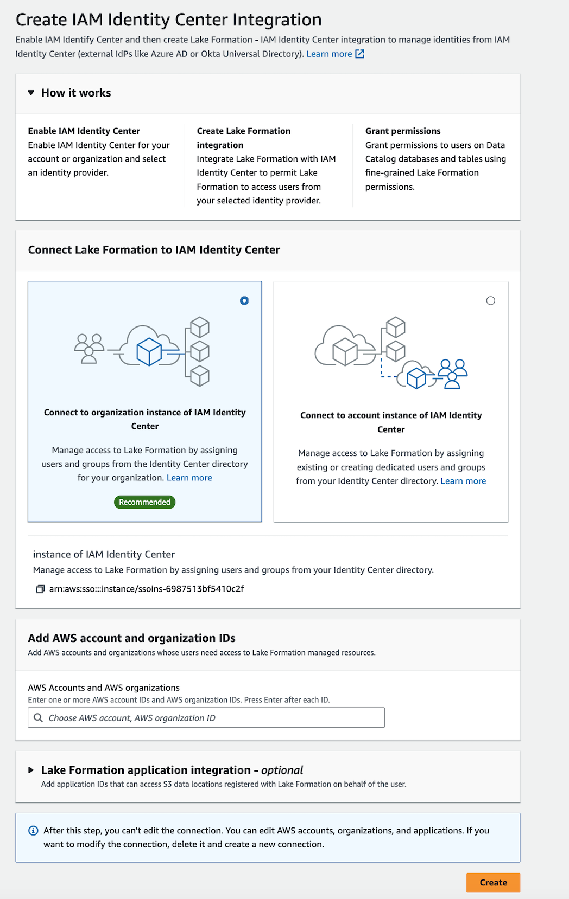

# Connecting Lake Formation with IAM Identity Center

Before you can use IAM Identity Center to manage identities to grant access to Data Catalog resources using Lake Formation,
you must complete the following steps. You can create the IAM Identity Center integration using the Lake Formation console or AWS CLI.

AWS Management Console

###### To connect Lake Formation with IAM Identity Center

1. Sign in to the AWS Management Console, and open the Lake Formation console at [https://console.aws.amazon.com/lakeformation/](https://console.aws.amazon.com/lakeformation/ "https://console.aws.amazon.com/lakeformation/").
2. In the left navigation pane, select **IAM Identity Center integration**.

 3. (Optional) Enter one or more valid AWS account IDs, organization IDs, and/or organizational
unit IDs to allow external accounts to access the Data Catalog resources.
When IAM Identity Center users or groups try to access Lake Formation managed Data Catalog
resources, Lake Formation assumes an IAM role to authorize metadata access.
If the IAM role belongs to an external account that does not have
an AWS Glue resource policy and an AWS RAM resource share, the IAM Identity Center
users and groups won't be able to access the resource even if
they've Lake Formation permissions.

Lake Formation uses the AWS Resource Access Manager (AWS RAM) service to share the resource with external accounts and organizations. AWS RAM sends an invitation to the grantee account to accept or reject the resource share.

For more information, see [Accepting a resource share invitation from AWS RAM](accepting-ram-invite.md "accepting-ram-invite.md").

###### Note

Lake Formation permits IAM roles from external accounts to act as carrier roles on behalf of IAM Identity Center users and groups for accessing Data Catalog
resources, but permissions can only be granted on Data Catalog
resources within the owning account. If you try to grant
permissions to IAM Identity Center users and groups on Data Catalog resources in an external account, Lake Formation throws the
following error - "Cross-account grants are not supported for
the principal." 4. (Optional) On the **Create Lake Formation integration** screen, specify the
ARNs of third-party applications that can access data in Amazon S3 locations
registered with Lake Formation. Lake Formation vends scoped-down temporary credentials in the form of AWS STS tokens to registered Amazon S3 locations based on the effective permissions, so that authorized applications can access data on behalf of users. 5. Select **Submit**.

After the Lake Formation administrator finishes the steps and creates the
integration, the IAM Identity Center properties appear in the Lake Formation console.
Completing these tasks makes Lake Formation an IAM Identity Center enabled application. The
properties in the console include the integration status. The
integration status says `Success` when it's completed.
This status indicates if IAM Identity Center configuration is completed.

AWS CLI

- The following example shows how to create Lake Formation
  integration with IAM Identity Center. You can also specify the `Status`
  (`ENABLED`, `DISABLED`) of the
  applications.

```
aws lakeformation create-lake-formation-identity-center-configuration \
    --catalog-id `<123456789012>` \
    --instance-arn `<arn:aws:sso:::instance/ssoins-112111f12ca1122p>` \
    --share-recipients '[{"DataLakePrincipalIdentifier": "`<123456789012>`"},
                        {"DataLakePrincipalIdentifier": "`<555555555555>`"}]' \
    --external-filtering '{"AuthorizedTargets": ["`<app arn1>`", "`<app arn2>`"], "Status": "ENABLED"}'

```

- The following example shows how to view a Lake Formation
  integration with IAM Identity Center.

```
aws lakeformation describe-lake-formation-identity-center-configuration
 --catalog-id `<123456789012>`

```
