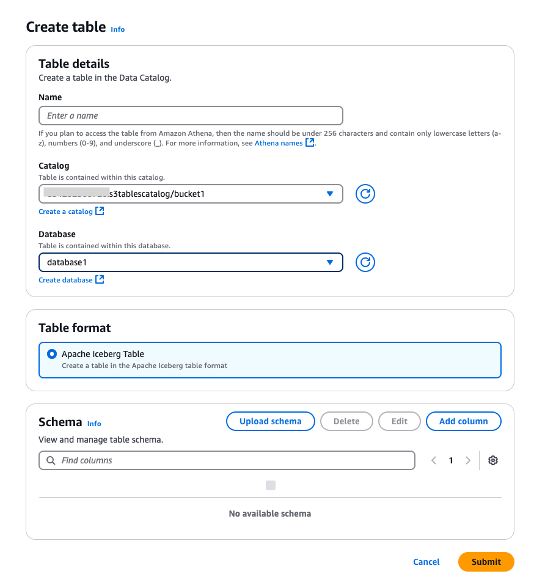

# Creating databases and tables in the S3 tables catalog

You can create databases to organize your Apache Iceberg tables, and tables to define the schema and location of your data in the S3 tables catalog.

1.  Open the Lake Formation console at [https://console.aws.amazon.com/lakeformation/](https://console.aws.amazon.com/lakeformation/ "https://console.aws.amazon.com/lakeformation/"), and sign in as a data lake administrator or database creator.
2.  In the navigation pane, choose **Databases** under **Data Catalog**.
3.  Choose **Create database**.
4.  On the **Create database** page, choose the **Database** option, and enter the following details:

        * **Name** – A unique name for the
         database
        * **Data catalog** – Choose the S3 tables
         catalog. The database will reside in this catalog.
        * **Description** –(Optional) Add a
         description and location.
        * **IAM access control for new tables** –
         Optionally select Use only IAM access control for new tables in this database. For
         information about this option, see the [Changing the default settings for your data lake](change-settings.md "change-settings.md") section.
        * Choose **Create database**.You can see the database created under the S3 tables catalog.

    The following CLI command shows how to create a database in the S3 tables catalog.

```
aws glue create-database
--region us-east-1 \
--catalog-id "123456789012:s3tablescatalog/test" \
--database-input \
 '{ "Name": "testglueclidbcreation" }'
```

You can create Apache Iceberg metadata tables in the S3 tables catalog using Lake Formation console or the AWS Glue `CreateTable` API.

1. Open the Lake Formation console at [https://console.aws.amazon.com/lakeformation/](https://console.aws.amazon.com/lakeformation/ "https://console.aws.amazon.com/lakeformation/"), and sign in as a data lake administrator or a user with `CreateTable` permission.
2. In the navigation pane, choose **Tables** under Data Catalog.
3. Choose Create table.
4. On the **Create table** page, enter the table details:



    * **Name** – Enter a unique name for the
     table.
    * **Catalog** – Choose the S3 tables
     catalog as the catalog.
    * **Database** – Choose the database under
     the S3 tables catalog.
    * **Description** – Enter a description for the
     table.
    * **Schema** – Choose Add columns to add columns and data
     types of the columns. You have the option to create an empty table and update the
     schema later. Iceberg allows you to evolve schema and partition after you create
     the table. You can use Athena queries to update the table schema and Spark queries
     for updating partitions.

5. Choose **Submit**.

```
aws glue create-table \
--database-name "testglueclidbcreation" \
--catalog-id "123456789012:s3tablescatalog/test" \
--region us-east-1 \
--table-input \
'{ "Name": "testtablegluecli", "Parameters": { "format": "ICEBERG" }, "StorageDescriptor": { "Columns": [ {"Name": "x", "Type": "int", "Parameters": {"required": "true"}} ] } }'

```
