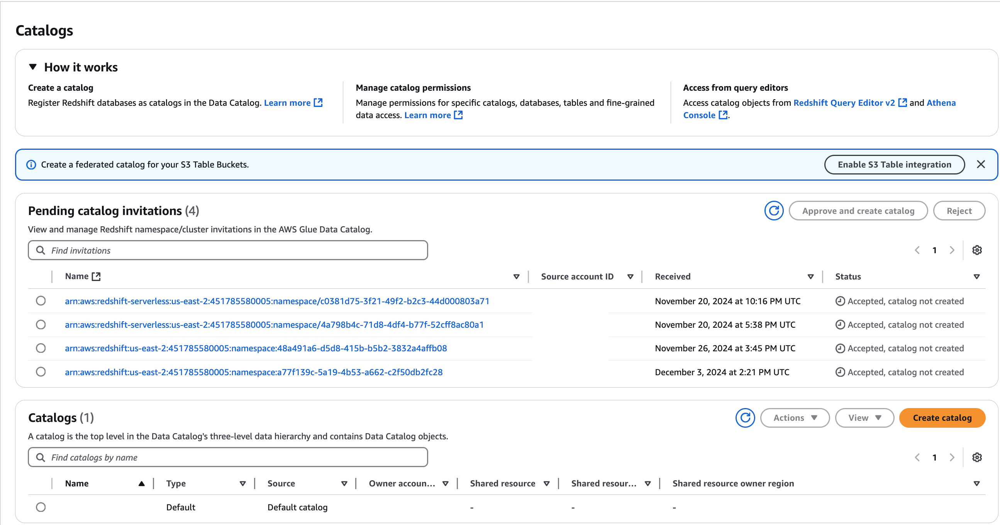
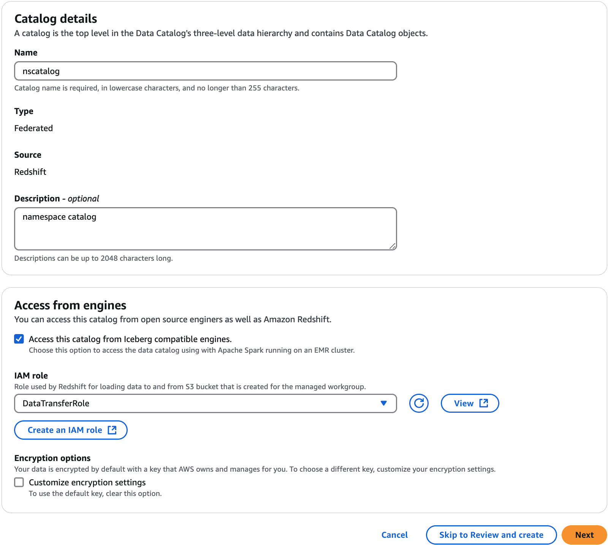

# Creating Amazon Redshift federated catalogs

This topic describes the steps you need to follow to accept a cluster or namespace
invitation, create a federated multi-level catalog, and grant permissions to other principals.
You can complete these tasks using the Lake Formation console, the AWS Command Line Interface (AWS CLI), or APIs/SDKs. The
examples in this topic show the producer cluster/namespace, the Data Catalog, and the data consumer
in the same account.

To learn more about Lake Formation cross-account capabilities, see [Cross-account data sharing in Lake Formation](cross-account-permissions.md "cross-account-permissions.md").

###### To manage a Amazon Redshift namespace in the Data Catalog

1. Review a namespace invitation and accept it.

Console

    1. Sign in to the Lake Formation console as a data lake administrator at
     [https://console.aws.amazon.com/lakeformation/](https://console.aws.amazon.com/lakeformation/ "https://console.aws.amazon.com/lakeformation/"). Navigate to the **Catalogs** page under
     **Data Catalog**.
    2. Review the namespace invitation that you're authorized to access. The
     **Status** column indicates your current participation status
     for the namespace. The **Not accepted** status indicates that you
     have been added to the namespace, but you have not yet accepted it or have
     rejected the invitation.


    
    3. To respond to a namespace or cluster invitation, select the invitation name
     and choose **Review invitation**. In **Accept or reject
     invitation**, review the invitation details. Choose
     **Accept** to accept the invitation or
     **Reject** to decline the invitation. You don't get access to
     the namespace if you reject the invitation.

AWS CLI
The following examples show how to view, accept, and register the invitation.
Replace the AWS account ID with a valid AWS account ID. Replace the
`data-share-arn` with the actual Amazon Resource Name (ARN) that
references the namespace.

    1. View a pending invitation.


    ```
    aws redshift describe-data-shares \
     --data-share-arn 'arn:aws:redshift:us-east-1:123456789012:datashare:abcd1234-1234-ab12-cd34-1a2b3c4d5e6f/ds_internal_namespace' \
    ```
    2. Accept an invitation.


    ```
     aws redshift associate-data-share-consumer \
     --data-share-arn 'arn:aws:redshift:us-east-1:123456789012:datashare:abcd1234-1234-ab12-cd34-1a2b3c4d5e6f/ds_internal_namespace' \
     --consumer-arn 'arn:aws:glue:us-east-1:123456789012:catalog'
    ```
    3. Register the cluster or namespace in the Lake Formation account. Use the [RegisterResource](../APIReference/API_RegisterResource.md "../APIReference/API_RegisterResource.md") API operation to register the datashare in Lake Formation.
     `DataShareArn` is the input parameter for
     `ResourceArn`.


    ###### Note

    This is a mandatory step.


    ```
    aws lakeformation register-resource \
     --resource-arn 'arn:aws:redshift:us-east-1:123456789012:datashare:abcd1234-1234-ab12-cd34-1a2b3c4d5e6f/ds_internal_namespace'
    ```

2. Create a federated catalog.

After you’ve accepted an invitation, you need to create a federated catalog in the Data Catalog that
maps the objects in the Amazon Redshift namespace to the Data Catalog. You must be a data lake administrator or a user or
role that has required permissions to create a catalog.

Console

    1. After accepting the namespace **Invitation**, the
     **Set catalog details** page is displayed.
    2. On the **Set catalog details** page, enter a unique name
     for the catalog. Use lower case for catalog names. Catalog names must be less
     than or equal to 255 characters long. You use this identifier for mapping the
     namespace internally in the metadata hierarchy (catalogid.dbName.schema.table).
    3. Enter a description for the catalog. Description must be less than or equal to 2048 characters long.
    4. Next, choose the **Access this catalog from Iceberg compatible engines**
     check box to enable accessing the Amazon Redshift resources using Apache Iceberg compatible
     analytical engines such as Athena and Apache Spark on Amazon EMR.


    You don't need to enable data lake access to access the federated catalogs using Amazon Redshift.


    
    5. To enable these query engines to read and write to Amazon Redshift namespaces, AWS Glue creates
     a managed Amazon Redshift cluster with the compute and storage resources required to
     perform read and write operations without impacting Amazon Redshift data warehouse
     workloads.


    You also need to provide an IAM role with the permissions required
     to transfer data to and from the Amazon S3 bucket.
    6. By default, the data in the Amazon Redshift cluster is encrypted using an AWS managed key. Lake Formation provides
     an option to create your custom KMS key for encryption. If you're using a
     customer managed key, you must add specific key policies to the key.


     Choose the **Customize encryption settings** if you're using a customer managed key
     to encrypt the data in the Amazon Redshift cluster/namespace. To use a custom key, you must
     add additional custom managed key policy to your KMS key. For more information,
     see [Prerequisites for managing Amazon Redshift namespaces in the AWS Glue Data Catalog](redshift-ns-prereqs.md "redshift-ns-prereqs.md").

AWS CLI

Use the following example code to create a catalog with the Amazon Redshift data published
to the Data Catalog using the AWS CLI.

```
aws glue create-catalog
--cli-input-json \
'{
    "Name": "nscatalog",
    "CatalogInput": {
        "Description": "Redshift federated catalog",
        "CreateDatabaseDefaultPermissions" : [],
        "CreateTableDefaultPermissions": [],
        "FederatedCatalog": {
            "Identifier": "arn:aws:redshift:us-east-1:123456789012:datashare:`11524d7f-f56d-45fe-83f7-d7bb0a4d6d71`/ds_internal_namespace",
            "ConnectionName": "aws:redshift"
        },
        "CatalogProperties": {
          "DataLakeAccessProperties" : {
            "DataLakeAccess" : true,
            "DataTransferRole" : "arn:aws:iam::123456789012:role/`DataTransferRole`"
         }
       }
    }
}'
```

3. Grant permissions to users in your account or in external accounts.

AWS Management Console

    1. Choose **Next** to grant permissions to other users on the
     shared catalogs, databases, and tables.
    2. On the **Add permissions** screen, choose the principals and the types of permissions to grant.


    


    	1. In the **Principals** section, choose a principal type and then specify principals to grant permissions.


    		* **IAM users and roles** –
    		 Choose one or more users or roles from the IAM users and roles
    		 list.
    		* **SAML users and groups** –
    		 For SAML and Amazon Quick Suite users and groups, enter one or
    		 more Amazon Resource Names (ARNs) for users or groups federated through
    		 SAML, or ARNs for Amazon Quick Suite users or groups. Press
    		 **Enter** after each ARN.


    		For information about how to construct the ARNs, see AWS CLI grant and revoke AWS CLI commands.
    		* **External accounts** – For
    		 AWS, AWS organization, or IAM Principal enter one or more valid
    		 AWS account IDs, organization IDs, organizational unit IDs, or ARN for
    		 the IAM user or role. Press Enter after each ID. An organization ID
    		 consists of "o-" followed by 10–32 lower-case letters or digits. An
    		 organizational unit ID starts with "ou-" followed by 4–32 lowercase
    		 letters or digits (the ID of the root that contains the OU). This string
    		 is followed by a second "-" dash and 8 to 32 additional lowercase
    		 letters or digits.
    	2. In the **Permissions** section, select permissions and grantable permissions.


    	Under **Catalog permissions**, select one
    	 or more permissions to grant. Under **Grantable
    	 permissions**, select the permissions that the grant recipient
    	 can grant to other principals in their AWS account. This option is not
    	 supported when you are granting permissions to an IAM principal from an
    	 external account.


    	Choose **Super user** to grant the user
    	 unrestricted permissions to the resources (databases, tables, views) within
    	 the catalog.
    3. Choose **Add**.

AWS CLI
Use the following examples to grant catalog, database, and table permissions
using the AWS CLI:

    * The following example shows how to grant permissions on the federated
     catalog.


    ```
    aws lakeformation grant-permissions
     --cli-input-cli-json \
       '{
             "Principal": {
                  "DataLakePrincipalIdentifier": "arn:aws:iam::123456789012:role/non-admin"
              },
              "Resource": {
                   "Catalog": {
                         "Id": "123456789012:nscatalog"
                    }
                },
                "Permissions": [
                       "DESCRIBE","CREATE_CATALOG"
                 ],
                "PermissionsWithGrantOption": [
                 ]
        }'
    ```
    * Use the following example to grant permissions on a database.


    ```
    aws lakeformation grant-permissions \
      --cli-input-json \
              '{
                  "Principal": {
                      "DataLakePrincipalIdentifier": `"arn:aws:iam::123456789012:role/non-admin"`
                  },
                  "Resource": {
                      "Database": {
                          "CatalogId": `"123456789012:nscatalog/dev"`,
                          "Name": `"public"`
                      }
                  },
                  "Permissions": [
                      "ALL"
                  ]
              }'
    ```
    * The following example shows how to grant permissions on a table in the Amazon Redshift
     database.


    ```
    aws lakeformation grant-permissions \
      --cli-input-json \
            '{
                "Principal": {
                    "DataLakePrincipalIdentifier": `"arn:aws:iam::123456789012:role/non-admin"`
                },
                "Resource": {
                    "Table": {
                        "CatalogId": `"123456789012:nscatalog2/dev"`,
                        "DatabaseName": `"public"`,
                        "TableWildcard" : {}
                    }
                },
                "Permissions": [
                    "ALL"
                ]
            }'
    ```

4. Choose **Next** to review the catalog details and create a federated catalog.
   The newly created federated catalog and the catalog objects appear in the
   **Catalogs** page.

An Amazon Redshift federated catalog is referenced with `catalogID = 
 123456789012:Redshift-federated catalog id`.
