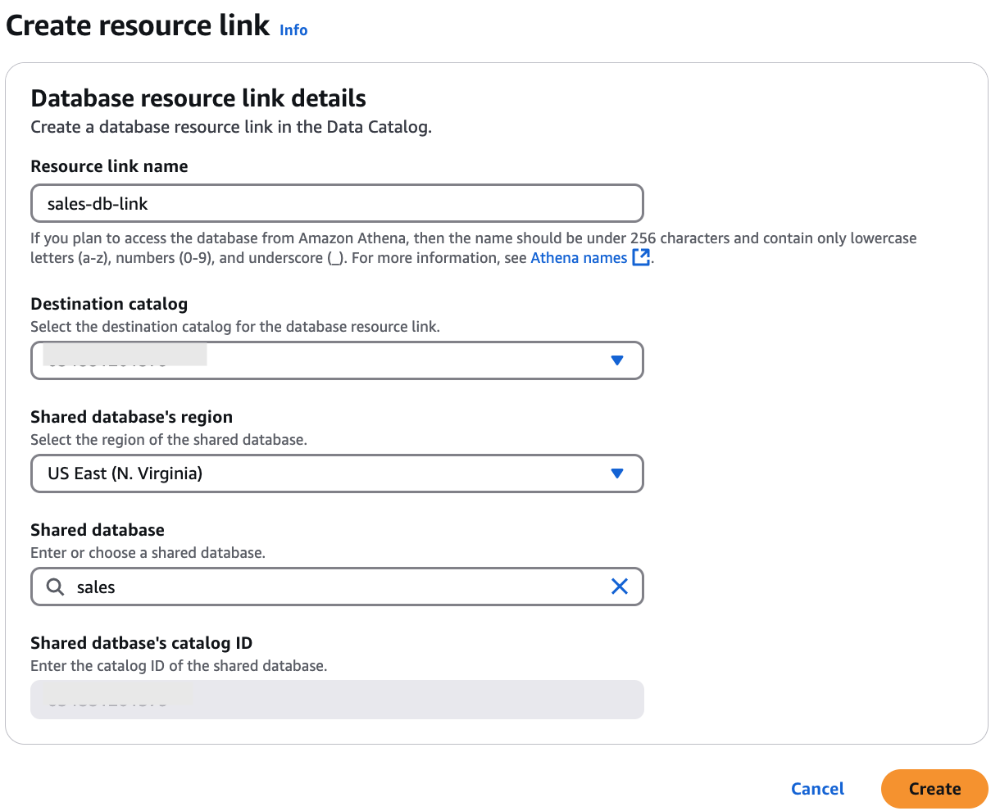

# Creating a resource link to a shared Data Catalog

database

You can create a resource link to a shared database by using the AWS Lake Formation console, API, or
AWS Command Line Interface (AWS CLI).

###### To create a resource link to a shared database (console)

1. Open the AWS Lake Formation console at [https://console.aws.amazon.com/lakeformation/](https://console.aws.amazon.com/lakeformation/ "https://console.aws.amazon.com/lakeformation/"). Sign in as a data lake
   administrator or as a database creator.

A database creator is a principal who has been granted the Lake Formation
`CREATE_DATABASE` permission. 2. In the navigation pane, choose **Databases**, and then choose
**Create**, **Resource link**. 3. On the **Create resource link** page, provide the following information:

**Resource link name**

Enter a name that adheres to the same rules as a database name. The name can be
the same as the target shared database.

**Destination catalog**
Select the destination catalog for the database resource link.

**Shared database owner Region**
If you are creating the resource link in a different Region, select the Region of the target shared database.

**Shared database**

Choose a database from the list, or enter a local (owned) or shared database
name.

The list contains all the databases shared with your account. Note the owner
account ID that is listed with each database. If you don't see a database that you
know was shared with your account, check the following:

    * If you aren't a data lake administrator, check that the data lake
     administrator granted you Lake Formation permissions on the database.
    * If you are a data lake administrator, and your account is not in the same
     AWS organization as the granting account, ensure that you have accepted the
     AWS Resource Access Manager (AWS RAM) resource share invitation for the database. For more
     information, see [Accepting a resource share invitation from AWS RAM](accepting-ram-invite.md "accepting-ram-invite.md").

**Shared database owner**

If you selected a shared database from the list, this field is populated with
the shared database's owner account ID. Otherwise, enter your AWS account ID (for
a resource link to a local database) or the ID of the AWS account that shared the
database.

**Shared database's catalog ID**
Enter the catalog ID for the shared database. When creating a resource link to a databse that's shared from another AWS
account, you need to specify this catalog ID to identify which account's
Data Catalog contains the source database.

When you select a shared database from the dropdown menu, the system
automatically fills in the catalog ID of the account
that owns and has shared that database with you.

 4. Choose **Create** to create the resource link.

You can then view the resource link name under the **Name** column on
the **Databases** page. 5. (Optional) Grant the Lake Formation `DESCRIBE` permission on the resource link to
principals from the Europe (Ireland) Region that must be able to view the link and
access the target database.

However, granting permissions on a resource link doesn't grant permissions on the
target (linked) database or table. You must grant permissions on the target database
separately for the table/resource link to be visible in Athena.

###### To create a resource link to a shared database in the same Region(AWS CLI)

1. Enter a command similar to the following.

```
aws glue create-database --database-input '{"Name":"myissues","TargetDatabase":{"CatalogId":"111122223333","DatabaseName":"issues"}}'

```

This command creates a resource link named `myissues` to the shared
database `issues`, which is in the AWS account 1111-2222-3333. 2. (Optional) Grant the Lake Formation `DESCRIBE` permission to principals on the
resource link that must be able to view the link and access the target database or table.

However, granting permissions on a resource link doesn't grant permissions on the
target (linked) database or table. You must grant permissions on the target database
separately for the table/resource link to be visible in Athena.

###### To create a resource link to a shared database in a different Region(AWS CLI)

1. Enter a command similar to the following.

```
aws glue create-database --region eu-west-1 --cli-input-json '{
    "CatalogId": "111122223333",
    "DatabaseInput": {
      "Name": "rl_useast1shared_irelanddb",
      "TargetDatabase": {
          "CatalogId": "444455556666",
          "DatabaseName": "useast1shared_db",
          "Region": "us-east-1"
       }
    }
}'
```

This command creates a resource link named `rl_useast1shared_irelanddb` in the AWS account 111122223333 in the Europe (Ireland) Region to
the shared database `useast1shared_db`, which is in the AWS account
444455556666 in the US East (N. Virginia) Region. 2. Grant the Lake Formation `DESCRIBE` permission to principals from the
Europe (Ireland) Region that must be able to view the link and access the link target
through the link.

###### See also:

- [How resource links work in Lake Formation](resource-links-about.md "resource-links-about.md")
- [DESCRIBE](lf-permissions-reference.md#perm-describe "lf-permissions-reference.md#perm-describe")
