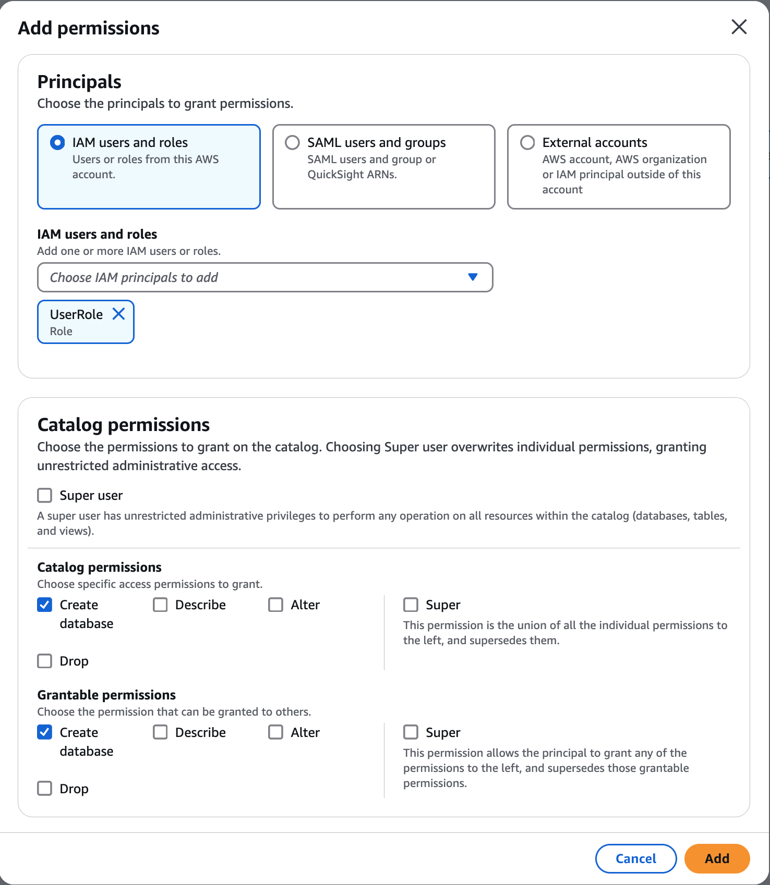

# Creating an Amazon Redshift managed catalog in the AWS Glue Data Catalog

You might not have an Amazon Redshift producer cluster or an Amazon Redshift datashare available today, but want to
create and manage Amazon Redshift tables using the AWS Glue Data Catalog. You can get started by creating an AWS Glue
managed catalog using the `glue:CreateCatalog` API or the AWS Lake Formation console by setting
the catalog type as `Managed` and `Catalog source` as **Redshift.** This step does the following:

- Creates a catalog in the Data Catalog
- Registers the catalog as a Lake Formation data location
- creates an Amazon Redshift managed serverless-workgroup
- Links Amazon Redshift serverless workgroup and Data Catalog using a datashare object

###### To create a managed catalog and set up permissions (console)

1. Open the Lake Formation console at [https://console.aws.amazon.com/lakeformation/](https://console.aws.amazon.com/lakeformation/ "https://console.aws.amazon.com/lakeformation/").
2. In the navigation pane, choose **Catalogs** under **Data
   Catalog**.
3. Select the option **Create catalog**.
4. On the **Set Catalog** details page, enter the following information:
   - **Name** – A unique name for your managed catalog. The name can't be changed, and must be in lower case. The name can
     consist of a maximum of 255 characters maximum.
     account.
   - **Type** – Choose `Managed catalog` as the catalog type.
   - **Storage** – Choose `Redshift` for storage.
   - **Description** – Enter a description for the catalog created from the data source.

5. You can use Apache Spark applications running on Amazon EMR on Amazon EC2 to access the Amazon Redshift
   databases in the AWS Glue Data Catalog.

To enable Apache Spark to read and write to Amazon Redshift managed storage, AWS Glue
creates a managed Amazon Redshift cluster with the compute and storage resources required to perform
read and write operations without impacting Amazon Redshift data warehouse workloads. You also need to
provide an IAM role with the permissions required to transfer data to and from the Amazon S3
bucket. For the permissions required for the data transfer role, see step 5 in the [Prerequisites for managing Amazon Redshift namespaces in the AWS Glue Data Catalog](redshift-ns-prereqs.md "redshift-ns-prereqs.md") section. 6. By default, the data in the Amazon Redshift cluster is encrypted using an AWS managed key. Lake Formation provides
an option to create your custom KMS key for encryption. If you're using a
customer managed key, you must add specific key policies to the key. 7. Choose the Customize encryption settings if you're using a customer
managed key to encrypt the data in the Amazon Redshift managed storage. To use a custom key, you must
add additional custom managed key policy to your KMS key. For more information, see [Prerequisites for managing Amazon Redshift namespaces in the AWS Glue Data Catalog](redshift-ns-prereqs.md "redshift-ns-prereqs.md"). 8. **Encryption options**
– Choose **Customize encryption settings** option if you want to use a custom key to encrypt the catalog.
To use a custom key, you must add additional custom managed key policy to your KMS key. 9. Choose **Next** to grant permissions to other principals. 10. On the **Grant permissions** page, choose **Add permissions**. 11. On the **Add permissions** screen, choose the principals and the types of permissions to grant.



    * In the **Principals** section, choose a principal type and then specify principals to grant permissions.


    	+ **IAM users and roles** –
    	 Choose one or more users or roles from the IAM users and roles
    	 list.
    	+ **SAML users and groups** –
    	 For SAML and Amazon Quick Suite users and groups, enter one or
    	 more Amazon Resource Names (ARNs) for users or groups federated through
    	 SAML, or ARNs for Amazon Quick Suite users or groups. Press
    	 **Enter** after each ARN.


    	For information about how to construct the ARNs, see AWS CLI grant and revoke AWS CLI commands.
    * In the **Permissions** section, select permissions and grantable permissions.


    Under **Catalog permissions**, select one
     or more permissions to grant.


    Choose **Super user** to grant unrestricted administrative permissions on all resources within the catalog.


     Under **Grantable permissions**, select the permissions that the grant recipient
     can grant to other principals in their AWS account. This option is not
     supported when you are granting permissions to an IAM principal from an
     external account.

12. Choose **Next** to review the information and create the catalog. The **Catalogs** list shows the new managed catalog.

###### To create a federated catalog (CLI)

- The following example shows how to create a federated catalog.

```
aws glue create-catalog --cli-input-json file://input.json

{
    "Name": `"CatalogName"`,
    "CatalogInput": {
      "Description": `"Redshift published Catalog"`,
      "CreateDatabaseDefaultPermissions" : [],
      "CreateTableDefaultPermissions": [],
      "CatalogProperties": {
        "DataLakeAccessProperties" : {
          "DataLakeAccess" : "true",
          "DataTransferRole" : `"DTR arn"`,
          "KMSKey": `"kms key arn"`,  // Optional
          "CatalogType": "aws:redshift"
        }
      }
    }
}

```

Glue get-catalog response

```
aws glue get-catalog \
  --catalog-id `account-id`:`catalog-name` \
  --region `us-east-1`

Response:
{
    "Catalog": {
        "Name": "CatalogName",
        "Description": "Glue Catalog for Redshift z-etl use case",
        "CreateDatabaseDefaultPermissions" : [],
        "CreateTableDefaultPermissions": [],
         "CatalogProperties": {
          "DataLakeAccessProperties" : {
            "DataLakeAccess": "true",
            "DataTransferRole": "DTR arn",
            "KMSKey": "kms key arn",
            "ManagedWorkgroupName": "MWG name",
            "ManagedWorkgroupStatus": "MWG status",
            "RedshiftDatabaseName": "RS db name",
            "NamespaceArn": "namespace key arn",
            "CatalogType": "aws:redshift"
         }
       }
    }
```
