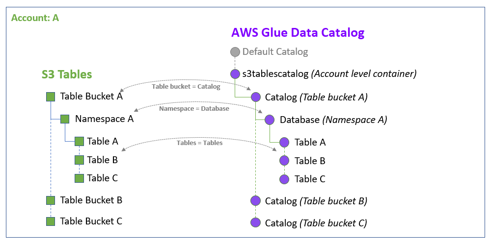

# Creating an Amazon S3 Tables catalog in the AWS Glue Data Catalog

[Amazon S3
Tables](../../../AmazonS3/latest/userguide/s3-tables.md "../../../AmazonS3/latest/userguide/s3-tables.md") provide S3 storage that's specifically optimized for analytics workloads,
improving query performance while reducing costs. The data in S3 Tables is stored in a new
bucket type: a _table bucket_, which stores tables as
subresources. S3 tables have built-in support for Apache Iceberg standard, which allows you to
easily query tabular data in Amazon S3 table buckets using popular query engines like Apache
Spark.

You can integrate Amazon S3 table buckets and tables with AWS Glue Data Catalog (Data Catalog), and register
the catalog as a Lake Formation data location from the Lake Formation console or using service APIs. When your
organization manages data in the Data Catalog, and register the data location with Lake Formation, you can
use Lake Formation to control access to your datasets.

You can apply Lake Formation permissions using tag-based access control and the named
resource method on the federated databases, and share them across multiple AWS accounts, AWS
Organizations, and organizational units (OUs). You can also share the federated databases
directly with IAM principals from another account.

For more information, see [Using Amazon S3 Tables with AWS
analytics services](../../../AmazonS3/latest/userguide/s3-tables-integrating-aws.md "../../../AmazonS3/latest/userguide/s3-tables-integrating-aws.md") in the Amazon Simple Storage Service User Guide.

###### Topics

- [How Data Catalog and Lake Formation integration works](#w76aac13c25c15 "#w76aac13c25c15")
- [Prerequisites for integrating Amazon S3 tables catalog with the Data Catalog and Lake Formation](s3tables-catalog-prerequisites.md "s3tables-catalog-prerequisites.md")
- [Enabling Amazon S3 Tables integration](enable-s3-tables-catalog-integration.md "enable-s3-tables-catalog-integration.md")
- [Creating databases and tables in the S3 tables catalog](create-databases-tables-s3-catalog.md "create-databases-tables-s3-catalog.md")
- [Registering an Amazon S3 table bucket in another AWS account](register-cross-account-s3-table-bucket.md "register-cross-account-s3-table-bucket.md")
- [Granting permissions](s3-tables-grant-permissions.md "s3-tables-grant-permissions.md")

## How Data Catalog and Lake Formation integration works

When you integrate the S3 tables catalog with the Data Catalog and Lake Formation, the
AWS Glue service creates a single federated catalog called `s3tablescatalog` in
your account's default Data Catalog specific to your AWS Region. The integration maps all Amazon S3 table bucket
resources in your account and AWS Region under the federated catalog in the following
manner:

- Amazon S3 table buckets become a multi-level catalog in the Data Catalog.
- The associated Amazon S3 namespace is registered as a database in the Data Catalog.
- The Amazon S3 tables in the table bucket becomes tables in the Data Catalog.

After integrating with Lake Formation, you can create Apache Iceberg tables in the table buckets catalog, and access them
via integrated AWS analytics engines such as Amazon Athena, Amazon EMR as well as third-party analytics engines.
