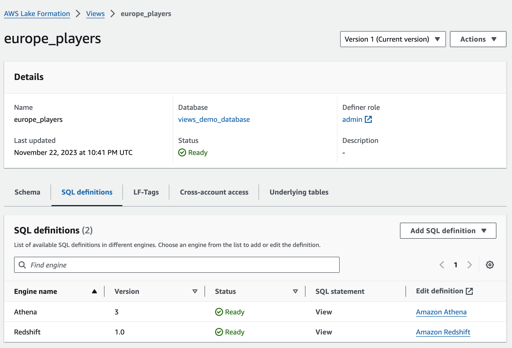

# Creating Data Catalog views using DDL statements

You can create AWS Glue Data Catalog views using SQL editors for Athena, Amazon Redshift, and using the
AWS Glue APIs/AWS CLI.

To create a Data Catalog view using SQL editors, choose Athena or Redshift Spectrum, and create the view
using a `CREATE VIEW` Data Definition Language (DDL) statement. After
creating a view in the dialect of the first engine, you can use an `ALTER
 VIEW` DDL statement from the second engine to add the additional
dialects.

When defining views, it is important to consider the following:

- Defining multi-dialect views – When you
  define a view with multiple dialects, the schemas of the different dialects must
  match. Each SQL dialect will have a slightly different syntax specification. The
  query syntax defining the Data Catalog view should resolve to the exact same column
  list, including both types and names, across all the dialects. This information
  is stored in the `StorageDescriptor` of the view. The dialects must
  also reference the same underlying table objects from the Data Catalog.

To add another dialect to a view using DDL, you can use the `ALTER
 VIEW` statement. If an `ALTER VIEW` statement tries to
update the view definition, such as modifying the storage descriptor or
underlying tables of the view, the statement errors out saying "Input and
existing storage descriptor mismatch". You can use SQL cast operations to ensure
that the view column types match.

- Updating a view – To update the view, you
  can use the `UpdateTable` API. If you update the view without
  matching storage descriptors or the reference tables, you can provide the
  `FORCE` flag (see engine SQL documentation for syntax). After a
  force update, the view will take on the forced `StorageDescriptor`
  and reference tables. Any further `ALTER VIEW` DDL should match the
  modified values. A view that has been updated to have incompatible dialects will
  be in a "Stale" status. The view status is visible in the Lake Formation console and using
  the `GetTable` operation.
- Referencing a varchar column type as a string
  – It is not possible to cast a varchar column type of Redshift Spectrum to a string.
  If a view is created in Redshift Spectrum with a varchar column type and a subsequent
  dialect tries to reference that field as a string, the Data Catalog will treat it as
  string without the need for the `FORCE` flag.
- Treatment of complex type fields – Amazon Redshift
  treats all complex types as [SUPER types](../../../redshift/latest/dg/r_SUPER_type.md "../../../redshift/latest/dg/r_SUPER_type.md") while Athena
  specifies the complex type. If a view has a `SUPER` type field, and
  another engine references that column as a particular complex type, such as
  struct (`<street_address:struct<street_number:int,
 street_name:string, street_type:string>>`), the Data Catalog assumes that
  the field to be the specific complex type, and uses that in the storage
  descriptor, without requiring the `Force` flag.
  For more information about the syntax for creating and managing Data Catalog views,
  see:

- [Using
  AWS Glue Data Catalog views](../../../athena/latest/ug/views-glue.md "../../../athena/latest/ug/views-glue.md") in the Amazon Athena User Guide.
- [Glue
  Data Catalog view query syntax](../../../athena/latest/ug/views-glue-ddl.md "../../../athena/latest/ug/views-glue-ddl.md") in the Amazon Athena User Guide.
- [Creating views in
  the AWS Glue Data Catalog](../../../redshift/latest/dg/data-catalog-views-overview.md "../../../redshift/latest/dg/data-catalog-views-overview.md") in the Amazon Redshift Database Developer Guide.

For more information about the SQL commands related to views in the Data Catalog,
see [CREATE EXTERNAL
VIEW](../../../redshift/latest/dg/r_CREATE_EXTERNAL_VIEW.md "../../../redshift/latest/dg/r_CREATE_EXTERNAL_VIEW.md"), [ALTER EXTERNAL
VIEW](../../../redshift/latest/dg/r_ALTER_EXTERNAL_VIEW.md "../../../redshift/latest/dg/r_ALTER_EXTERNAL_VIEW.md"), and [DROP EXTERNAL
VIEW](../../../redshift/latest/dg/r_DROP_EXTERNAL_VIEW.md "../../../redshift/latest/dg/r_DROP_EXTERNAL_VIEW.md").
After you create a Data Catalog view, the details of the view is available in the Lake Formation
console.

1. Choose **Views** under Data Catalog in the Lake Formation console.
2. A list of available views appears on the views page.
3. Choose a view from the list and the details page shows the attributes of the
   view.

Schema

Choose a `Column` row, and select **Edit
LF-Tags** to update tag values or assign new
LF-Tags.

SQL definitions

You can see a list of available SQL definitions. Select **Add SQL
definition**, and choose a query engine to add a SQL
definition. Choose a query engine (Athena or Amazon Redshift) under the `Edit
 definition` column to update a SQL definition.

LF-Tags

Choose **Edit LF-Tags** to edit values for a tag
or assign new tags. You can use LF-Tags to grant permissions on
views.

Cross-account access

You can see a list of AWS accounts, organizations and organizational
units (OUs) which with you've shared the Data Catalog view.

Underlying tables

The underlying tables referenced in the SQL definition used to create the
view are shown under this tab.
