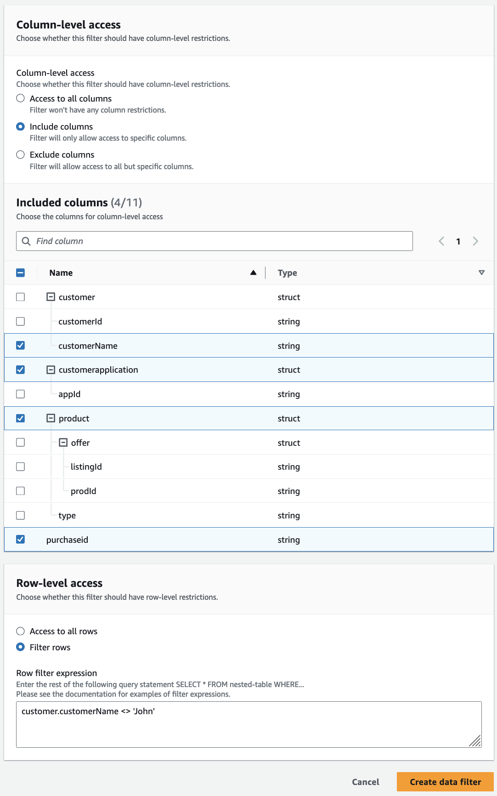

# Creating a data filter

You can create one or more data filters for each Data Catalog table.

###### To create a data filter for a Data Catalog table (console)

1. Open the Lake Formation console at
   [https://console.aws.amazon.com/lakeformation/](https://console.aws.amazon.com/lakeformation/ "https://console.aws.amazon.com/lakeformation/").

Sign as a data lake administrator, the target table owner, or a principal who has a
Lake Formation permission on the target table. 2. In the navigation pane, under **Data catalog**, choose **Data
filters**. 3. On the **Data filters** page, choose **Create new
filter**. 4. In the **Create data filter** dialog box, enter the following
information:

    * Data filter name
    * Target database – Specify the database that contains the table.
    * Target table
    * Column-level access – Leave this set to **Access to all
     columns** to specify row filtering only. Choose **Include
     columns** or **Exclude columns** to specify column or cell
     filtering, and then specify the columns to include or exclude.


    Nested columns – If you're applying the filter on a table that contains
     nested columns, you can explicitly specify sub-structures of the nested struct
     columns within a data filter.


    When you grant SELECT permission to a principal on this filer, the principal
     executing the following query, will only see the data for
     `customer.customerName` and not `customer.customerId`.


    ```
    SELECT "customer" FROM "example_db"."example_table";
    ```


    

     When you grant permissions to the `customer` column, the principal
     receives the access to the column and the nested fields under the column
     (`customerName` and `customerID`).
    * Row filter expression – Enter a filter expression to specify row or cell
     filtering. For supported data types and operators, see [PartiQL support in row filter expressions](partiql-support.md "partiql-support.md"). Choose **Access to all rows** to
     grant access to all .


    You can include partial column structs from nested columns in a row filter
     expression to filter rows that contain specific value.


    When a principal is granted permissions to a table with a row filter expression
     `Select * from example_nestedtable where customer.customerName
     <>'John'`, and **Column-level** access is set to
     **Access to all columns**, the query results shows only rows where
     `customerName <>'John'` evaluates to true.

The following screenshot shows a data filter that implements cell filtering. In
queries against the `orders` table, it denies access to the
`customer_name` column and shows only rows that have 'pharma' in the
`product_type` column.

 5. Choose **Create filter**.

###### To create a data filter with cell-filter policies on a nested field

This section uses the following sample schema to show how to create a data cells filter:

```
[
    { name: "customer", type: "struct<customerId:string,customerName:string>" },
    { name: "customerApplication", type: "struct<appId:string>" },
    { name: "product", type: "struct<offer:struct<prodId:string,listingId:string>,type:string>" },
    { name: "purchaseId", type: "string" },
]

```

1. On the **Create a data filter**, page enter a name for the data
   filter.
2. Next, use the drop-down to choose a database name and table name.
3. In the **Column-level access** section, choose Included columns, and select a nested
   column (`customer.customerName`).
4. In the **Row-level access** section, choose the **Access to all
   rows** option.
5. Choose **Create filter**.

When you grant `SELECT` permission on this filter, the principal gets access to all rows in the `customerName` column. 6. Next, define another data filter for the same database/table. 7. In the **Column-level access** section, choose Included columns, and select another nested
column (`customer.customerid`). 8. In the **Row-level access** section, choose **Filter rows**, and enter a
**Row filter expression** (`customer.customerid <> 5`). 9. Choose **Create filter**.

When you grant `SELECT` permission on this filter, the principal receives
access to all rows in the `customerName`, and `customerId` fields
except the cell where the value is 5 in the `customerId` column.
