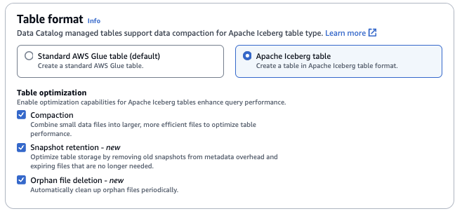

# Creating Apache Iceberg tables

AWS Lake Formation supports creating Apache Iceberg tables that use the Apache Parquet data format
in the AWS Glue Data Catalog with data residing in Amazon S3. A table in the Data Catalog is the metadata
definition that represents the data in a data store. By default, Lake Formation creates Iceberg v2
tables. For the difference between v1 and v2 tables, see [Format version
changes](https://iceberg.apache.org/spec/#appendix-e-format-version-changes "https://iceberg.apache.org/spec/#appendix-e-format-version-changes") in the Apache Iceberg documentation.

[Apache Iceberg](https://iceberg.apache.org/ "https://iceberg.apache.org/") is an open table format for very large analytic datasets.
Iceberg allows for easy changes to your schema, also known as schema evolution, meaning that users can add, rename, or remove columns from a data table without disrupting the underlying data.
Iceberg also provides support for data versioning, which allows users to track changes to data overtime.
This enables the time travel feature, which allows users to access and query historical versions of data and analyze changes to the data between updates and deletes.

You can use Lake Formation console or the `CreateTable` operation in the AWS Glue API to create an Iceberg table in the Data Catalog.
For more information, see [CreateTable action (Python: create_table)](../../../glue/latest/dg/aws-glue-api-catalog-tables.md#aws-glue-api-catalog-tables-CreateTable "../../../glue/latest/dg/aws-glue-api-catalog-tables.md#aws-glue-api-catalog-tables-CreateTable").

When you create an Iceberg table in the Data Catalog, you must specify the table format and
metadata file path in Amazon S3 to be able to perform reads and writes.

You can use Lake Formation to secure your Iceberg table using fine-grained access control
permissions when you register the Amazon S3 data location with AWS Lake Formation. For source data in Amazon S3
and metadata that is not registered with Lake Formation, access is determined by IAM permissions
policies for Amazon S3 and AWS Glue actions. For more information, see [Managing Lake Formation permissions](managing-permissions.md "managing-permissions.md").

###### Note

Data Catalog doesn’t support creating partitions and adding Iceberg table properties.

###### Topics

- [Prerequisites](#iceberg-prerequisites "#iceberg-prerequisites")
- [Creating an Iceberg table](#create-iceberg-table "#create-iceberg-table")

## Prerequisites

To create Iceberg tables in the Data Catalog, and set up Lake Formation data access permissions, you need to complete the following requirements:

1. ###### Permissions required to create Iceberg tables without the data registered with
   Lake Formation.

In addition to the permissions required to create a table in the Data Catalog, the table creator requires the following permissions:

    * `s3:PutObject` on resource arn:aws:s3:::{bucketName}
    * `s3:GetObject` on resource arn:aws:s3:::{bucketName}
    * `s3:DeleteObject`on resource arn:aws:s3:::{bucketName}

2. ###### Permissions required to create Iceberg tables with data registered with
   Lake Formation:

To use Lake Formation to manage and secure the data in your data lake, register your Amazon S3
location that has the data for tables with Lake Formation. This is so that Lake Formation can vend
credentials to AWS analytical services such as Athena, Redshift Spectrum, and Amazon EMR to access
data. For more information on registering an Amazon S3 location, see [Adding an Amazon S3 location to your data lake](register-data-lake.md "register-data-lake.md").

A principal who reads and writes the underlying data that is registered with Lake Formation requires the following permissions:

    * `lakeformation:GetDataAccess`
    * `DATA_LOCATION_ACCESS`


    A principal who has data location permissions on a location also has location
     permissions on all child locations.


    For more information on data location permissions, see [Underlying data access control](access-control-underlying-data.md "access-control-underlying-data.md").

To enable compaction, the service needs to assume an IAM role that has permissions to update tables in the Data Catalog. For details, see [Table optimization prerequisites](../../../glue/latest/dg/optimization-prerequisites.md "../../../glue/latest/dg/optimization-prerequisites.md").

## Creating an Iceberg table

You can create Iceberg v1 and v2 tables using Lake Formation console or AWS Command Line Interface as documented on
this page. You can also create Iceberg tables using AWS Glue console or AWS Glue crawler. For
more information, see [Data Catalog and Crawlers](../../../glue/latest/dg/catalog-and-crawler.md "../../../glue/latest/dg/catalog-and-crawler.md") in the
AWS Glue Developer Guide.

**To create an Iceberg table**

Console

1.  Sign in to the AWS Management Console, and open the Lake Formation console at [https://console.aws.amazon.com/lakeformation/](https://console.aws.amazon.com/lakeformation/ "https://console.aws.amazon.com/lakeformation/").
2.  Under Data Catalog, choose **Tables**, and use the **Create
    table** button to specify the following attributes:
    - **Table name**: Enter a name for the table. If you’re using
      Athena to access tables, use these [naming
      tips](../../../athena/latest/ug/tables-databases-columns-names.md "../../../athena/latest/ug/tables-databases-columns-names.md") in the Amazon Athena User Guide.
    - **Database**: Choose an existing database or create a new one.
    - **Description**:The description of the table. You can write a description to help you understand the contents of the table.
    - **Table format**: For **Table format**, choose Apache
      Iceberg.

    
    - **Table optimization**

          + **Compaction** – Data
           files are merged and rewritten remove obsolete data and consolidate
           fragmented data into larger, more efficient files.
          + **Snapshot retention** – Snapshots are timestamped versions
           of an Iceberg table. Snapshot retention configurations allow customers to enforce how long
           to retain snapshots and how many snapshots to retain. Configuring a snapshot retention
           optimizer can help manage storage overhead by removing older, unnecessary snapshots and
           their associated underlying files.
          + **Orphan file deletion** – Orphan files are files that are no longer referenced by the Iceberg table metadata. These files can
           accumulate over time, especially after operations like table deletions or failed ETL jobs.
           Enabling orphan file deletion allows AWS Glue to periodically identify and remove these
           unnecessary files, freeing up storage.

      For more information, see [Optimizing Iceberg tables](../../../glue/latest/dg/table-optimizers.md "../../../glue/latest/dg/table-optimizers.md").

    - **IAM role**: To run compaction, the service assumes an
      IAM role on your behalf. You can choose an IAM role using the
      drop-down. Ensure that the role has the permissions required to enable
      compaction.

    To learn more about the required permissions, see [Table optimization prerequisites](../../../glue/latest/dg/optimization-prerequisites.md "../../../glue/latest/dg/optimization-prerequisites.md").
    - **Location**: Specify the path to the folder in Amazon S3 that
      stores the metadata table. Iceberg needs a metadata file and location in the
      Data Catalog to be able to perform reads and writes.
    - **Schema**: Choose **Add columns** to add
      columns and data types of the columns. You have the option to create an
      empty table and update the schema later. Data Catalog supports Hive data types.
      For more information, see [Hive data types](https://cwiki.apache.org/confluence/plugins/servlet/mobile?contentId=27838462#content/view/27838462 "https://cwiki.apache.org/confluence/plugins/servlet/mobile?contentId=27838462#content/view/27838462").

    Iceberg allows you to evolve schema and partition after you create the
    table. You can use [Athena
    queries](../../../athena/latest/ug/querying-iceberg-evolving-table-schema.md "../../../athena/latest/ug/querying-iceberg-evolving-table-schema.md") to update the table schema and [Spark queries](https://iceberg.apache.org/docs/latest/spark-ddl/#alter-table-sql-extensions "https://iceberg.apache.org/docs/latest/spark-ddl/#alter-table-sql-extensions") for updating partitions.

AWS CLI

```
aws glue create-table \
    --database-name iceberg-db \
    --region us-west-2 \
    --open-table-format-input '{
      "IcebergInput": {
           "MetadataOperation": "CREATE",
           "Version": "2"
         }
      }' \
    --table-input '{"Name":"`test-iceberg-input-demo`",
            "TableType": "EXTERNAL_TABLE",
            "StorageDescriptor":{
               "Columns":[
                   {"Name":"col1", "Type":"int"},
                   {"Name":"col2", "Type":"int"},
                   {"Name":"col3", "Type":"string"}
                ],
               "Location":"s3://`DOC_EXAMPLE_BUCKET_ICEBERG`/"
            }
        }'

```
