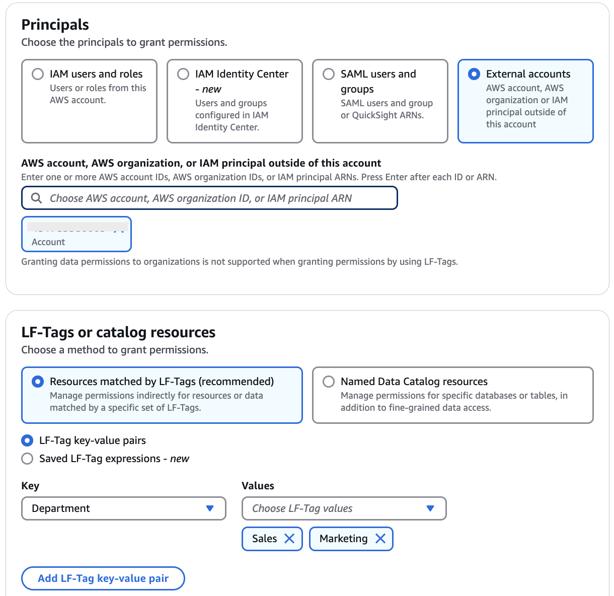
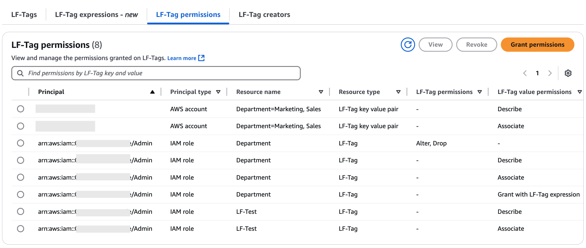

# Data sharing using tag-based access control

AWS Lake Formation tag-based access control (LF-TBAC) is an authorization strategy that defines permissions based on attributes.
The following steps explain how to grant cross-account permissions by using LF-Tags.

###### Set up required on the producer/grantor account

1. Add LF-Tags.
   1. Sign in to Lake Formation console as a data lake administrator or a LF-Tag creator.
   2. In the left navigation bar, choose **Permissions**, and **LF-Tags and permissions**.
   3. Choose **Add LF-Tag**.

   For detailed instructions to create
   LF-Tags, see [Creating LF-Tags](TBAC-creating-tags.md "TBAC-creating-tags.md").

2. Grant **Describe** and/or **Associate**
   permissions **LF-Tag key-value** pairs to IAM principals in your
   account or external accounts.

Granting permissions on **LF-Tag key-value** pairs enables the
principals to view the LF-Tags, and assign them to Data Catalog resources (databases, tables,
and columns). 3. Next, the data lake administrator or an IAM principal with **Associate** permission can assign the
LF-Tag to databases, tables, or columns. For more information, see [Assigning LF-Tags to Data Catalog resources](TBAC-assigning-tags.md "TBAC-assigning-tags.md"). 4. Next, grant data permission to external accounts using LF-Tag expressions. This enables the
grantee or recipient of the permissions to access the Data Catalog resource(s) that are
tagged with the same key(s) and value(s).

    1. In the navigation pane, choose **Permissions** and **Data permissions**.
    2. Choose **Grant**.
    3. On the **Grant permissions** page, for **Principals**,
     choose **External accounts**, and enter the grantee AWS account
     ID or the IAM role of the principal or the Amazon Resource Name (ARN) for the
     principal (principal ARN) if making a direct cross-account grant to an external
     principal. You need to press **Enter** after entering the account
     ID.

    
    4. For **LF-Tags or catalog resources**, choose
     **Resources matched by LF-Tags (recommended)**.

    	1. Choose the option **LF-Tag key-value pairs** or **Saved LF-Tag expressions** .
    	2. **If you choose, **LF-Tag key-value pairs**, enter the key and
    	 value(s)** of the **LF-Tag** that is associated with the
    	 Data Catalog resource being shared with the grantee account.

    	The grantee is granted permissions on the Data Catalog resources that were assigned a
    	 matching LF-Tag in the LF-Tag expression. If the LF-Tag expression specifies
    	 multiple values per tag key, any one of the tag values can be a match.
    5. Choose the database-level or table-level permissions to grant on resources that
     match the LF-Tag expression.

    ###### Important

    Because the data lake administrator must grant
     permissions on shared resources to the principals in the grantee account, you must
     always grant cross-account permissions with the grant option.

    For more information, see [Granting LF-Tag permissions using the
     console](TBAC-granting-tags-console.md "TBAC-granting-tags-console.md").

    ###### Note

    Principals who receive direct cross-account grants will not have the **Grantable permissions** option.

###### Set up required on the receiving/grantee account

1.  Sign in to Lake Formation console as a data lake administrator of the consumer account.
2.  Next, receive the resource share in the consumer account.
    1. Open the AWS RAM console.
    2. In the navigation pane, under **Shared with me**, choose **Resource shares**.
    3. Select the resource shares, choose **Accept resource share**.

3.  When you share a resource with another account, the resource still belongs to the
    producer account and is not visible within the Athena console. To make the
    resource visible in the Athena console, you need to create a resource link
    pointing to the shared resource. For instructions on creating a resource link, see
    [Creating a resource link to a shared Data Catalog
    table](create-resource-link-table.md "create-resource-link-table.md") and [Creating a resource link to a shared Data Catalog
    database](create-resource-link-database.md "create-resource-link-database.md")

        1. Choose **Databases** or **Tables** under the Data Catalog.
        2. On the Databases/Tables page, choose **Create**, **Resource link** .
        3. Enter the following information for a database resource link:

        	* **Resource link name** – A unique name for the resource
        	 link.
        	* **Destination catalog** – The catalog where you're creating
        	 the resource link.
        	* **Shared database Region** – The Region
        	 of the database shared with you if you are creating the resource link in a
        	 different Region.
        	* **Shared database** – Choose the shared
        	 database.
        	* **Shared database’s catalog ID** – Enter
        	 the catalog ID for the shared database.
        4. Choose **Create**.
         You can see the newly created resource link in the databases list.

    Similarly, you can create a resource link to a shared table.

4.  Now grant **Describe** permission on the resource link to the IAM principals that you are sharing the resource.
    1. On the **Databases/Tables** page, select the resource link, and
       on the **Actions** menu, choose **Grant**.
    2. In the **Grant permissions** section, select **IAM users and roles**.
    3. Choose the IAM role that you want to grant access to the resource link.
    4. In the **Resource link** permissions section, select **Describe**.
    5. Choose **Grant**.

5.  Next, grant **LF-Tag key-value permissions** to the principals in
    the consumer account.

You should be able to find the LF-Tags that are shared with you in the consumer
account on the Lake Formation console, under **Permissions**, **LF-Tags
and permissions**. You can associate tags shared from grantor on resources
shared from grantor account that includes: databases, tables, and columns. You can
further grant permissions on the resources to other principals.

    1. In the navigation pane, under **Permissions**, **Data permissions**, choose **Grant**.
    2. On the **Grant permissions** page, choose **IAM
     users and roles**.
    3. Next, choose the IAM users and roles in your account to grant access to the shared databases/tables.
    4. Next, for **LF-Tags or catalog resources**, choose **Resources matched by LF-Tags**.
    5. Next, choose the key and values of the LF-Tag that is shared with you.
    6. Next, choose the database and table permissions that you want to grant to the IAM users and roles.
     You can also choose **Grantable permissions** that enables the IAM users and roles to grant permissions to other users/roles.
    7. Choose **Grant**.
    8. You can view the permission grants under **Data permissions** on the Lake Formation console.
