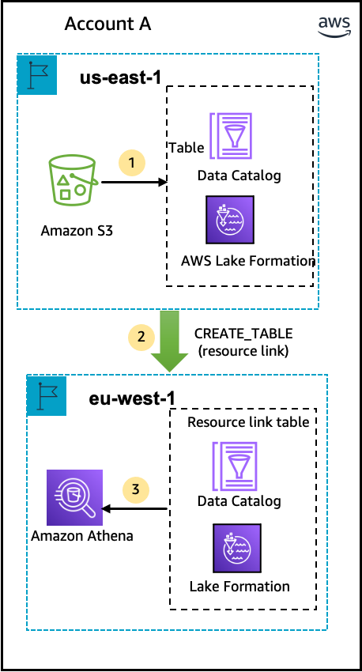
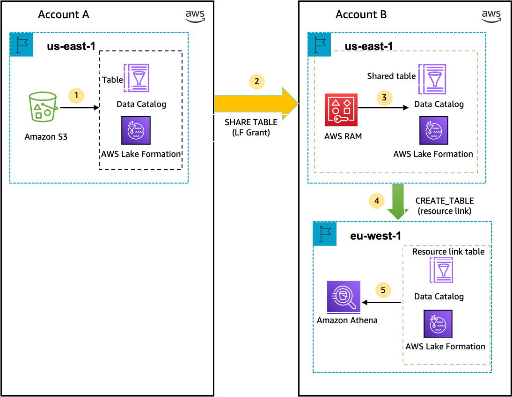

# Accessing tables across Regions

Lake Formation supports querying Data Catalog tables across AWS Regions. You can access data in a
Region from other Regions using Amazon Athena, Amazon EMR, and AWS Glue ETL by [creating resource links](creating-resource-links.md "creating-resource-links.md") in other Regions pointing
to the source databases and tables. With cross-Region table access, you can access data across
Regions without copying the underlying data or the metadata into the Data Catalog.

For example, you can share a database or table in a producer account to a consumer account
in Region A. After accepting the resource share invitation in Region A, the data lake
administrator of the consumer account can create resource links to the shared resource in
Region B. The consumer account administrator can grant permissions on the shared resource to
the IAM principals in that account in Region A and can grant resource link permissions in
Region B. Using the resource link, the principals in the consumer account can query the shared data from Region B.

You can also host the Amazon S3 data source in Region A in a producer account, and register the data location in a central account in Region B.
You can create Data Catalog resources in the central account, set up Lake Formation permissions, and share data with consumers in your account or with external accounts in Region B.
The cross-Region feature allows users to access these Data Catalog tables from Region C using resource links.

Using this feature, you can query federated databases in Apache Hive Metastores across
Regions, and also join tables in the local Region with tables in another Region when running
queries.

Lake Formation supports the following features with cross-Region table access:

- LF-Tag based access control
- Fine-grained access control permissions
- Write operations on the shared database or table with appropriate permissions
- Cross-account data sharing at account-level and direct with IAM
  principals-level
  Non-administrative users with `Create_Database` and `Create_Table` permissions can create cross-Region resource links.

###### Note

You can create cross-Region resource links in any Region and access data without applying Lake Formation permissions.
For source data in Amazon S3 that isn't registered with Lake Formation, access is determined by IAM permissions policies for Amazon S3 and AWS Glue actions.

For limitations, see [Cross-Region data access limitations](x-region-considerations.md "x-region-considerations.md").

## Workflows

The following diagrams show the workflows for accessing data across AWS Regions from the same AWS account and from an external account.

### Workflow for accessing tables shared

within the same AWS account

In the diagram below, the data is shared with a user in the same AWS account in the
US East (N. Virginia) Region, and the user queries the shared data from the
Europe (Ireland) Region.

The data lake administrator performs the following activities (steps 1-2):

1. A data lake administrator sets up an AWS account with the Data Catalog databases and
   tables and registers an Amazon S3 data location with Lake Formation in the US East (N. Virginia)
   Region.

Grants `Select` permission on a Data Catalog resource
(product table in the diagram) to a principal (user) in the same account. 2. Creates a resource link in the Europe (Ireland) Region pointing to the source table in the US East (N. Virginia) Region. Grants `DESCRIBE` permission
on the resource link from the Europe (Ireland) Region to the principal. 3. The user queries the table from the Europe (Ireland)Region using Athena.

### Workflow for accessing tables shared

with an external AWS account

In the diagram below, the producer account (Account A) hosts the Amazon S3 bucket, registers the
data location, and shares a Data Catalog table with a consumer account (Account B) in the
US East (N. Virginia) Region and a user from the consumer account (Account B) queries the
table from the Europe (Ireland) Region.

1. A data lake administrator sets up an AWS account (producer account) with the
   Data Catalog resources and an Amazon S3 data location registered with Lake Formation in the
   US East (N. Virginia) Region.
2. The data lake administrator of the producer account shares a Data Catalog table to a consumer account.
3. The data lake administrator of the consumer account accepts the data share
   invitation in the US East (N. Virginia) Region and Grants `Select` permission on the shared table to a principal from the same Region.
4. The data lake administrator of the consumer account creates a resource link
   in the Europe (Ireland) Region pointing to the target shared table in the
   US East (N. Virginia) Region and grants the user `DESCRIBE` permission on the
   resource link from Europe (Ireland) Region.
5. The user queries the data from the Europe (Ireland) Region using Athena.
