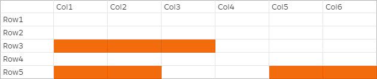

# Data filtering and cell-level security in Lake Formation

When you grant Lake Formation permissions on a Data Catalog table, you can include data filtering
specifications to restrict access to certain data in query results and engines integrated with
Lake Formation. Lake Formation uses data filtering to achieve column-level security, row-level security, and
cell-level security. You can define and apply data filters on nested columns if your
source data contains nested structures.

With the data filtering capabilities of Lake Formation, you can implement the following levels of
data security.

###### Column-level security

Granting permissions on a Data Catalog table with column-level security (column filtering)
allows users to view only specific columns and nested columns that they have access to in
the table. Consider a `persons` table that is used in multiple applications for a
large multi-region communications company. Granting permissions on Data Catalog tables with
column filtering can restrict users who don't work in the HR department from seeing
personally identifiable information (PII) such as a social security number or birth date.
You can also define security policies and grant access to only partial sub-structures of
nested columns.

###### Row-level security

Granting permissions on a Data Catalog table with row-level security (row filtering) allows
users to view only specific rows of data that they have access to in the table. The
filtering is based on the values of one or more columns. You can include nested column
structures when defining row-filter expressions. For example, if different regional offices
of the communications company have their own HR departments, you can limit the person
records that HR employees can see to only records for employees in their region.

###### Cell-level security

Cell-level security combines row filtering and column filtering for a highly flexible
permissions model. If you view the rows and columns of a table as a grid, by using
cell-level security, you can restrict access to individual elements (cells) of the grid
anywhere in the two dimensions. That is, you can restrict access to different columns
depending on the row. This is illustrated by the following diagram, in which restricted columns are shaded.


Continuing the example of the persons table, you can create a _data filter_ at the
cell-level that restricts access to the street address column if the row has the country
column set to "UK", but allows access to the street address column if the row has the country
column set to "US".

Filters apply only to read operations. Therefore, you can grant only the
`SELECT` Lake Formation permission with filters.

###### Cell-level security on nested columns

Lake Formation allows you to define and apply data filters with cell-level security on nested
columns. However, the integrated analytical engines such as Amazon Athena, Amazon EMR, and
Amazon Redshift Spectrum support executing queries against Lake Formation managed nested tables with row and
column-level security.

For limitations, see [Data filtering limitations](data-filtering-notes.md "data-filtering-notes.md").

###### Topics

- [Data filters in Lake Formation](#data-filters-about "#data-filters-about")
- [PartiQL support in row filter expressions](partiql-support.md "partiql-support.md")
- [Permissions required for querying tables with
  cell-level filtering](row-filtering-prereqs.md "row-filtering-prereqs.md")
- [Managing data filters](managing-filters.md "managing-filters.md")

## Data filters in Lake Formation

You can implement column-level, row-level, and cell-level security by creating _data filters_. You select a data filter when you grant the
`SELECT` Lake Formation permission on tables. If your table contains nested column
structures, you can define a data filter by including or excluding the child columns and
define row-level filter expressions on nested attributes.

Each data filter belongs to a specific table in your Data Catalog. A data filter includes the
following information:

- Filter name
- The Catalog IDs of the table associated with the filter
- Table name
- Name of the database that contains the table
- Column specification – a list of columns and nested columns (with `struct` datatypes) to include or exclude in query results.
- Row filter expression – an expression that specifies the rows to include in
  query results. With some restrictions, the expression has the syntax of a
  `WHERE` clause in the PartiQL language. To specify all rows, choose
  **Access to all rows** under **Row-level access** in the console or use `AllRowsWildcard` in
  API calls.

For more information about what is supported in row filter expressions, see [PartiQL support in row filter expressions](partiql-support.md "partiql-support.md").

The level of filtering that you get depends on how you populate the data filter.

- When you specify the "all columns" wildcard and provide a row filter expression, you
  are establishing row-level security (row filtering) only.
- When you include or exclude specific columns and nested columns, and specify "all
  rows" using the all-rows wildcard, you are establishing column-level security (column
  filtering) only.
- When you include or exclude specific columns and also provide a row filter
  expression, you are establishing cell-level security (cell filtering).

The following screenshot from the Lake Formation console shows a data filter that performs
cell-level filtering. For queries against the `orders` table, it restricts access
to the `customer_name` column and the query results return only rows where the `product_type` column
contains 'pharma'.


Note the use of single quotes to enclose the string literal, `'pharma'`.

You can use the Lake Formation console to create this data filter, or you can supply the following
request object to the `CreateDataCellsFilter` API operation.

```
{
     "Name": "restrict-pharma",
     "DatabaseName": "sales",
     "TableName": "orders",
     "TableCatalogId": "111122223333",
     "RowFilter": {"FilterExpression": "product_type='pharma'"},
     "ColumnWildcard": {
         "ExcludedColumnNames": ["customer_name"]
     }
}
```

You can create as many data filters as you need for a table. In order to do so, you
require `SELECT` permission with the grant option on a table. Data Lake
Administrators by default have the permission to create _data
filters_ on all tables in that account. You typically only use a subset of the
possible data filters when granting permissions on the
table to a principal. For example, you could create a second data filter for the
`orders` table that is a row-security-only data filter. Referring to the
preceding screenshot, you could choose the **Access to all columns** option
and include a row filter expression of `product_type<>pharma`. The name of this
data filter could be `no-pharma`. It restricts access to all rows that have the
`product_type` column set to 'pharma'.

The request object for the `CreateDataCellsFilter` API operation for this data
filter is the following.

```
{
     "Name": "no-pharma",
     "DatabaseName": "sales",
     "TableName": "orders",
     "TableCatalogId": "111122223333",
     "RowFilter": {"FilterExpression": "product_type<>'pharma'"},
     "ColumnNames": ["customer_id", "customer_name", "order_num"
          "product_id", "purchase_date", "product_type",
          "product_manufacturer", "quantity", "price"]
}
```

You could then grant `SELECT` on the `orders` table with the
`restrict-pharma` data filter to an administrative user, and `SELECT`
on the `orders` table with the `no-pharma` data filter to
non-administrative users. For users in the healthcare sector, you would grant
`SELECT` on the `orders` table with full access to all rows and
columns (no data filter), or perhaps with yet another data filter that restricts access to
pricing information.

You can include or exclude nested columns when specifying column-level and row-level
security within a data filter. In the following example, access to the
`product.offer` field is specified using qualified column names (wrapped in
double quotes). This is important for nested fields in order to avoid errors occurring when
column names contain special characters, and to maintain backward compatibility with top level
column-level security definitions.

```
{
     "Name": "example_dcf",
     "DatabaseName": "example_db",
     "TableName": "example_table",
     "TableCatalogId": "111122223333",
     "RowFilter": { "FilterExpression": "customer.customerName <> 'John'" },
     "ColumnNames": ["customer", "\"product\".\"offer\""]
}

```

###### See also

- [Managing data filters](managing-filters.md "managing-filters.md")
