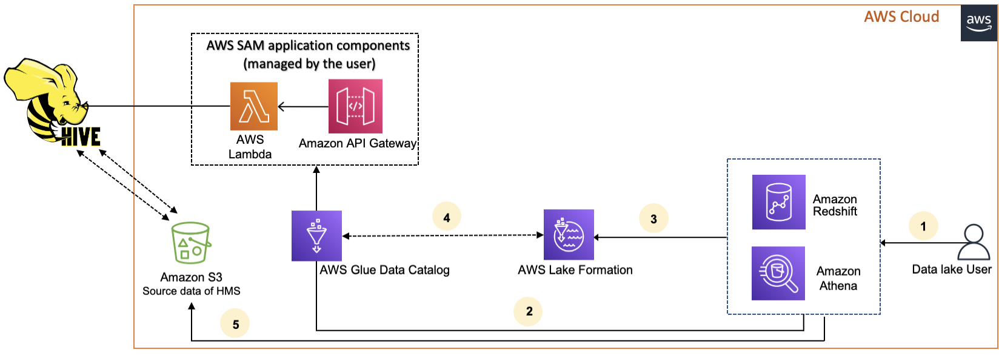

# Managing permissions on datasets that use external

metastores

With AWS Glue Data Catalog metadata federation (Data Catalog federation), you can connect the Data Catalog to
external metastores that store metadata for your Amazon S3 data, and securely manage data access
permissions using AWS Lake Formation. You don't have to migrate the metadata from the external metastore
into the Data Catalog.

The Data Catalog provides a centralized metadata repository that makes managing and discovering
data across disparate systems easier. When your organization manages data in the Data Catalog, you
can use AWS Lake Formation to control access to your datasets in Amazon S3.

###### Note

Currently, we support only Apache Hive (version 3 and above) metastore federation.

To set up Data Catalog federation, we provide an AWS Serverless Application Model (AWS SAM) application called
[GlueDataCatalogFederation-HiveMetastore](https://console.aws.amazon.com/lambda/home#/create/app?applicationId=arn:aws:serverlessrepo:us-east-1:766175011753:applications/GlueDataCatalogFederation-HiveMetastore "https://console.aws.amazon.com/lambda/home#/create/app?applicationId=arn:aws:serverlessrepo:us-east-1:766175011753:applications/GlueDataCatalogFederation-HiveMetastore") in the AWS Serverless Application Repository.

The reference implementation is provided on GitHub as an open source project at [AWS Glue Data Catalog Federation - Hive Metastore](https://github.com/awslabs/aws-glue-data-catalog-federation "https://github.com/awslabs/aws-glue-data-catalog-federation").

The AWS SAM application creates and deploys the following resources that are required for connecting
the Data Catalog to the Hive metastore:

- **An AWS Lambda function** – Hosts the implementation of the federation service that
  communicates between the Data Catalog and the Hive metastore. AWS Glue invokes this Lambda function
  to retrieve metadata objects from the Hive metastore.
- **Amazon API Gateway** – The connection endpoint for your Hive metastore that acts
  as a proxy to route all invocations to the Lambda function.
- **An IAM role** – A role with necessary permissions to create the connection between the
  Data Catalog and the Hive metastore.
- **AWS Glue connection** – An Amazon API Gateway type of AWS Glue connection that stores the
  Amazon API Gateway endpoint and an IAM role to invoke it.
  When you query tables, the AWS Glue service makes a runtime call to the Hive metastore and
  fetches the metadata. The Lambda function acts as a
  translator between the Hive metastore and Data Catalog.

After establishing the connection, in order to sync the metadata in the Hive metastore
with the Data Catalog, you need to create a _federated database_ in the
Data Catalog using the Hive metastore connection details, and map this database to the Hive
database. A database is referred as a federated database when it points to an entity outside the
Data Catalog.

You can apply Lake Formation permissions using tag-based access control and the named resource method
on the federated database, and share it across multiple AWS accounts,
AWS Organizations, and organizational units (OUs). You can also share the federated
database directly with IAM principals from another account.

You can define fine-grained permissions at column level, row level, and cell level using
Lake Formation data filters on the external Hive tables. You can use Amazon Athena, Amazon Redshift, or Amazon EMR to
query the Lake Formation managed external Hive tables.

For more information on cross-account data sharing and data filtering, see:

- [Cross-account data sharing in Lake Formation](cross-account-permissions.md "cross-account-permissions.md")
- [Data filtering and cell-level security in Lake Formation](data-filtering.md "data-filtering.md")

###### Data Catalog metadata federation high-level steps

1. You create IAM users and roles that have appropriate permissions to deploy the AWS SAM
   application and to create federated databases.
2. You register the Amazon S3 data location with Lake Formation by selecting the `Enable Data Catalog
federation` option for datasets that use an external Hive metastore.
3. You configure the AWS SAM application settings (AWS Glue connection name, URL to the Hive
   metastore, and Lambda function parameters) and deploy the AWS SAM application.
4. The AWS SAM application deploys the resources that are required to connect the external Hive
   metastore with the Data Catalog.
5. To apply Lake Formation permissions on the Hive database and tables, you create a database in the
   Data Catalog using the Hive metastore connection details, and map this database to the Hive
   database.
6. Grant permissions on the federated databases to principals in your account or in another
   account.

###### Note

You can connect the Data Catalog to an external Hive mestastore, create
federated databases, and run queries and ETL scripts on Hive databases and tables without applying Lake Formation permissions.
For source data in Amazon S3 that isn't registered with Lake Formation, access is
determined by IAM permissions policies for Amazon S3 and AWS Glue actions.

For limitations, see [Hive metadata store data sharing considerations and
limitations](notes-hms.md "notes-hms.md").

###### Topics

- [Workflow](#hms-workflow "#hms-workflow")
- [Prerequisites for connecting the Data Catalog to the Hive metastore](hms-prerequisites.md "hms-prerequisites.md")
- [Connecting the Data Catalog to an external Hive metastore](hms-setup.md "hms-setup.md")
- [Additional resources](additional-resources-hms.md "additional-resources-hms.md")

## Workflow

The following diagram shows the workflow for connecting the AWS Glue Data Catalog to an external
Hive metastore.

1. A principal submits a query using an integrated service such as Athena or
   Redshift Spectrum.
2. The integrated service makes a call to the Data Catalog for the metadata, which in turn calls the
   Hive metastore endpoint available behind Amazon API Gateway, and receives responses
   to metadata requests.
3. The integrated service sends the request to Lake Formation to verify table information and credentials to access the table.
4. Lake Formation authorizes the request and vends temporary credentials to the integrated
   application, which allows data access.
5. Using the temporary credentials received from Lake Formation, the integrated service reads the data
   from Amazon S3, and shares the results to the principal.
