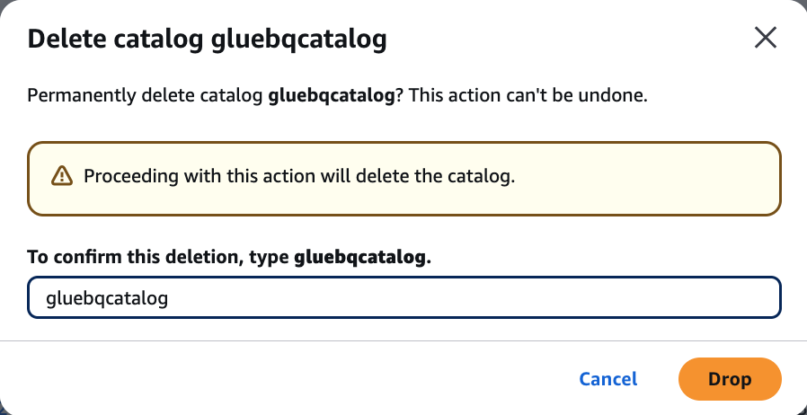

# Deleting a federated catalog

You can delete the federated catalogs that you created in the AWS Glue Data Catalog using the `glue:DeleteCatalog` operation or the AWS Lake Formation console.

###### To delete a federated catalog (console)

1. Open the Lake Formation console at [https://console.aws.amazon.com/lakeformation/](https://console.aws.amazon.com/lakeformation/ "https://console.aws.amazon.com/lakeformation/").
2. In the navigation pane, choose **Catalogs** under **Data
   Catalog**.
3. Choose the catalog that you want to delete from the catalogs list.
4. Choose **Delete** from **Actions**.
5. Choose **Drop** to confirm and the federated catalog will be deleted from the Data Catalog.



###### To delete a federated catalog (CLI)

- ```
  aws glue delete-catalog
    --catalog-id `123456789012:catalog name`
  ```

```

```
