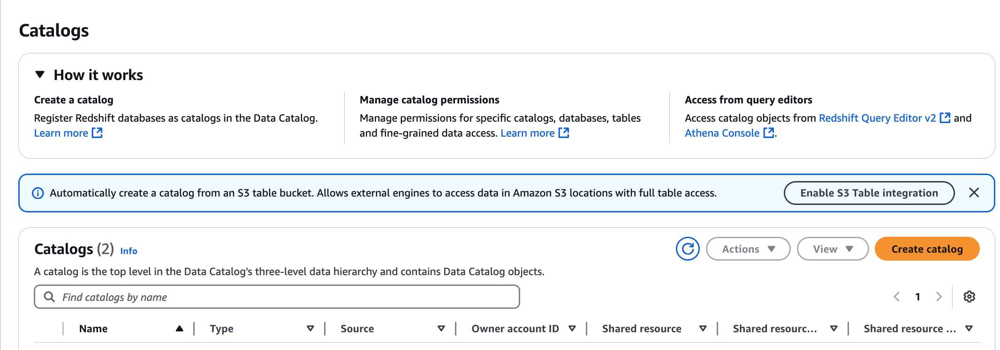
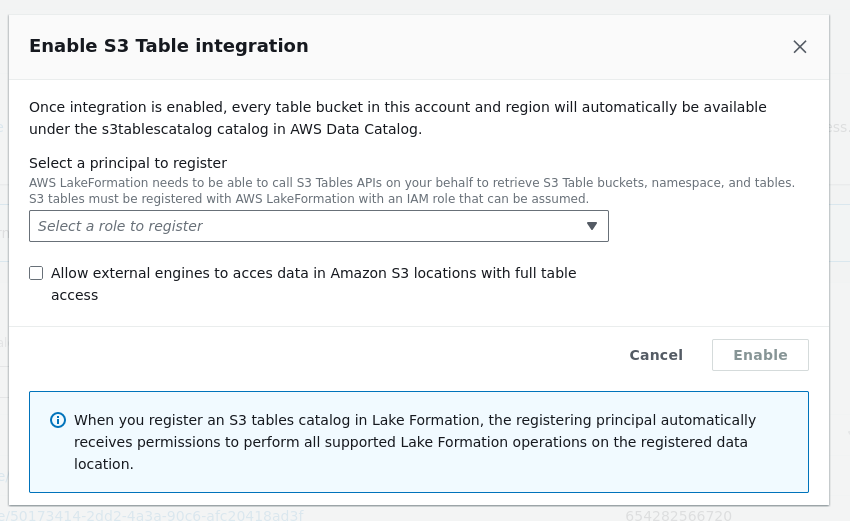
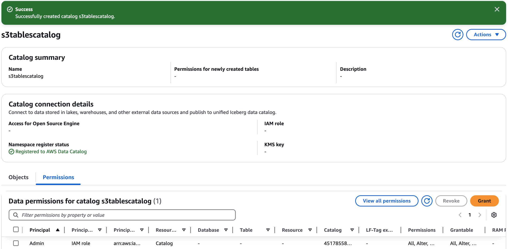

#

Enabling Amazon S3 Tables integration

You can create Amazon S3 table buckets using Amazon S3 console, and integrate it with
AWS analytics services. For more information, see [Using Amazon S3 Tables with
AWS analytics services](../../../AmazonS3/latest/userguide/s3-tables-integrating-aws.md "../../../AmazonS3/latest/userguide/s3-tables-integrating-aws.md").

In AWS Lake Formation, you can enable Amazon S3 Tables integration with AWS Glue Data Catalog and AWS Lake Formation using the Lake Formation console or use AWS CLI.

1. Open the Lake Formation console at [https://console.aws.amazon.com/lakeformation/](https://console.aws.amazon.com/lakeformation/ "https://console.aws.amazon.com/lakeformation/").
2. In the navigation pane, choose **Catalogs** under **Data
   Catalog**.
3. Choose **Enable S3 Table integration** on the **Catalogs** page.

 4. Choose an IAM role with the required permissions for Lake Formation to assume to vend credentials to the analytical query engines. For the permissions required for the role
to accessing data, see [step3-permissions](s3tables-catalog-prerequisites.md#step3-permissions "s3tables-catalog-prerequisites.md#step3-permissions") in the prerequisites section.

 5. Select **Allow external engines to access data in Amazon S3 locations with full table access** option.
When you enable full table access for third-party engines, Lake Formation returns credentials to the third-party engine directly without performing IAM session tag validation.
This means you cannot apply Lake Formation fine-grained access controls to the tables being accessed. 6. Choose **Enable**. The new catalog for S3 Tables is added to the catalog
list. When you enable the S3 tables catalog integration, the service registers the
data location of the S3 table bucket with Lake Formation. 7. Choose the catalog to view catalog objects and grant permissions to other principals.



To create multi-level catalogs, see the [Creating a table bucket](../../../AmazonS3/latest/userguide/s3-tables-buckets-create.md "../../../AmazonS3/latest/userguide/s3-tables-buckets-create.md") section in the Amazon Simple Storage Service User Guide.

1. Register the S3 Tables catalog as a Lake Formation data location.

```
aws lakeformation register-resource \
  --resource-arn 'arn:aws:s3tables:us-east-1:123456789012:bucket/*' \
  --role-arn 'arn:aws:iam::123456789012:role/LakeFormationDataAccessRole' \
  --with-federation
  --with-privileged-access
```

2. Create a catalog.

```
aws glue create-catalog --cli-input-json file://input.json

'{
   "Name": `"s3tablescatalog"`,
   "CatalogInput" : {
      "FederatedCatalog": {
         "Identifier": "arn:aws:s3tables:us-east-1:123456789012:bucket/*",
         "ConnectionName": "aws:s3tables"
      },
      "CreateDatabaseDefaultPermissions": [],
      "CreateTableDefaultPermissions": []
   }
}'

```
