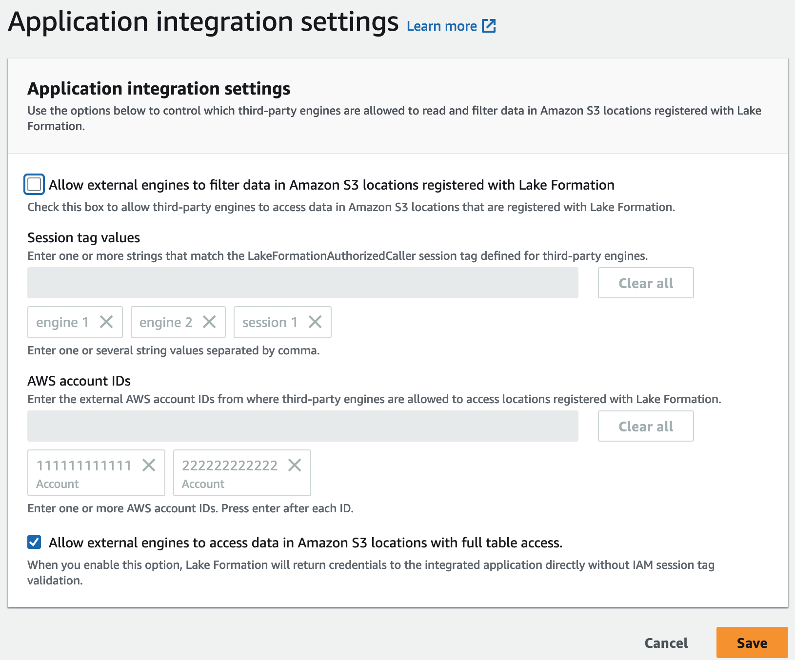

# Application integration for full table

access

Follow these steps to enable third-party query engines to access data without the
IAM session tag validation:

Console

1. Sign in to the Lake Formation console at [https://console.aws.amazon.com/lakeformation/](https://console.aws.amazon.com/lakeformation/ "https://console.aws.amazon.com/lakeformation/").
2. In the left-side navigation, expand **Administration**, and choose **Application
   integration settings**.
3. On the **Application integration settings** page, choose the
   **Allow external engines to access data in Amazon S3 locations with full
   table access** option.

When you enable this option, Lake Formation returns credentials to the
querying application directly without IAM session tag validation.



AWS CLI
Use the `put-data-lake-settings` CLI command to set the `AllowFullTableExternalDataAccess` parameter.

```
aws lakeformation put-data-lake-settings —cli-input-json file://put-data-lake-settings.json —region ap-northeast-1
{
    "DataLakeSettings": {
        "DataLakeAdmins": [
            {
                "DataLakePrincipalIdentifier": "arn:aws:iam::111111111111:user/lakeAdmin"
            }
        ],
        "AllowFullTableExternalDataAccess": true
    }
}


```
