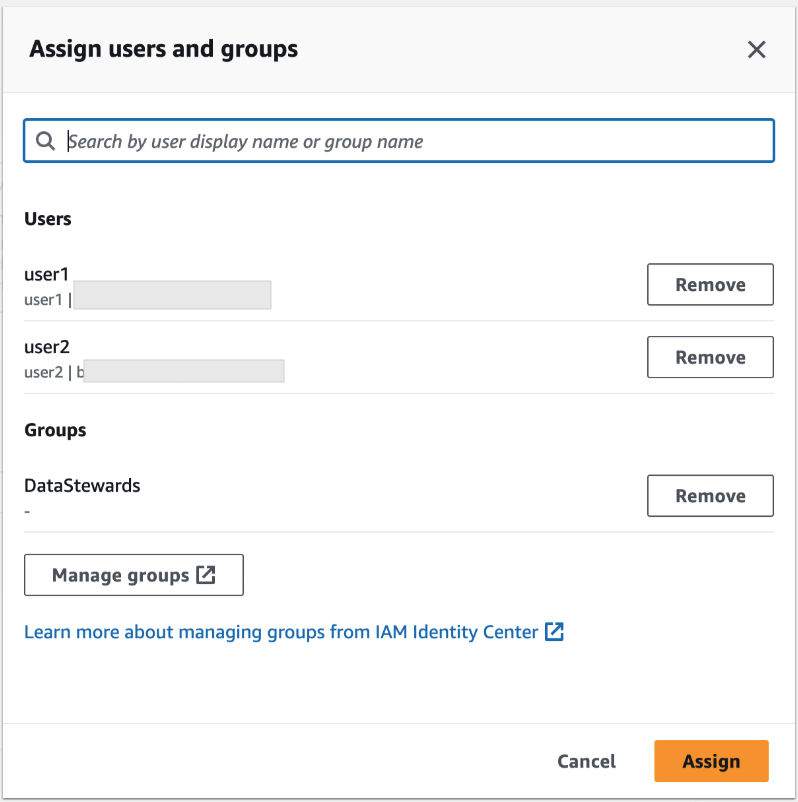

# Granting permissions to users and groups

Your data lake administrator can grant permissions to IAM Identity Center users and groups on
Data Catalog resources (databases, tables, and views) to allow easy data access. To grant or
revoke data lake permissions, the grantor requires permissions for the following IAM Identity Center
actions.

- [DescribeUser](../../../singlesignon/latest/IdentityStoreAPIReference/API_DescribeUser.md "../../../singlesignon/latest/IdentityStoreAPIReference/API_DescribeUser.md")
- [DescribeGroup](../../../singlesignon/latest/IdentityStoreAPIReference/API_DescribeGroup.md "../../../singlesignon/latest/IdentityStoreAPIReference/API_DescribeGroup.md")
- [DescribeInstance](../../../singlesignon/latest/APIReference/API_DescribeInstance.md "../../../singlesignon/latest/APIReference/API_DescribeInstance.md")
  You can grant permissions by using the Lake Formation console, the API, or the AWS CLI.

For more information on granting permissions, see
[Granting permissions on Data Catalog resources](granting-catalog-permissions.md "granting-catalog-permissions.md").

###### Note

You can only grant permissions on resources in your account. To cascade permissions to users
and groups on resources shared with you, you must use AWS RAM resources shares.

AWS Management Console

###### To grant permissions to users and groups

1. Sign in to the AWS Management Console, and open the Lake Formation console at [https://console.aws.amazon.com/lakeformation/](https://console.aws.amazon.com/lakeformation/ "https://console.aws.amazon.com/lakeformation/").
2. Select **Data lake permissions** under **Permissions** in the Lake Formation console.
3. Select **Grant**.
4. On the **Grant data lake permissions** page, choose, **IAM Identity Center** users and groups.
5. Select **Add** to choose the users and groups to grant permissions.

 6. On the **Assign users and groups** screen, choose
the users and/or groups to grant permissions.

Select **Assign**.

 7. Next, choose the method to grant permissions.

For instructions on granting permissions using named resources method, see [Granting data permissions using the named
resource method](granting-cat-perms-named-resource.md "granting-cat-perms-named-resource.md").

For instructions on granting permission using LF-Tags, see [Granting data lake permissions using the
LF-TBAC method](granting-catalog-perms-TBAC.md "granting-catalog-perms-TBAC.md"). 8. Choose the Data Catalog resources on which you want to grant permissions. 9. Choose the Data Catalog permissions to grant. 10. Select **Grant**.

AWS CLI
The following example shows how to grant IAM Identity Center user `SELECT` permission on a table.

```
aws lakeformation grant-permissions \
--principal DataLakePrincipalIdentifier=arn:aws:identitystore:::user/`<UserId>` \
--permissions "SELECT" \
--resource '{ "Table": { "DatabaseName": "retail", "TableWildcard": {} } }'

```

To retrieve `UserId` from IAM Identity Center, see [GetUserId](../../../singlesignon/latest/IdentityStoreAPIReference/API_GetUserId.md "../../../singlesignon/latest/IdentityStoreAPIReference/API_GetUserId.md") operation in the IAM Identity Center API Reference.
