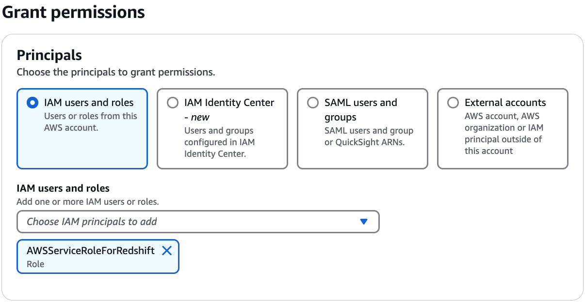

# Granting data lake permissions using the

LF-TBAC method

You can grant the `DESCRIBE` and `ASSOCIATE` Lake Formation permissions on
LF-Tags to principals so that they can view the LF-Tags and assign them to Data Catalog resources
(databases, tables, views, and columns). When LF-Tags are assigned to Data Catalog resources, you can use
the Lake Formation tag-based access control (LF-TBAC) method to secure those resources. For more information, see
[Lake Formation tag-based access control](tag-based-access-control.md "tag-based-access-control.md").

At first, only the data lake administrator can grant these permissions. If the data lake
administrator grants these permissions with the grant option, other principals can grant them.
The `DESCRIBE` and `ASSOCIATE` permissions are explained in [Lake Formation tag-based access control best
practices and considerations](lf-tag-considerations.md "lf-tag-considerations.md").

You can grant the `DESCRIBE` and `ASSOCIATE` permissions on a LF-Tag
to an external AWS account. A data lake administrator in that account can then grant those
permissions to other principals in the account. Principals to whom the data lake administrator
in the external account grants the `ASSOCIATE` permission can then assign LF-Tags
to Data Catalog resources that you shared with their account.

When granting to an external account, you must include the grant option.

You can grant permissions on LF-Tags by using the AWS Lake Formation console, the API, or the
AWS Command Line Interface (AWS CLI).

###### Note

The following steps are not needed for S3 Tables catalogs. You can use
LF-Tags to grant permissions on existing S3 Tables catalogs without deleting and
recreating them.

###### Enabling LF-Tags support for existing federated catalogs that uses Lake Formation permissions

Follow these steps, if you have existing federated catalogs that are using Lake Formation
permissions, such as Amazon Redshift or Amazon DynamoDB catalogs that were created before
LF-Tags support was available for federated catalogs.

1. Delete the existing catalog – Call the `deleteCatalog` API operation to remove the existing federated catalog that uses Lake Formation permissions.
2. Create a new federated catalog – Create a new catalog and point the new catalog to your existing namespace/datashare.

Use a new name for the catalog – This process updates your pre-existing
federated catalogs to support LF-Tag functionality. If you want to use the
same catalog name, contact AWS support team for assistance.

###### Topics

- [Granting Data Catalog permissions](#granting-cat-perms-TBAC-console "#granting-cat-perms-TBAC-console")

###### See also

- [Managing LF-Tag value
  permissions](TBAC-granting-tags.md "TBAC-granting-tags.md")
- [Managing LF-Tags for metadata access control](managing-tags.md "managing-tags.md")
- [Lake Formation tag-based access control](tag-based-access-control.md "tag-based-access-control.md")

## Granting Data Catalog permissions

Use the Lake Formation console or AWS CLI to grant
Lake Formation permissions on Data Catalog databases, tables, views, and columns using the Lake Formation tag-based access control (LF-TBAC) method.

Console
The following steps explain how to grant permissions by using the Lake Formation tag-based access
control (LF-TBAC) method and the **Grant data lake permissions** page on the Lake Formation
console. The page is divided into the following sections:

- Principals – The users, roles, and AWS accounts to
  grant permissions to.
- LF-Tags or catalog resources – The databases,
  tables, or resource links to grant permissions on.
- Permissions – The Lake Formation permissions to grant.

1. ###### Open the Grant data lake permissions page.

Open the AWS Lake Formation console at [https://console.aws.amazon.com/lakeformation/](https://console.aws.amazon.com/lakeformation/ "https://console.aws.amazon.com/lakeformation/"), and sign in as a
data lake administrator or as a user who has been granted Lake Formation permissions on
Data Catalog resources through LF-TBAC with the grant option.

In the navigation pane, under **Permissions**, choose **Data lake permissions**. Then
choose **Grant**. 2. ###### Specify the principals.

In the **Principals** section, choose a principal type and then
specify principals to grant permissions to.



**IAM users and roles**

Choose one or more users or roles from the **IAM users and
roles** list.

**IAM Identity Center**

Choose one or more users or from the **Users and
groups** list.

**SAML users and groups**

For **SAML and Quick Suite users and groups**,
enter one or more Amazon Resource Names (ARNs) for users or groups federated
through SAML, or ARNs for Quick Suite users or groups. Press Enter
after each ARN.

For information about how to construct the ARNs, see [Lake Formation grant and revoke AWS CLI commands](lf-permissions-reference.md#perm-command-format "lf-permissions-reference.md#perm-command-format").

###### Note

Lake Formation integration with Quick Suite is supported for
Quick Suite Enterprise Edition only.

**External accounts**

For **AWS accounts, AWS organization**, or
**IAM principal** enter one or more valid
AWS account IDs, organization IDs, organizational unit IDs, or ARN for the
IAM user or role. Press **Enter** after each ID.

An organization ID consists of "o-" followed
by 10 to 32 lower-case letters or digits.

An organizational unit ID starts with "ou-" followed by 4 to 32 lowercase letters or digits (the ID of the root that contains the OU).
This string is followed by a second "-" dash and 8 to 32 additional lowercase letters or digits. 3. ###### Specify the LF-Tags.

Ensure that the **Resources matched by LF-Tags** option
is chosen. Choose **LF-Tag key-value pairs** or **Saved LF-Tag expressions**.

    1. If you choose the **LF-Tag key-value pairs** option, choose the keys and values.


    If you choose more than one value, you are creating a LF-Tag expression with an
     `OR` operator. This means that if any of the LF-Tag values match a
     LF-Tag assigned to a Data Catalog resource, you are granted permissions on the
     resource.


    ![The LF-Tag or catalog resources section contains two tiles arranged horizontally, where each tile contains an option button and descriptive text. The options are Resources matched by LF-Tags (recommended), and Named data catalog resources. Resources matched by LF-Tags is selected. Below the tiles are a Key field and a Values field arranged horizontally. The Key field contains "module" and the Values field is a dropdown list that contains three entries: Orders, Sales, and Customers. Each entry has a check box associated. The check box for Customers is selected. To the right of these two fields is a Remove button. At the bottom is an Add LF-Tag button, indicating that you can add another row containing the Key and Values fields and a Remove button.](images/grant-data-permissions-tags-2.png)
    2. (Optional) Choose **Add LF-Tag key-value pair** again to specify another
     LF-Tag.


    If you specify more than one LF-Tag, you are creating a LF-Tag expression with an
     `AND` operator. The principal is granted permissions on a Data Catalog
     resource only if the resource was assigned a matching LF-Tag for each LF-Tag
     in the LF-Tag expression.
    3. Choose **Save as a new expression** option to reuse the expression.


    You need `Create LF-Tag expression` to save expressions.


    For more information about LF-Tag expressions, see [Managing LF-Tag expressions for metadata access
     control](managing-tag-expressions.md "managing-tag-expressions.md").

4. ###### Specify the permissions.

Specify the permissions that you want to grant the principal on matching Data Catalog
resources. Matching resources are those resources that were assigned LF-Tags that
match one of the LF-Tag expressions granted to the principal.

You can specify the permissions to grant on matching databases, matching tables,
and matching views.


Under **Database permissions**, select the database
permissions to grant to the principal on matching databases.

Under **Table permissions**, select the table or view permissions
to grant to the principal on matching tables and views.

You can also choose `Select`, `Describe`, and `Drop` permissions from the **Table permissions** to apply on views. 5. Choose **Grant**.

AWS CLI
You can use the AWS Command Line Interface (AWS CLI) and the Lake Formation tag-based access control (LF-TBAC) method to
grant Lake Formation permissions on Data Catalog databases, tables, and columns.

###### Granting data lake permissions using the

AWS CLI and the LF-TBAC method

- Use the `grant-permissions` command.

###### Example

The following example grants the LF-Tag expression
"`module=*`" (all values of the LF-Tag key `module`) to
user `datalake_user1`. That user will have the
`CREATE_TABLE` permission on all matching
databases—databases that have been assigned the LF-Tag with the key
`module`, with any value.

```
aws lakeformation grant-permissions --principal DataLakePrincipalIdentifier=arn:aws:iam::111122223333:user/datalake_user1 --permissions "CREATE_TABLE" --resource '{ "LFTagPolicy": {"CatalogId":"111122223333","ResourceType":"DATABASE","Expression":[{"TagKey":"module","TagValues":["*"]}]}}'
```

###### Example

The next example grants the LF-Tag expression "`(level=director)
 AND (region=west OR region=south)`" to user
`datalake_user1`. That user will have the `SELECT`,
`ALTER`, and `DROP` permissions with the grant option
on matching tables—tables that have been assigned both
`level=director` and (`region=west` or
`region=south`).

```
aws lakeformation grant-permissions --principal DataLakePrincipalIdentifier=arn:aws:iam::111122223333:user/datalake_user1 --permissions "SELECT" "ALTER" "DROP" --permissions-with-grant-option "SELECT" "ALTER" "DROP" --resource '{ "LFTagPolicy": {"CatalogId":"111122223333","ResourceType":"TABLE","Expression": [{"TagKey": "level","TagValues": ["director"]},{"TagKey": "region","TagValues": ["west", "south"]}]}}'
```

###### Example

This next example grants the LF-Tag expression
"`module=orders`" to the AWS account 1234-5678-9012.
The data lake administrator in that account can then grant the
"`module=orders`" expression to principals in their account.
Those principals will then have the `CREATE_TABLE` permission on
matching databases owned by account 1111-2222-3333 and shared with
account 1234-5678-9012 by using either the named resource method or
the LF-TBAC method.

```
aws lakeformation grant-permissions --principal DataLakePrincipalIdentifier=123456789012 --permissions "CREATE_TABLE" --permissions-with-grant-option "CREATE_TABLE" --resource '{ "LFTagPolicy": {"CatalogId":"111122223333","ResourceType":"DATABASE","Expression":[{"TagKey":"module","TagValues":["orders"]}]}}'
```
