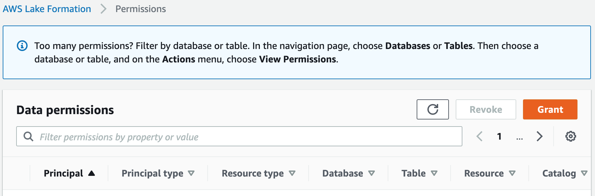

# Granting data permissions provided by data

filters

Data filters represent a subset of data within a table. To provide data access to
principals, `SELECT` permissions need to be granted to those principals. With this
permission the principals can:

- View the actual table name in list of tables shared with their account.
- Create data filters on the shared table and grant permissions to their users on those
  data filters.

Console

###### To grant SELECT permissions

1. Go to the **Permissions** page in the Lake Formation console, and then
   choose **Grant**.

 2. Select the principals you want to provide access to, and select **Named
data catalog resources**.

 3. To provide access to the data that the filter represents, choose
**Select** under **Data filter
permissions**.


CLI
Enter a `grant-permissions` command. Specify `DataCellsFilter`
for the resource argument, and specify `SELECT` for the Permissions argument.

The following example grants `SELECT` with the grant option to user
`datalake_user1` on the data filter `restrict-pharma`, which
belongs to the `orders` table in the `sales` database in
AWS account `1111-2222-3333`.

```
aws lakeformation grant-permissions --cli-input-json file://grant-params.json
```

The following are the contents of file `grant-params.json`.

```
{
    "Principal": {
        "DataLakePrincipalIdentifier": "arn:aws:iam::111122223333:user/datalake_user1"
    },
    "Resource": {
        "DataCellsFilter": {
            "TableCatalogId": "111122223333",
            "DatabaseName": "sales",
            "TableName": "orders",
            "Name": "restrict-pharma"
        }
    },
    "Permissions": ["SELECT"]
}
```
