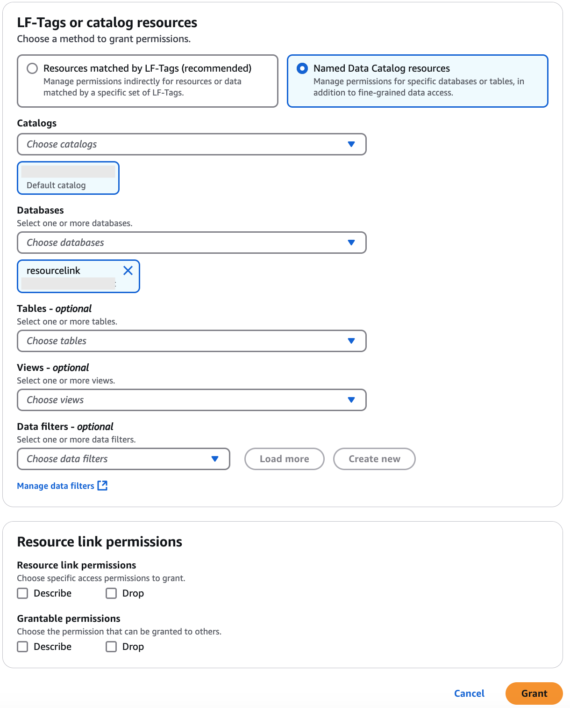

# Granting resource link permissions

Follow these steps to grant AWS Lake Formation permissions on one or more resource links
to a principal in your AWS account.

After you create a resource link, only you can view and access it. (This assumes that
**Use only IAM access control for new tables in this database** is not
enabled for the database.) To permit other principals in your account to access the
resource link, grant at least the `DESCRIBE` permission.

###### Important

Granting permissions on a resource link doesn't grant permissions on the target
(linked) database or table. You must grant permissions on the target separately.

You can grant permissions by using the Lake Formation console, the API, or the AWS Command Line Interface (AWS CLI).

console

###### To grant resource link permissions using the Lake Formation console

1. Do one of the following:
   - For database resource links, follow the steps in [Granting database permissions using the
     named resource method](granting-database-permissions.md "granting-database-permissions.md"). to do the following:
     1. Select the resource link from the databases list under Data Catalog,
        **Databases**.
     2. Choose **Grant** to open the
        **Grant permissions** page.
     3. Specify principals to grant permissions.
     4. The **Catalogs** and **Databases** fields are populated.

   - For table resource links, follow the steps in [Granting table permissions using the named resource method](granting-table-permissions.md "granting-table-permissions.md") to do the following:
     1. Select the resource link from the tables list under Data Catalog,
        **Tables**.
     2. Open the **Grant permissions** page.
     3. Specify principals.
     4. The **Catalogs**, **Databases** ,
        **Tables** fields are populated.
     5. Specify principals.

2. Under **Permissions**, select the permissions to grant.
   Optionally, select grantable permissions.

 3. Choose **Grant**.

AWS CLI

###### To grant resource link permissions using AWS CLI

- Run the `grant-permissions` command, specifying a resource link as the
  resource.

This example grants `DESCRIBE` to user `datalake_user1`
on the table resource link `incidents-link` in the database
`issues` in AWS account 1111-2222-3333.

```
aws lakeformation grant-permissions --principal DataLakePrincipalIdentifier=arn:aws:iam::111122223333:user/datalake_user1 --permissions "DESCRIBE" --resource '{ "Table": {"DatabaseName":"issues", "Name":"incidents-link"}}'

```

###### See Also:

- [Creating resource links](creating-resource-links.md "creating-resource-links.md")
- [Lake Formation permissions reference](lf-permissions-reference.md "lf-permissions-reference.md")
