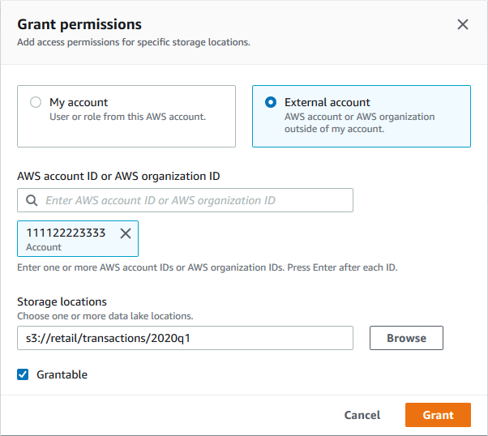

# Granting data location permissions

(external account)

Follow these steps to grant data location permissions to an external AWS account or
organization.

You can grant permissions by using the Lake Formation console, the API, or the AWS Command Line Interface
(AWS CLI).

###### Before you begin

Ensure that all cross-account access prerequisites are satisfied. For more
information, see [Prerequisites](cross-account-prereqs.md "cross-account-prereqs.md").

AWS Management Console

###### To grant data location permissions (external account, console)

1. Open the AWS Lake Formation console at [https://console.aws.amazon.com/lakeformation/](https://console.aws.amazon.com/lakeformation/ "https://console.aws.amazon.com/lakeformation/"). Sign in as a data lake
   administrator.
2. In the navigation pane, under **Permissions**, choose **Data locations**, and then
   choose **Grant**.
3. In the **Grant permissions** dialog box, choose the
   **External account** tile.
4. Provide the following information:
   - For **AWS account ID or AWS organization ID**, enter valid
     AWS account numbers, organization IDs, or organizational unit IDs.

   Press **Enter** after each ID.

   An organization ID consists of "o-" followed by 10 to 32 lower-case letters or
   digits.

   An organizational unit ID consists of "ou-" followed by 4 to 32 lowercase
   letters or digits (the ID of the root that contains the OU). This string is
   followed by a second "-" (hyphen) and 8 to 32 additional lowercase letters or
   digits.
   - Under **Storage locations**, choose
     **Browse**, and choose an Amazon Simple Storage Service (Amazon S3) storage location. The
     location must be registered with Lake Formation.

 5. Select **Grantable**. 6. Choose **Grant**.

AWS CLI

###### To grant data location permissions (external account, AWS CLI)

- To grant permissions to an external AWS account, enter a command similar to the
  following.

```
aws lakeformation grant-permissions --principal DataLakePrincipalIdentifier=111122223333  --permissions "DATA_LOCATION_ACCESS" --permissions-with-grant-option "DATA_LOCATION_ACCESS" --resource '{ "DataLocation": {"CatalogId":"123456789012","ResourceArn":"arn:aws:s3::retail/transactions/2020q1"}}'

```

This command grants `DATA_LOCATION_ACCESS` with the grant option to
account 1111-2222-3333 on the Amazon S3 location
`s3://retail/transactions/2020q1`, which is owned by account
1234-5678-9012.

To grant permissions to an organization, enter a command similar to the
following.

```
aws lakeformation grant-permissions --principal DataLakePrincipalIdentifier=arn:aws:organizations::111122223333:organization/o-abcdefghijkl --permissions "DATA_LOCATION_ACCESS" --permissions-with-grant-option "DATA_LOCATION_ACCESS" --resource '{"DataLocation": {"CatalogId":"123456789012","ResourceArn":"arn:aws:s3::retail/transactions/2020q1"}}'
```

This command grants `DATA_LOCATION_ACCESS` with grant option to the
organization `o-abcdefghijkl` on the Amazon S3 location
`s3://retail/transactions/2020q1`, which is owned by account
1234-5678-9012.

To grant permissions to a principal in an external AWS account, enter a command
similar to the following.

```
aws lakeformation grant-permissions --principal DataLakePrincipalIdentifier=arn:aws:iam::111122223333:user/datalake_user1 --permissions "DATA_LOCATION_ACCESS" --resource '{ "DataLocation": {"ResourceArn":"arn:aws:s3::retail/transactions/2020q1", "CatalogId": "123456789012"}}'
```

This command grants `DATA_LOCATION_ACCESS` to a principal in account
1111-2222-3333 on the Amazon S3 location
`s3://retail/transactions/2020q1`, which is owned by account
1234-5678-9012.

###### Example

The following example grants data location permissions on
`s3://retail` to `ALLIAMPrincipals` group in an
external account.

```
aws lakeformation grant-permissions --principal DataLakePrincipalIdentifier=111122223333:IAMPrincipals --permissions "DATA_LOCATION_ACCESS" --resource '{ "DataLocation": {"ResourceArn":"arn:aws:s3:::retail", "CatalogId": "123456789012"}}'
```

###### See Also:

- [Lake Formation permissions reference](lf-permissions-reference.md "lf-permissions-reference.md")
