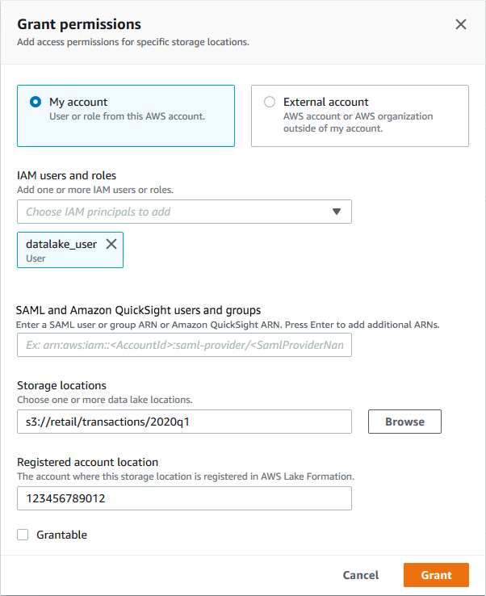

# Granting data location permissions (same

account)

Follow these steps to grant data location permissions to principals in your AWS
account. You can grant permissions by using the Lake Formation console, the API, or the AWS Command Line Interface
(AWS CLI).

AWS Management Console###### To grant data location permissions (same account)

1. Open the AWS Lake Formation console at [https://console.aws.amazon.com/lakeformation/](https://console.aws.amazon.com/lakeformation/ "https://console.aws.amazon.com/lakeformation/"). Sign in as a data lake
   administrator or as a principal who has grant permissions on the desired data
   location.
2. In the navigation pane, under **Permissions**, choose **Data
   locations**.
3. Choose **Grant**.
4. In the **Grant permissions** dialog box, ensure that the
   **My account** tile is selected. Then provide the following
   information:
   - For **IAM users and roles**, choose one or more principals.
   - For **SAML and Amazon Quick Suite users and groups**, enter
     one or more Amazon Resource Names (ARNs) for users or groups federated through SAML or ARNs for
     Amazon Quick Suite users or groups.

   Enter one ARN at a time, and press **Enter** after each ARN.
   For information about how to construct the ARNs, see [Lake Formation grant and revoke AWS CLI commands](lf-permissions-reference.md#perm-command-format "lf-permissions-reference.md#perm-command-format").
   - For **Storage locations**, choose
     **Browse**, and choose an Amazon Simple Storage Service (Amazon S3) storage location. The
     location must be registered with Lake Formation. Choose **Browse** again to
     add another location. You can also type the location, but ensure that you precede
     the location with `s3://`.
   - For **Registered account location**, enter the AWS account
     ID where the location is registered. This defaults to your account ID. In a
     cross-account scenario, data lake administrators in a recipient account can
     specify the owner account here when granting the data location permission to other
     principals in the recipient account.
   - (Optional) To enable the selected principals to grant data location
     permissions on the selected location, select
     **Grantable**.

 5. Choose **Grant**.

AWS CLI###### To grant data location permissions (same account)

- Run a `grant-permissions` command, and grant
  `DATA_LOCATION_ACCESS` to the principal, specifying the Amazon S3 path as the
  resource.

###### Example

The following example grants data location permissions on
`s3://retail` to user `datalake_user1`.

```
aws lakeformation grant-permissions --principal DataLakePrincipalIdentifier=arn:aws:iam::`<account-id>`:user/datalake_user1 --permissions "DATA_LOCATION_ACCESS" --resource '{ "DataLocation": {"ResourceArn":"arn:aws:s3:::retail"}}'
```

###### Example

The following example grants data location permissions on
`s3://retail` to `ALLIAMPrincipals` group.

```
aws lakeformation grant-permissions --principal DataLakePrincipalIdentifier=111122223333:IAMPrincipals --permissions "DATA_LOCATION_ACCESS" --resource '{ "DataLocation": {"ResourceArn":"arn:aws:s3:::retail", "CatalogId": "111122223333"}}'
```

###### See Also:

- [Lake Formation permissions reference](lf-permissions-reference.md "lf-permissions-reference.md")
