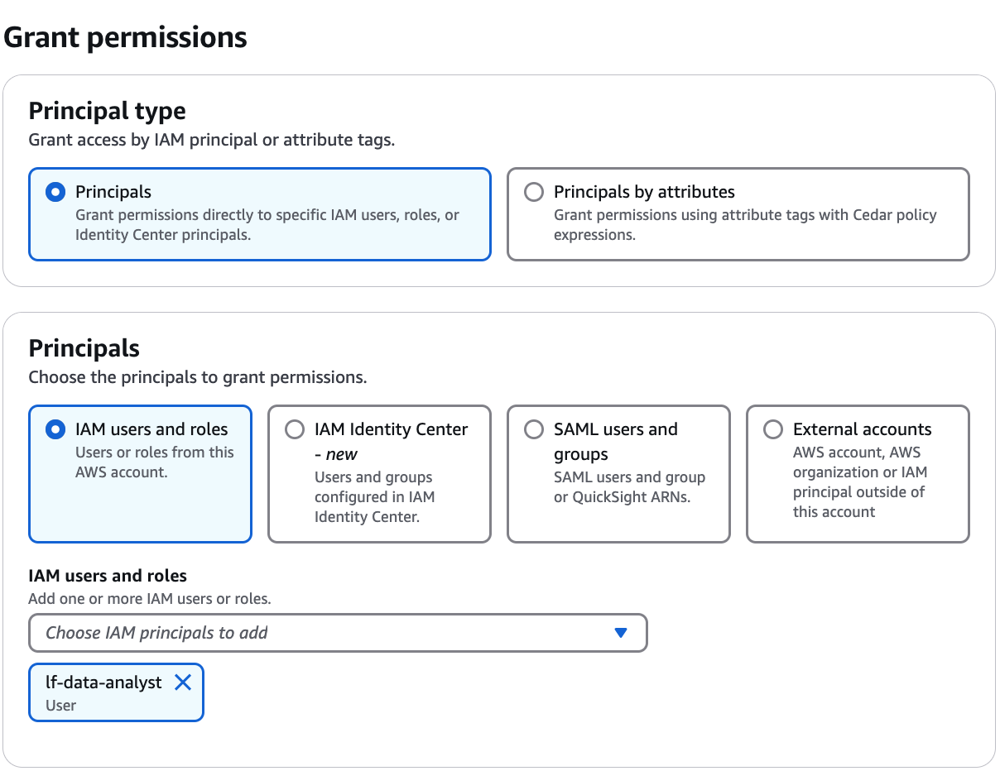

# Granting catalog permissions using the

named resource method

The following steps explain how to grant catalog permissions by using the named
resource method.

Console
Use the **Grant permissions** page on the Lake Formation console. The
page is divided into the following sections:

- **Principal type** – You can grant permissions to specific
  principals or use attribute tags.
  - Principals – The IAM users, roles, IAM Identity Center users and groups, SAML users and groups, AWS
    accounts, organizations, or organizational units to grant permissions.

  Principal by attributes – Add tag key-value pairs from IAMroles or IAM session tags. Principals with
  matching attributes receive access to the specified resource.
  - LF-Tags or catalog resources – The catalogs, databases,
    tables, views, or resource links to grant permissions on.
  - Permissions – The Lake Formation permissions to grant.

###### Note

To grant permissions on a database resource link, see [Granting resource link permissions](granting-link-permissions.md "granting-link-permissions.md").

1. Open the **Grant permissions** page.

Open the AWS Lake Formation console at [https://console.aws.amazon.com/lakeformation/](https://console.aws.amazon.com/lakeformation/ "https://console.aws.amazon.com/lakeformation/"), and sign in as
a data lake administrator, the catalog creator, or an IAM user who has

**Grantable permissions** on the catalog.

Do one of the following:

    * In the navigation pane, under **Permissions**,
     choose **Data permissions**. Then choose
     **Grant**.
    * In the navigation pane, choose **Catalogs** under **Data Catalog**. Then,
     on the **Catalogs** page, choose a catalog, and from the
     **Actions** menu, under
     **Permissions**, choose
     **Grant**.

###### Note

You can grant permissions on a catalog through its resource link.
To do so, on the **Catalogs** page, choose a catalog
link container, and on the **Actions** menu, choose
**Grant on target**. For more information, see
[How resource links work in Lake Formation](resource-links-about.md "resource-links-about.md"). 2. Next, in the **Principal type** section, choose
principals or specify attributes attached to the principals.

###### **Specify principals**

**IAM users and roles**

Choose one or more users or roles from the **IAM users and
roles** list.

**IAM Identity Center**

Choose one or more users or groups from the **Users and
groups** list. Select **Add** to add more users or groups.

**SAML users and groups**

For **SAML and Quick Suite users and groups**,
enter one or more Amazon Resource Names (ARNs) for users or groups federated
through SAML, or ARNs for Amazon Quick Suite users or groups. Press Enter
after each ARN.

For information about how to construct the ARNs, see [Lake Formation grant and revoke AWS CLI commands](lf-permissions-reference.md#perm-command-format "lf-permissions-reference.md#perm-command-format").

###### Note

Lake Formation integration with Quick Suite is supported only for Quick Suite Enterprise Edition.

**External accounts**

For **AWS account, AWS organization**, or
**IAM Principal** enter one or more valid AWS
account IDs, organization IDs, organizational unit IDs, or ARN for the IAM user or role. Press **Enter** after each ID.

An organization ID consists of "o-" followed by 10–32 lower-case letters
or digits.

An organizational unit ID starts with "ou-" followed by 4–32 lowercase
letters or digits (the ID of the root that contains the OU). This string is
followed by a second "-" dash and 8 to 32 additional lowercase letters or
digits.

###### **Principals by attributes**

**Attributes**
Add the IAM tag key-value pairs from the IAM role.

**Permission scope**
Specify if you're granting permissions to principals with matching attributes in the same account or in another account. 3. In the **LF-Tags or catalog resources** section, choose
**Named data catalog resources**.

 4. Choose one or more catalogs from the **Catalogs**
list. You can also choose one or more **Databases**,
**Tables**, and/or **Data
filters**. 5. In the **Catalog permissions** section, select permissions
and grantable permissions. Under **Catalog
permissions**, select one or more permissions to grant.

Choose **Super user** to grant unrestricted
administrative privileges to perform any operation on all resources
within the catalog (databases, tables, and views).

###### Note

After granting `Create database` or `Alter` on a
catalog that has a location property that points to a registered location,
be sure to also grant data location permissions on the location to the
principals. For more information, see [Granting data location permissions](granting-location-permissions.md "granting-location-permissions.md"). 6. (Optional) Under **Grantable permissions**, select the
permissions that the grant recipient can grant to other principals in their
AWS account. This option is not supported when you are granting permissions
to an IAM principal from an external account. 7. Choose **Grant**.

The **Data permissions** page shows the permission details. If you used
**Principals by attribute** option to grant permissions, you can view the
permission grant to `ALLPrincipals` in the list.

AWS CLI
For granting catalog permissions using AWS CLI, see [Creating Amazon Redshift federated catalogs](create-ns-catalog.md "create-ns-catalog.md").
