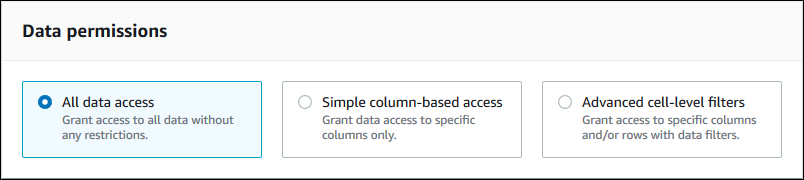

# Granting table permissions using the named resource method

You can use the Lake Formation console or AWS CLI to grant Lake Formation permissions
on Data Catalog tables. You can grant permissions on individual tables, or with a single
grant operation, you can grant permissions on all tables in a database.

If you grant permissions on all tables in a database, you are implicitly granting the
`DESCRIBE` permission on the database. The database then appears on the
**Databases** page on the console, and is returned by the
`GetDatabases` API operation. This automatic `DESCRIBE` permission grant
doesn't apply when using attribute-based access control (ABAC). When granting
permissions on all tables in a database using attributes, Lake Formation doesn't
implicitly grant `DESCRIBE` permission to the database.

When you choose `SELECT` as the permission to grant, you have the option
to apply a column filter, row filter, or cell filter.

Console
The following steps explain how to grant table permissions by using the named
resource method and the **Grant data lake permissions** page on the Lake Formation console.
The page is divided into these sections:

- Principals types – The users, roles, AWS
  accounts, organizations, or organizational units to grant permissions to.
  You can also grant permissions to principals with matching
  attributes.
- LF-Tags or catalog resources – The databases,
  tables, or resource links to grant permissions on.
- Permissions – The Lake Formation permissions to grant.

###### Note

To grant permissions on a table resource link, see [Granting resource link permissions](granting-link-permissions.md "granting-link-permissions.md").

1. Open the Grant permissions page.

Open the AWS Lake Formation console at [https://console.aws.amazon.com/lakeformation/](https://console.aws.amazon.com/lakeformation/ "https://console.aws.amazon.com/lakeformation/"), and sign in as a
data lake administrator, the table creator, or a user who has been granted
permissions on the table with the grant option.

Do one of the following:

    * In the navigation pane, choose **Data permissions**
     under **Permissions**. Then choose
     **Grant**.
    * In the navigation pane, choose **Tables**. Then, on
     the **Tables** page, choose a table, and on the
     **Actions** menu, under
     **Permissions**, choose
     **Grant**.

###### Note

You can grant permissions on a table through its resource link. To do so,
on the **Tables** page, choose a resource link, and on the
**Actions** menu, choose **Grant on
target**. For more information, see [How resource links work in Lake Formation](resource-links-about.md "resource-links-about.md"). 2. Next, in the **Principal types** section, specify principals or
principals with matching attrubutes to grant permissions.

**IAM users and roles**

Choose one or more users or roles from the **IAM users and
roles** list.

**IAM Identity Center**

Choose one or more users or groups from the **Users and
groups** list.

**SAML users and groups**

For **SAML and Quick Suite users and groups**,
enter one or more Amazon Resource Names (ARNs) for users or groups federated
through SAML, or ARNs for Quick Suite users or groups. Press Enter
after each ARN.

For information about how to construct the ARNs, see [Lake Formation grant and revoke AWS CLI commands](lf-permissions-reference.md#perm-command-format "lf-permissions-reference.md#perm-command-format").

###### Note

Lake Formation integration with Quick Suite is supported for
Quick Suite Enterprise Edition only.

**External accounts**

For **AWS account , AWS organization**, or
**IAM Principal** enter one or more valid AWS account IDs, organization IDs, organizational unit IDs, or the ARN for the IAM user or role.
Press **Enter** after each ID.

An organization ID consists of "o-" followed by 10–32 lower-case letters
or digits.

An organizational unit ID starts with "ou-" followed by 4–32 lowercase
letters or digits (the ID of the root that contains the OU). This string is
followed by a second "-" character and 8 to 32 additional lowercase letters or
digits.

Principals by attributes
Specify the attribute key and value(s).
If you choose more than one value, you are creating an attribute expression with an OR operator.
This means that if any of the attribute tag values assigned to an IAM role or user match, the role/user gains access permissions on the resource

Choose the permission scope by specifying if you're granting permissions to principals with matching attributes in the same account or in another account. 3. In the **LF-Tags or catalog resources** section, choose a
database. Then choose one or more tables, or **All tables**.

 4. ###### Specify the permissions with no data
filtering.

In the **Permissions** section, select the table permissions to grant, and optionally select grantable
permissions.


If you grant **Select**, the **Data
permissions** section appears beneath the **Table and
column permissions** section, with the **All data
access** option selected by default. Accept the default.

 5. Choose **Grant**. 6. ###### Specify the **Select** permission with
data filtering

Select the **Select** permission. Don't select any other
permissions.

The **Data permissions** section appears beneath the
**Table and column permissions** section. 7. Do one of the following:

    * Apply simple column filtering only.


    	1. Choose **Simple column-based
    	 access**.


    	![The top section is the Table and column permissions section. It is described in the preceding screenshot. It contains check boxes for table permissions and grantable permissions. The bottom section, Data permissions, has three tiles arranged horizontally, where each tile has an option button and description. The options are All data access, Simple column-based access, and Advanced cell-level filters. The Simple column-based access option is selected. Beneath the tiles is an option button group with the label Choose permission filter. The options are Include columns and Exclude columns. Beneath the option group is a Select columns dropdown list, and beneath that is a Grantable permissions subsection, which contains a single check box labeled Select.](images/grant-table-permissions-section-column-filter.png)
    	2. Choose whether to include or exclude columns, and then choose
    	 the columns to include or exclude.


    	Only include lists are supported
    	 when granting permissions to an external AWS account or
    	 organization.
    	3. (Optional) Under **Grantable permissions**,
    	 turn on the grant option for the Select permission.


    	 If you include the grant option, the grant recipient can
    	 grant permissions only on the columns that you grant to
    	 them.
    ###### Note

    You can also apply column filtering only by creating a data
     filter that specifies a column filter and specifies all rows as the
     row filter. However, this requires more steps.
    * Apply column, row, or cell filtering.


    	1. Choose **Advanced cell-level
    	 filters**.


    	![This section, titled Data permissions, is beneath the Table permissions section. It has three tiles arranged horizontally, where each tile has an option button and description. The options are All data access, Simple column-based access, and Advanced cell-level filters. The Advanced cell-level filters option is selected. Beneath the tiles is the label View existing permissions with an exposure triangle to the left. The existing permissions are not exposed. Below that is a section entitled Data filters to grant. To the right of the title are three buttons: Refresh, Manage filters, and Create new filter. Below the title and buttons is a text field with the placeholder text "Find filter". Below that is a table of existing filters. Each row has a check box at the left. The column headings are Filter name, Table, Database, and Table catalog ID. There are two rows. The filter name in the first row is restrict-pharma. The name in the second row is no-pharma.](images/grant-table-permissions-section-cell-filter.png)
    	2. (Optional) Expand **View existing
    	 permissions**.
    	3. (Optional) Choose **Create new
    	 filter**.
    	4. (Optional) To view details for the listed filters, or to
    	 create new or delete existing filters, choose **Manage
    	 filters**.


    	The **Data filters** page opens in a new
    	 browser window.


    	When you are finished on the **Data
    	 filters** page, return to the **Grant
    	 permissions** page, and if necessary, refresh the
    	 page to view any new data filters that you created.
    	5. Select one or more data filters to apply to the grant.


    	###### Note

    	If there are no data filters in the list, it means that no
    	 data filters were created for the selected table.

8. Choose **Grant**.

AWS CLI
You can grant table permissions by using the named resource method and the AWS Command Line Interface
(AWS CLI).

###### To grant table permissions using the AWS CLI

- Run a `grant-permissions` command, and specify a table as the
  resource.

###### Example– Grant on a single table - no filtering

The following example grants `SELECT` and `ALTER` to user
`datalake_user1` in AWS account 1111-2222-3333 on the table `inventory` in the database
`retail`.

```
aws lakeformation grant-permissions --principal DataLakePrincipalIdentifier=arn:aws:iam::111122223333:user/datalake_user1 --permissions "SELECT" "ALTER" --resource '{ "Table": {"DatabaseName":"retail", "Name":"inventory"}}'

```

###### Note

If you grant the `ALTER` permission on a table that has its
underlying data in a registered location, be sure to also grant data location
permissions on the location to the principals. For more information, see [Granting data location permissions](granting-location-permissions.md "granting-location-permissions.md").

###### Example– Grant on All Tables with the Grant option - no filtering

The next example grants `SELECT` with the grant option on all tables in
database `retail`.

```
aws lakeformation grant-permissions --principal DataLakePrincipalIdentifier=arn:aws:iam::111122223333:user/datalake_user1 --permissions "SELECT" --permissions-with-grant-option "SELECT" --resource '{ "Table": { "DatabaseName": "retail", "TableWildcard": {} } }'

```

###### Example– Grant with simple column filtering

This next example grants `SELECT` on a subset of columns in the table
`persons`. It uses simple column filtering.

```
aws lakeformation grant-permissions --principal DataLakePrincipalIdentifier=arn:aws:iam::111122223333:user/datalake_user1 --permissions "SELECT" --resource '{ "TableWithColumns": {"DatabaseName":"hr", "Name":"persons", "ColumnNames":["family_name", "given_name", "gender"]}}'
```

###### Example– Grant with a data filter

This example grants `SELECT` on the `orders` table and
applies the `restrict-pharma` data filter.

```
aws lakeformation grant-permissions --cli-input-json file://grant-params.json
```

The following are the contents of file
`grant-params.json`.

```
{
    "Principal": {"DataLakePrincipalIdentifier": "arn:aws:iam::111122223333:user/datalake_user1"},
    "Resource": {
        "DataCellsFilter": {
            "TableCatalogId": "111122223333",
            "DatabaseName": "sales",
            "TableName": "orders",
            "Name": "restrict-pharma"
        }
    },
    "Permissions": ["SELECT"],
    "PermissionsWithGrantOption": ["SELECT"]
}
```

###### See also

- [Overview of Lake Formation permissions](lf-permissions-overview.md "lf-permissions-overview.md")
- [Data filtering and cell-level security in Lake Formation](data-filtering.md "data-filtering.md")
- [Lake Formation personas and IAM permissions reference](permissions-reference.md "permissions-reference.md")
- [Granting resource link permissions](granting-link-permissions.md "granting-link-permissions.md")
- [Accessing and viewing shared Data Catalog tables and
  databases](viewing-shared-resources.md "viewing-shared-resources.md")
