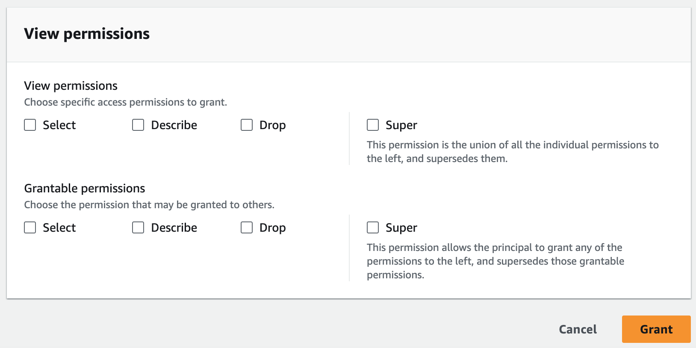

#

Granting permissions on views using the named resource method

The following steps explain how to grant permissions on views by using the named
resource method and the **Grant permissions** page. The page is divided
into the following sections:

- Principal types – The IAM users, roles,
  IAM Identity Center users and groups, AWS accounts, organizations, or organizational units to
  grant permissions. You can also grant permissions to principals with matching
  attributes.
- LF-Tags or catalog resources – The databases,
  tables, views, or resource links to grant permissions on.
- Permissions – The data lake permissions to grant.

## Open the **Grant permissions**

page

1. Open the AWS Lake Formation console at [https://console.aws.amazon.com/lakeformation/](https://console.aws.amazon.com/lakeformation/ "https://console.aws.amazon.com/lakeformation/"), and sign in as a
   data lake administrator, the database creator, or an IAM user who has **Grantable permissions**
   on the database.
2. Do one of the following:
   - In the navigation pane, under **Permissions**, choose
     **Data permissions**. Then choose
     **Grant**.
   - In the navigation pane, choose **Views** under
     **Data Catalog**. Then, on the **Views**
     page, choose a view, and from the **Actions** menu,
     under **Permissions**, choose
     **Grant**.

###### Note

You can grant permissions on a view through its resource link. To do
so, on the **Views** page, choose a resource link, and
on the **Actions** menu, choose **Grant on
target**. For more information, see [How resource links work in Lake Formation](resource-links-about.md "resource-links-about.md").

## Specify the principal types

In the **Principal types** section, either choose Principals or
Principals by attributes. If you choose Principals, the following options are
available:

**IAM users and roles**

Choose one or more users or roles from the **IAM users and
roles** list.

**IAM Identity Center**

Choose one or more users or groups from the **Users and
groups** list.

**SAML users and groups**

For **SAML and Quick Suite users and groups**,
enter one or more Amazon Resource Names (ARNs) for users or groups federated
through SAML, or ARNs for Amazon Quick Suite users or groups. Press Enter
after each ARN.

For information about how to construct the ARNs, see [Lake Formation grant and revoke AWS CLI commands](lf-permissions-reference.md#perm-command-format "lf-permissions-reference.md#perm-command-format").

###### Note

Lake Formation integration with Quick Suite is supported only for Quick Suite Enterprise Edition.

**External accounts**

For **AWS account, AWS organization**, or
**IAM Principal** enter one or more valid AWS
account IDs, organization IDs, organizational unit IDs, or ARN for the IAM
user or role. Press **Enter** after each ID.

An organization ID consists of "o-" followed by 10–32 lower-case letters
or digits.

An organizational unit ID starts with "ou-" followed by 4–32 lowercase
letters or digits (the ID of the root that contains the OU). This string is
followed by a second "-" dash and 8 to 32 additional lowercase letters or
digits.

###### See Also

- [Accessing and viewing shared Data Catalog tables and
  databases](viewing-shared-resources.md "viewing-shared-resources.md")

**Principals by attributes**
Specify the attribute key and value(s).
If you choose more than one value, you are creating an attribute expression with an OR operator.
This means that if any of the attribute tag values assigned to an IAM role or user match, the role/user gains access permissions on the resource

Choose the permission scope by specifying if you're granting permissions to principals with matching attributes in the same account or in another account.

## Specify the views

In the **LF-Tags or catalog resources** section, choose one or
more views to grant permissions on.

1. Choose **Named data catalog resources**.
2. Choose one or more views from the **Views** list. You can
   also choose one or more catalogs, databases, tables, and/or data
   filters.

Granting data lake permissions to `All tables` within a database
will result in the grantee having permissions on all tables and views within
the database.

## Specify the permissions

In the **Permissions** section, select permissions and grantable
permissions.

1. Under **View permissions**, select one or more
   permissions to grant.
2. (Optional) Under **Grantable permissions**, select the
   permissions that the grant recipient can grant to other principals in their
   AWS account. This option is not supported when you are granting permissions
   to an IAM principal from an external account.
3. Choose **Grant**.

###### See Also

- [Lake Formation permissions reference](lf-permissions-reference.md "lf-permissions-reference.md")
- [Granting permissions on a database or table shared
  with your account](regranting-shared-resources.md "regranting-shared-resources.md")
