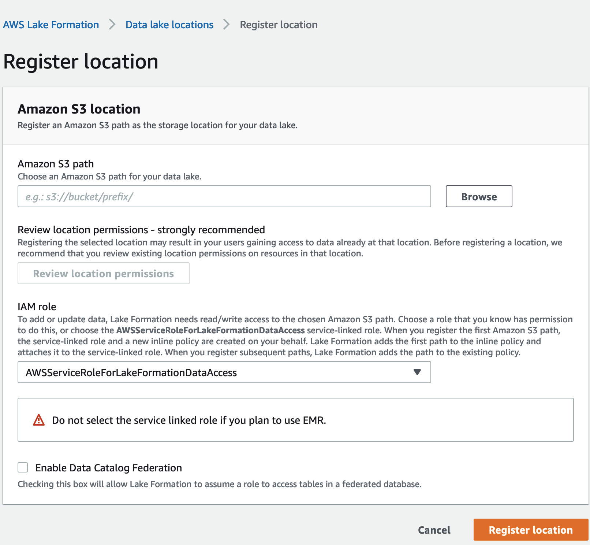

# Prerequisites for connecting the Data Catalog to the Hive metastore

To connect the AWS Glue Data Catalog to an external Apache Hive metastore and set up data access permissions, you
need to complete the following requirements:

###### Note

We recommend that a Lake Formation administrator deploys the AWS SAM application, and only a privileged user uses the Hive metastore connection to create the corresponding federated databases.

1. ###### Create IAM roles.

###### To deploy the AWS SAM application

    * Create a role that has the necessary permissions for deploying resources (Lambda function,
     Amazon API Gateway, IAM role, and the AWS Glue connection) required to create a
     connection to the Hive metastore.

###### To create federated databases

The following permissions are required on resources:

    * `glue:CreateDatabase on resource arn:aws:glue:region:account-id:database/gluedatabasename`
    * `glue:PassConnection on resource arn:aws:glue:region:account-id:connection/hms_connection`

2. ###### Register the Amazon S3 location with Lake Formation.

To use Lake Formation to manage and secure the data in your data lake, you must register the Amazon S3
location that has the data for tables in the Hive metastore with Lake Formation. By doing so, Lake Formation
can vend credentials to AWS analytical services such as Athena, Redshift Spectrum, and Amazon EMR.

For more information on registering an Amazon S3 location, see [Adding an Amazon S3 location to your data lake](register-data-lake.md "register-data-lake.md").

When you register the Amazon S3 location, select the **Enable Data Catalog
Federation** check box to allow Lake Formation to assume a role to access tables in a
federated database.

For more information about registering a data location with Lake Formation, see [Configure an Amazon S3 location for your
data lake](initial-lf-config.md#register-s3-location "initial-lf-config.md#register-s3-location"). 3. ###### Use the correct Amazon EMR version.

To use Amazon EMR with the federated Hive metastore databases, you need to have Hive version
3.x or higher and Amazon EMR version 6.x or higher.
