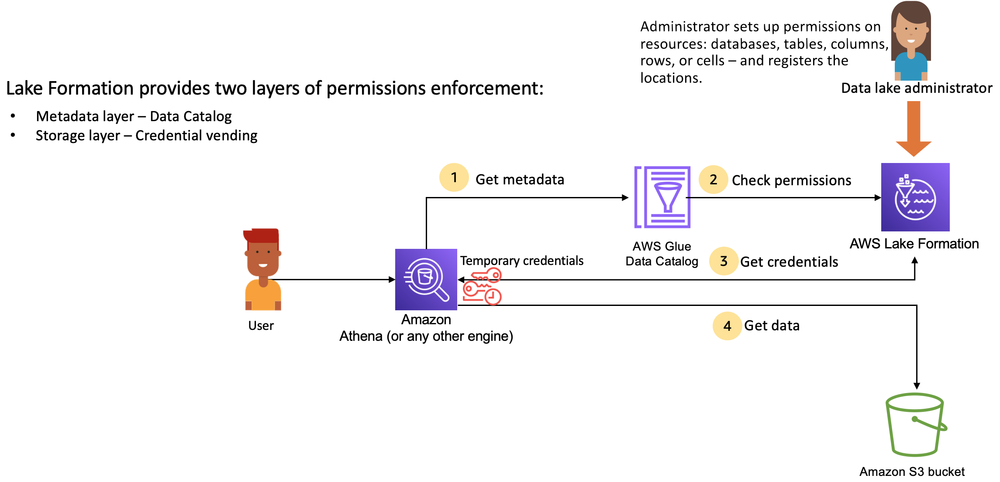

# AWS Lake Formation: How it works

AWS Lake Formation provides a relational database management system (RDBMS) permissions model to grant or revoke access to
Data Catalog resources such as databases, tables, and columns with underlying data in Amazon S3. The easy to manage Lake Formation permissions replace the complex Amazon S3 bucket policies
and corresponding IAM policies.

In Lake Formation, you can implement permissions on two levels:

- Enforcing metadata-level permissions on the Data Catalog resources such as databases and
  tables
- Managing storage access permissions on the underlying data stored in Amazon S3 on behalf of
  integrated engines

## Lake Formation permissions management workflow

Lake Formation integrates with analytical engines to query Amazon S3 data stores and metadata objects that are registered with Lake Formation. The following diagram
illustrates how permissions management works in Lake Formation.

###### Lake Formation permissions management high-level steps

Before Lake Formation can provide access controls for data in your data lake, a
[data lake administrator](initial-lf-config.md#create-data-lake-admin "initial-lf-config.md#create-data-lake-admin") or a user
with administrative permissions sets up individual Data Catalog table user policies to allow or deny
access to Data Catalog tables using Lake Formation permissions.

Then, either the data lake administrator or a user delegated by the administrator
grants Lake Formation permissions to users on the Data Catalog databases and tables, and registers
the Amazon S3 location of the table with Lake Formation.

1. **Get metadata** – A principal (user) submits a query or an
   ETL script to an [integrated analytical
   engine](working-with-services.md "working-with-services.md") such as Amazon Athena, AWS Glue, Amazon EMR, or Amazon Redshift Spectrum. The
   integrated analytical engine identifies the table that is being requested and
   sends a request for metadata to the Data Catalog.
2. **Check permissions** – The Data Catalog checks
   user's permissions with Lake Formation, and if the user is authorized to access the table,
   returns the metadata that the user is allowed to see to the engine.
3. **Get credentials** – The Data Catalog lets the
   engine know if the table is managed by Lake Formation or not. If the underlying data is
   registered with Lake Formation, the analytical engine requests Lake Formation to provide data access
   by granting temporary access.
4. **Get data** – If the user is authorized to
   access the table, Lake Formation provides temporary access to the integrated
   analytical engine. Using the temporary access, the analytical engine
   fetches the data from Amazon S3, and performs necessary filtering such as column,
   row, or cell filtering. When the engine finishes running the job, it returns the
   results back to the user. This process is called [credential
   vending](using-cred-vending.md "using-cred-vending.md").

If the table is not managed by Lake Formation, the second call from the analytic engine
is made directly to Amazon S3. The concerned Amazon S3 bucket policy and IAM user policy
are evaluated for data access.

Whenever you use IAM policies, make sure that you follow IAM best practices.
For more information, see [Security best practices in IAM](../../../IAM/latest/UserGuide/best-practices.md "../../../IAM/latest/UserGuide/best-practices.md") in the _IAM
User Guide_.

###### Topics

- [Metadata permissions](metadata-permissions.md "metadata-permissions.md")
- [Storage access management](storage-permissions.md "storage-permissions.md")
- [Cross-account data sharing in Lake Formation](cross-data-sharing-lf.md "cross-data-sharing-lf.md")
