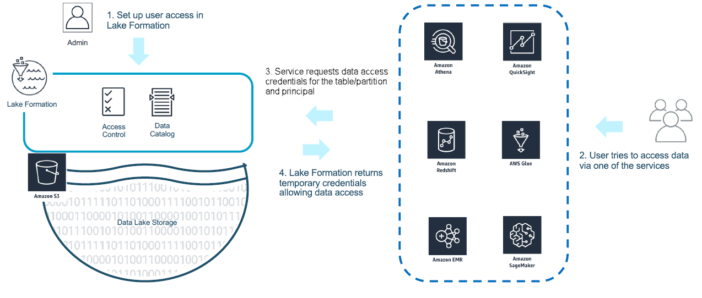

# How Lake Formation application integration works

This section describes how to use application integration API operations to integrate a
third-party application (query engine) with Lake Formation.

1. The Lake Formation administrator performs the following activities:
   - Registers an Amazon S3 location with Lake Formation by providing an IAM role (used for
     vending credentials) that has appropriate permissions to access data within the Amazon S3
     location
   - Registers a third-party application to be able to call Lake Formation's credential vending API
     operations. See [Registering a third-party query engine](register-query-engine.md "register-query-engine.md")
   - Grants permissions for users to access databases and tables

   For example, if you want to publish a user sessions data set that includes some
   columns containing personally identifiable information (PII), to restrict access,
   you assign these columns an [LF-TBAC](tag-based-access-control.md "tag-based-access-control.md") tag named “classification” with a value of “sensitive”. Next, you
   define a permission that allows a business analyst to access the user sessions data,
   but exclude those columns tagged with _classification =
   sensitive_.

2. A principal (user) submits a query to an integrated service.
3. The integrated application sends the request to Lake Formation asking for table information and
   credentials to access the table.
4. If the querying principal is authorized to access the table, Lake Formation returns the
   credentials to the integrated application, which allows data access.

###### Note

Lake Formation doesn't access the underlying data when vending credentials. 5. The integrated service reads data from Amazon S3, filters columns based on the policies it
received, and returns the results back to the principal.

###### Important

Lake Formation credential vending API operations enable a **distributed-enforcement with explicit deny on failure (fail-close) model.**
This introduces a three-party security model between customers, third-party services and
Lake Formation. Integrated services are trusted to properly enforce Lake Formation permissions
(distributed-enforcement).

The integrated service is responsible for filtering the data read from Amazon S3
based on the policies returned from Lake Formation before the filtered data is returned
back to the user. Integrated services follow a fail-close model, which means that they must
fail the query if they are unable to enforce required Lake Formation permissions.
