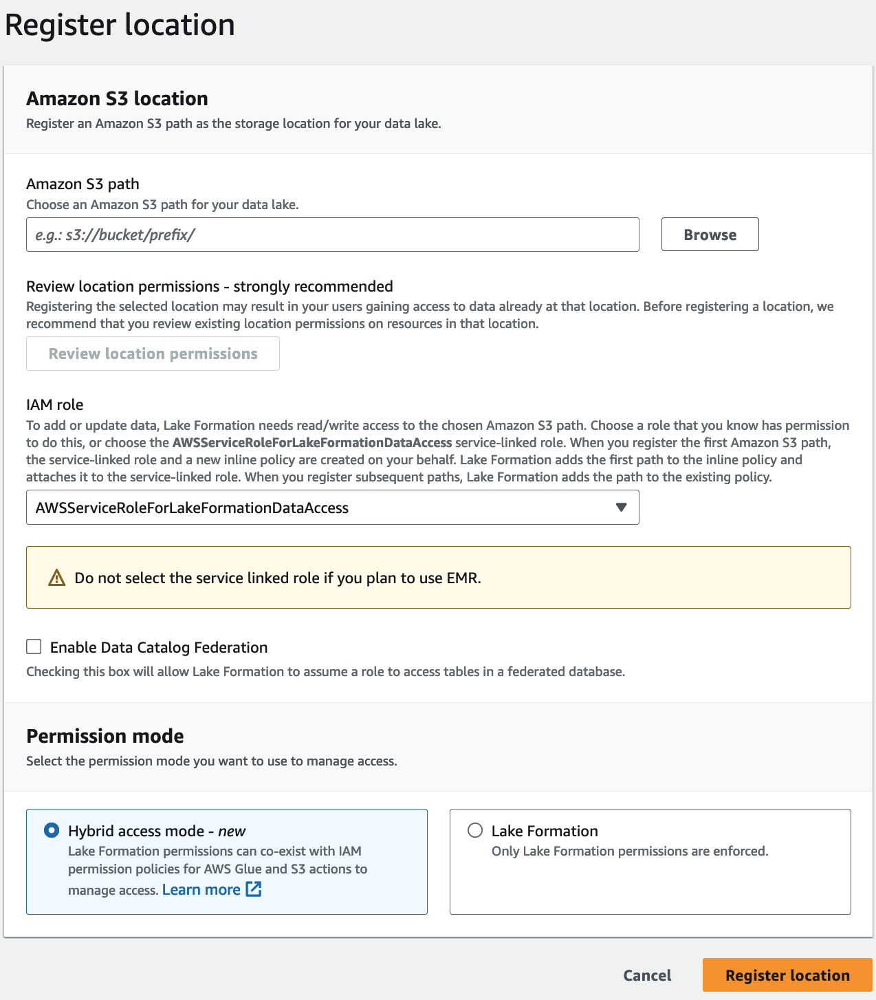
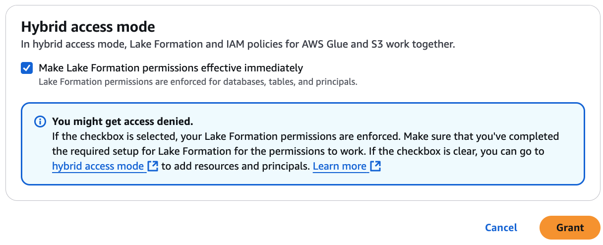
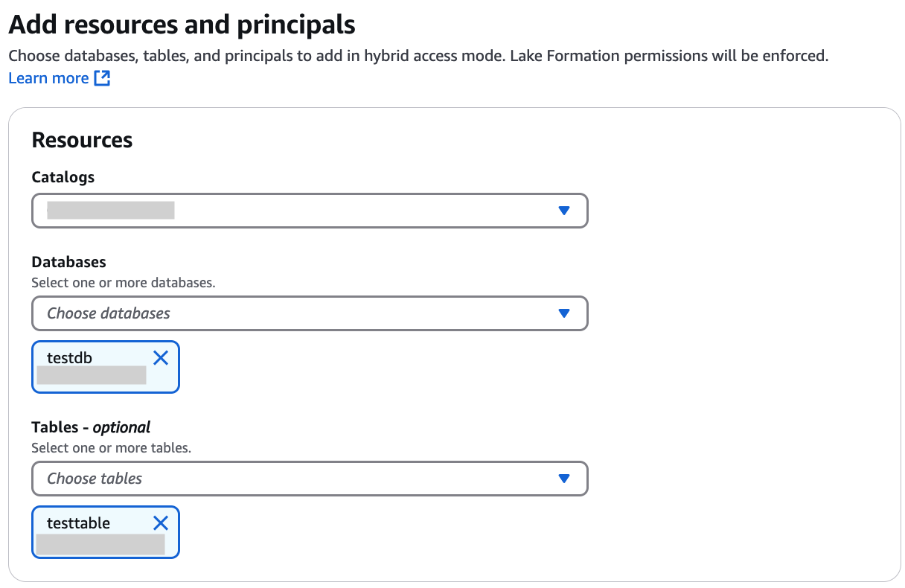
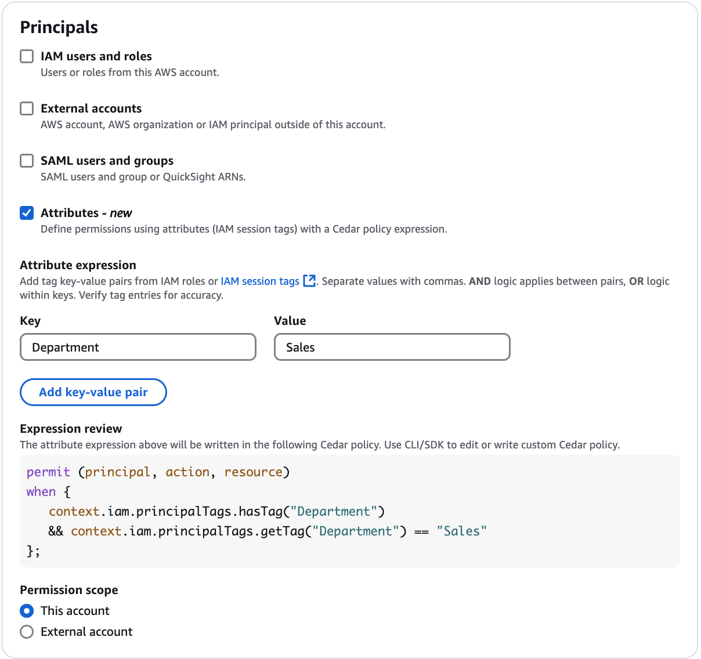

# Converting an AWS Glue resource to a hybrid resource

Follow these steps to register an Amazon S3 location in hybrid access mode and on-board new
Lake Formation users without interrupting the existing Data Catalog users' data access.

Scenario description - The data location is not registered with Lake Formation, and users' access
to the Data Catalog database and tables is determined by IAM permissions policies for Amazon S3 and
AWS Glue actions.
The `IAMAllowedPrincipals` group by default has `Super` permissions on all tables in the database.

###### To enable hybrid access mode for a data location that is not registered with Lake Formation

1. ###### Register an Amazon S3 location enabling hybrid access mode.

Console

    1. Sign in to the [Lake Formation
     console](https://console.aws.amazon.com/lakeformation/ "https://console.aws.amazon.com/lakeformation/") as a data lake administrator.
    2. In the navigation pane, choose **Data lake locations** under **Administration**.
    3. Choose **Register location**.


    
    4. On the **Register location** window, choose the **Amazon S3** path that you want to register with Lake Formation.
    5. For **IAM role**, choose either the `AWSServiceRoleForLakeFormationDataAccess` service-linked role (the default) or a custom IAM

     role that meets the requirements in [Requirements for roles used to register
     locations](registration-role.md "registration-role.md").
    6. Choose **Hybrid access mode** to apply fine-grained Lake Formation access
     control policies to opt-in principals and Data Catalog databases and tables
     pointing to the registered location.


    Choose Lake Formation to allow Lake Formation to authorize access requests to the registered location.
    7. Choose **Register location**.

AWS CLI
Following is an example for registering a data location with Lake Formation with
HybridAccessEnabled:true/false. Default value for the
`HybridAccessEnabled` parameter is false. Replace Amazon S3 path, role name, and AWS account id with valid values.

```
aws lakeformation register-resource --cli-input-json file:`file path`
json:
    {
        "ResourceArn": "arn:aws:s3:::`s3-path`",
        "UseServiceLinkedRole": false,
        "RoleArn": "arn:aws:iam::`<123456789012>`:role/`<role-name>`",
        "HybridAccessEnabled": true
    }
```

2. ###### Grant permissions and opt in principals to use Lake Formation permissions for
   resources in hybrid access mode

Before you opt in principals and resources in hybrid access mode, verify that
`Super` or `All` permissions to
`IAMAllowedPrincipals` group exists on the databases and tables that have
location registered with Lake Formation in hybrid access mode.

###### Note

You can't grant the `IAMAllowedPrincipals` group permission on `All
 tables` within a database. You need to select each table separately from the
drop-down menu, and grant permissions. Also, when you create new tables in the
database, you can choose to use the `Use only IAM access control for new tables
 in new databases` in the **Data Catalog Settings**. This
option grants `Super` permission to the `IAMAllowedPrincipals`
group automatically when you create new tables within the database.

Console

    1. On the Lake Formation console, under **Data Catalog**, choose
     **Catalogs**, **Databases**, or
     **Tables**.
    2. Select a catalog, a database, or a table from the list, and choose **Grant**
     from the **Actions** menu.
    3. Choose principals to grant permissions on the database, tables, and columns using named resource method or LF-Tags.


    Alternatively, choose **Data permissions**, select the
     principals to grant permissions from the list, and choose
     **Grant**.


    For more details on granting data permissions, see [Granting permissions on Data Catalog resources](granting-catalog-permissions.md "granting-catalog-permissions.md").


    ###### Note

    If you’re granting a principal Create table permission, you also need to grant data location
     permissions (`DATA_LOCATION_ACCESS`) to the principal. This permission is not needed to update tables.

    For more information, see [Granting data location permissions](granting-location-permissions.md "granting-location-permissions.md").
    4. When you use **Named resource method** to grant permissions, the option to opt in principals and resources is available on the lower section of the **Grant data permission** page.


    Choose **Make Lake Formation permissions effective immediately** to enable Lake Formation permissions for the principals and resources.


    
    5. Choose **Grant**.


     When you opt in principal A on table A that is pointing to a data location,
     it allows principal A to have access to this table’s location using Lake Formation
     permissions if the data location is registered in hybrid mode.

AWS CLI
Following is an example for opting in a principal and a table in hybrid access mode. Replace the role name, AWS account id, database name, and table name with valid values.

```
aws lakeformation create-lake-formation-opt-in --cli-input-json file://`file path`
json:
  {
        "Principal": {
            "DataLakePrincipalIdentifier": "arn:aws:iam::`<123456789012>`:role/`<hybrid-access-role>`"
        },
        "Resource": {
            "Table": {
                "CatalogId": "`<123456789012>`",
                "DatabaseName": "`<hybrid_test>`",
                "Name": "`<hybrid_test_table>`"
            }
        }
    }
```

    1. If you choose LF-Tags to grant permissions, you can opt in principals to
     use Lake Formation permissions in a separate step. You can do this by
     choosing **Hybrid access mode** under
     **Permissions** from the left navigation bar.
    2. On the lower section of the **Hybrid access mode** page, choose **Add** to add resources and principals to hybrid access mode.
    3. On the **Add resources and principals** page, choose the
     catalogs, databases and tables registered in hybrid access mode.


    You can choose `All tables` under a database to grant access.


    
    4. Choose principals opt in to use Lake Formation permissions in
     hybrid access mode.


    	* **Principals** – You can choose IAM users and roles in the same account or in another account. You can also choose SAML users and
    	 groups.
    	* **Attributes** – Select attributes to grant permissions based on
    	 attributes.


    	
    	* Enter the key-value pair to create a grant based on attributes. Review the Cedar policy
    	 expression on the console. For more information about Cedar,
    	 see [What is Cedar? | Cedar Policy Language Reference GuideLink](https://docs.cedarpolicy.com/ "https://docs.cedarpolicy.com/").
    	* Choose **Add**.


    	All IAM roles/users with matching attributes are granted access.
    5. Choose **Add**.
