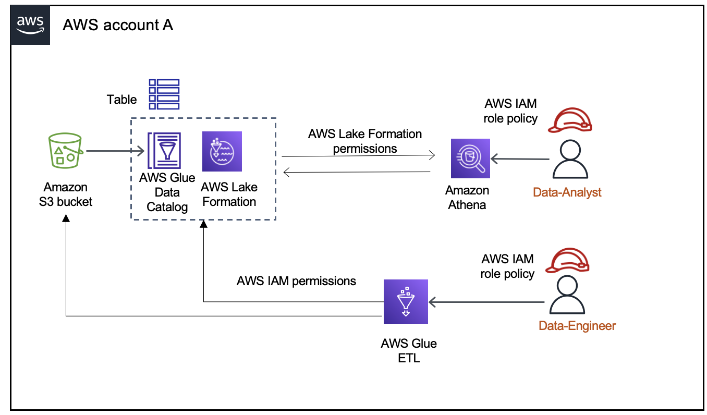

# Hybrid access mode

AWS Lake Formation _hybrid access mode_ supports two permission
pathways to the same AWS Glue Data Catalog objects.
In the first pathway,
Lake Formation allows you to select specific principals, and grant them Lake Formation permissions to access
catalogs, databases, tables, and views by opting in. The second pathway allows all other principals to
access these resources through the default IAM principal policies for Amazon S3 and AWS Glue actions.

When registering an Amazon S3 location with Lake Formation, you have the option to either enforce Lake Formation
permissions for all resources at this location or use hybrid access mode. The hybrid access mode
enforces only `CREATE_TABLE`, `CREATE_PARTITION`,
`UPDATE_TABLE` permissions by default. When an Amazon S3 location is in the hybrid mode,
you can enable Lake Formation permissions by opting in principals for the Data Catalog objects under that
location.
It means both Lake Formation permissions and IAM permissions can control access to
that data. This means that opted in principals will require both Lake Formation permissions and
IAM permissions to access the data, while non-opted-in principals will continue to access data
using only IAM permissions.

Thus, hybrid access mode provides the flexibility to selectively enable Lake Formation for catalogs,
databases, and tables in your Data Catalog for a specific set of users without interrupting the
access for other existing users or workloads.

For considerations and limitations, see [Hybrid access mode considerations and limitations](notes-hybrid.md "notes-hybrid.md") .

###### Terms and definitions

Here are the definitions of Data Catalog resources based on how you set up access permissions:

Lake Formation resource

A resource that is registered with Lake Formation. Users require Lake Formation permissions to access the
resource.

AWS Glue resource

A resources that is not registered with Lake Formation. Users require only IAM permissions to
access the resource because it has `IAMAllowedPrincipals` group permissions.
Lake Formation permissions are not enforced.

For more information on `IAMAllowedPrincipals` group permissions, see [Metadata permissions](metadata-permissions.md "metadata-permissions.md").

Hybrid resource

A resources that is registered in hybrid access mode. Based on the users accessing the
resource, the resource dynamically switch between being a Lake Formation resource or an AWS Glue
resource.

## Common hybrid access mode use cases

You can use hybrid access mode to provide access in single account and cross-account data
sharing scenarios:

###### Single account scenarios

- **Convert an AWS Glue resource to a hybrid resource**
  – In this scenario, you are not currently using Lake Formation but want to adopt Lake Formation
  permissions for Data Catalog objects. When you register the Amazon S3 location in hybrid access
  mode, you can grant Lake Formation permissions to users who opt in specific databases and tables
  pointing to that location.
- **Convert a Lake Formation resource to a hybrid resource** –
  Currently, you are using Lake Formation permissions to control access for a Data Catalog database but
  want to provide access to new principals using IAM permissions for Amazon S3 and AWS Glue
  without interrupting the existing Lake Formation permissions.

When you update a data location registration to hybrid access mode, new principals can access the
Data Catalog database pointing the Amazon S3 location using IAM permissions policies without
interrupting existing users' Lake Formation permissions.

Before updating the data location registration to enable hybrid access mode, you need to
first opt in principals that are currently accessing the resource with Lake Formation permissions.

This is to prevent potential interruption to the current workflow.
You need to also grant
`Super` permission on the tables in the database to the `IAMAllowedPrincipal` group.

###### Cross-account data sharing scenarios

- **Share AWS Glue resources using hybrid access mode**
  – In this scenario, the producer account has tables in a database that are currently
  shared with a consumer account using IAM permissions policies for Amazon S3 and AWS Glue
  actions. The data location of the database is not registered with Lake Formation.

Before registering the data location in hybrid access mode, you need to update the
**Cross account version settings** to version 4. Version 4 provides the
new AWS RAM permission policies required for cross-account sharing when
`IAMAllowedPrincipal` group has `Super` permission on the
resource. For those resources with `IAMAllowedPrincipal` group permissions, you
can grant Lake Formation permissions to external accounts and opt them in to use Lake Formation permissions.
The data lake administrator in the recipient account can grant Lake Formation permissions to
principals in the account and opt them in to enforce the Lake Formation permissions.

- **Share Lake Formation resources using hybrid access mode** –
  Currently, the producer account has tables in a database that are shared with a consumer
  account enforcing Lake Formation permissions. The data location of the database is registered with
  Lake Formation.

In this case, you can update the Amazon S3 location registration to hybrid access mode, and share the data from Amazon S3 and metadata
from Data Catalog using Amazon S3 bucket policies and Data Catalog resource policies to principals in the consumer account.
You need to re-grant the existing Lake Formation permissions and opt in the principals before updating the Amazon S3 location registration.
Also, you need to grant `Super` permission on the tables in the database to the `IAMAllowedPrincipals` group.

###### Topics

- [How hybrid access mode works](hybrid-access-workflow.md "hybrid-access-workflow.md")
- [Setting up hybrid access mode - common scenarios](hybrid-access-setup.md "hybrid-access-setup.md")
- [Removing principals and resources from hybrid access mode](delete-hybrid-access.md "delete-hybrid-access.md")
- [Viewing principals and resources in hybrid access mode](view-hybrid-access.md "view-hybrid-access.md")
- [Additional resources](additional-resources-hybrid.md "additional-resources-hybrid.md")
