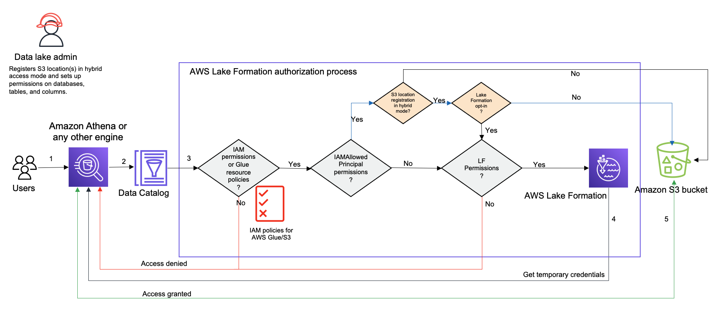

# How hybrid access mode works

The following diagram shows how Lake Formation authorization works in hybrid access mode when you query
the Data Catalog resources.

Before accessing data in your data lake, a data lake administrator or a user with
administrative permissions sets up individual Data Catalog table user policies to allow or deny
access to tables in your Data Catalog. Then, a principal who has the permissions to perform
`RegisterResource` operation registers the Amazon S3 location of the table with Lake Formation
in hybrid access mode. If a data location is not registered with Lake Formation, the
administrator grants Lake Formation permissions to specific users on the Data Catalog databases and tables
and opts them in to use Lake Formation permissions for those databases and tables in hybrid access
mode.

1. Submits a query - A principal submits a query or an ETL script using an integrated service such as Amazon Athena, AWS Glue, Amazon EMR, or Amazon Redshift Spectrum.
2. Requests data - The integrated analytical engine identifies the table that is being requested and sends the metadata request to the Data Catalog (`GetTable`, `GetDatabase`).
3. Checks permissions - The Data Catalog verifies the querying principal’s access permissions with Lake Formation.
   1. If the table doesn't have `IAMAllowedPrincipals` group permissions
      attached, Lake Formation permissions are enforced.
   2. If the principal has opted in to use Lake Formation permissions in the hybrid access mode,
      and the table has `IAMAllowedPrincipals` group permissions attached, Lake Formation
      permissions are enforced. The query engine applies the filters it received from Lake Formation
      and returns the data to the user.
   3. If the table location is not registered with Lake Formation and the principal has not opted in
      to use Lake Formation permissions in hybrid access mode, the Data Catalog checks if the table has
      `IAMAllowedPrincipals` group permissions attached to it. If this
      permission exists on the table, all principals in the account gets `Super`
      or `All` permissions on the table.

   Lake Formation credential vending is not available, even when opted in,
   unless the data location is registered with Lake Formation.

4. Get credentials – The Data Catalog checks and lets the
   engine know if the table location is registered with Lake Formation or not. If the underlying data
   is registered with Lake Formation, the analytical engine requests Lake Formation for temporary credentials to
   access data in the Amazon S3 bucket.
5. Get data – If the principal is authorized to access the
   table data, Lake Formation provides temporary access to the integrated analytical engine. Using the
   temporary access, the analytical engine fetches the data from Amazon S3, and performs necessary
   filtering such as column, row, or cell filtering. When the engine finishes running the
   job, it returns the results back to the user. This process is called credential vending.
   For more information,
 see [Integrating third-party services with
   Lake Formation](Integrating-with-LakeFormation.md "Integrating-with-LakeFormation.md").
6. If the data location of the table is not registered with Lake Formation, the second call from
   the analytic engine is made directly to Amazon S3. The concerned Amazon S3 bucket policy and IAM
   user policy are evaluated for data access. Whenever you use IAM policies, make sure that
   you follow IAM best practices. For more information, see [Security best practices in IAM in the
   IAM User Guide](../../../IAM/latest/UserGuide/best-practices.md "../../../IAM/latest/UserGuide/best-practices.md").
