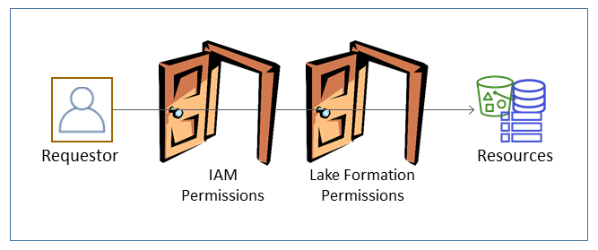

# Overview of Lake Formation permissions

There are two main types of permissions in AWS Lake Formation:

- Metadata access – Permissions on Data Catalog resources (_Data Catalog
  permissions_).

These permissions enable principals to create, read, update, and delete metadata databases
and tables in the Data Catalog.

- Underlying data access – Permissions on locations in Amazon Simple Storage Service (Amazon S3)
  (_data access permissions_ and _data
  location permissions_).

      + Data lake permissions enable principals to read and write data to *underlying* Amazon S3 locations—data pointed to by
       Data Catalog resources.
      + Data location permissions enable principals to create and alter metadata databases and
       tables that point to specific Amazon S3 locations.

  For both areas, Lake Formation uses a combination of Lake Formation permissions and AWS Identity and Access Management (IAM)
  permissions. The IAM permissions model consists of IAM policies. The Lake Formation permissions
  model is implemented as DBMS-style GRANT/REVOKE commands, such as `Grant SELECT on
 *tableName* to *userName*`.

When a principal makes a request to access Data Catalog resources or underlying data, for the
request to succeed, it must pass permission checks by both IAM and Lake Formation.

Lake Formation permissions control access to Data Catalog resources, Amazon S3 locations, and the underlying
data at those locations. IAM permissions control access to the Lake Formation and AWS Glue APIs and
resources. So although you might have the Lake Formation permission to create a metadata table in the
Data Catalog (`CREATE_TABLE`), your operation fails if you don't have the IAM
permission on the `glue:CreateTable` API. (Why a `glue:` permission?
Because Lake Formation uses the AWS Glue Data Catalog.)

###### Note

Lake Formation permissions apply only in the Region in which they were granted.

AWS Lake Formation requires that each principal (user or role) be authorized to perform actions on
Lake Formation–managed resources. A principal is granted the necessary authorizations by the data
lake administrator or another principal with the permissions to grant Lake Formation permissions.

When you grant a Lake Formation permission to a principal, you can optionally grant the ability to
pass that permission to another principal.

You can use the Lake Formation API, the AWS Command Line Interface (AWS CLI), or the **Data
permissions** and **Data locations** pages of the Lake Formation console to
grant and revoke Lake Formation permissions.
