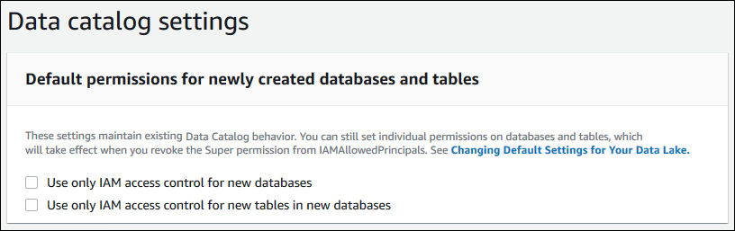

# Lake Formation permissions reference

To perform AWS Lake Formation operations, principals need both Lake Formation permissions and AWS Identity and Access Management
(IAM) permissions. You typically grant IAM permissions using
_coarse-grained_ access control policies, as described in [Overview of Lake Formation permissions](lf-permissions-overview.md "lf-permissions-overview.md") . You can grant Lake Formation permissions by using the console,
the API, or the AWS Command Line Interface (AWS CLI).

To learn how to grant or revoke Lake Formation permissions, see [Granting permissions on Data Catalog resources](granting-catalog-permissions.md "granting-catalog-permissions.md") and [Granting data location permissions](granting-location-permissions.md "granting-location-permissions.md").

###### Note

The examples in this section show how to grant permissions to principals in the same
AWS account. For examples of cross-account grants, see [Cross-account data sharing in Lake Formation](cross-account-permissions.md "cross-account-permissions.md").

## Lake Formation permissions per resource type

Following are the valid Lake Formation permissions available for each type of resource:

| Resource                               | Permission                  |
| -------------------------------------- | --------------------------- |
| `Catalog`                              | `ALL` (`Super`), Super user |
| `ALTER`                                |
| `CREATE_DATABASE`                      |
| `DESCRIBE`                             |
| `DROP`                                 |
| `Database`                             | `ALL` (`Super`)             |
| `ALTER`                                |
| `CREATE_TABLE`                         |
| `DESCRIBE`                             |
| `DROP`                                 |
| `Table`                                | `ALL` (`Super`)             |
| `ALTER`                                |
| `DELETE`                               |
| `DESCRIBE`                             |
| `DROP`                                 |
| `INSERT`                               |
| `SELECT`                               |
| `View`                                 | `ALL` (`Super`)             |
| `SELECT`                               |
| `DESCRIBE`                             |
| `DROP`                                 |
| `Data Catalog`                         | `CREATE_DATABASE`           |
| `Amazon S3 location`                   | `DATA_LOCATION_ACCESS`      |
| `LF-Tags`                              | `DROP`                      |
| `ALTER`                                |
| `LF-Tag values`                        | `ASSOCIATE`                 |
| `DESCRIBE`                             |
| `GrantWithLFTagExpression`             |
| `LF-Tag policy<br>• Database`          | `ALL` (`Super`)             |
| `ALTER`                                |
| `CREATE_TABLE`                         |
| `DESCRIBE`                             |
| `DROP`                                 |
| `LF-Tag policy<br>• Table`             | `ALL` (`Super`)             |
| `ALTER`                                |
| `DESCRIBE`                             |
| `DELETE`                               |
| `DROP`                                 |
| `INSERT`                               |
| `SELECT`                               |
| `Resource link<br>• Database or Table` | `DESCRIBE`                  |
| `DROP`                                 |
| `Table with data filters`              | `DESCRIBE`                  |
| `DROP`                                 |
| `SELECT`                               |
| `Table with column filter`             | `SELECT`                    |

###### Topics

- [Lake Formation grant and revoke AWS CLI commands](#perm-command-format "#perm-command-format")
- [Lake Formation permissions](#lf-permissions "#lf-permissions")

## Lake Formation grant and revoke AWS CLI commands

Each permission description in this section includes examples of granting the
permission using an AWS CLI command. The following are the synopses of the Lake Formation
**grant-permissions** and **revoke-permissions** AWS CLI
commands.

```
grant-permissions
[--catalog-id <value>]
--principal <value>
--resource <value>
--permissions <value>
[--permissions-with-grant-option <value>]
[--cli-input-json <value>]
[--generate-cli-skeleton <value>]
```

```
revoke-permissions
[--catalog-id <value>]
--principal <value>
--resource <value>
--permissions <value>
[--permissions-with-grant-option <value>]
[--cli-input-json <value>]
[--generate-cli-skeleton <value>]
```

For detailed descriptions of these commands, see [grant-permissions](../../../cli/latest/reference/lakeformation/grant-permissions.md "../../../cli/latest/reference/lakeformation/grant-permissions.md") and [revoke-permissions](../../../cli/latest/reference/lakeformation/revoke-permissions.md "../../../cli/latest/reference/lakeformation/revoke-permissions.md") in the _AWS CLI Command Reference_.
This section provides additional information on the `--principal`
option.

The value of the `--principal` option is one of the following:

- Amazon Resource Name (ARN) for an AWS Identity and Access Management (IAM) user or role
- ARN for a user or group that authenticates through a SAML provider, such as
  Microsoft Active Directory Federation Service (AD FS)
- ARN for an Amazon Quick Suite user or group
- For cross-account permissions, an AWS account ID, an organization ID, or an
  organizational unit ID
- For IAM Identity Center user or group, IAM Identity Center user or group ARN.

The following are syntax and examples for all `--principal` types.

**Principal is an IAM user**

Syntax:

```
--principal DataLakePrincipalIdentifier=arn:aws:iam::`<account-id>`:user/`<user-name>`
```

Example:

```
--principal DataLakePrincipalIdentifier=arn:aws:iam::111122223333:user/datalake_user1
```

**Principal is an IAM role**

Syntax:

```
--principal DataLakePrincipalIdentifier=arn:aws:iam::`<account-id>`:role/`<role-name>`
```

Example:

```
--principal DataLakePrincipalIdentifier=arn:aws:iam::111122223333:role/workflowrole
```

**Principal is a user authenticating through a SAML provider**

Syntax:

```
--principal DataLakePrincipalIdentifier=arn:aws:iam::`<account-id>`:saml-provider/`<SAMLproviderName>`:user/`<user-name>`
```

Examples:

```
--principal DataLakePrincipalIdentifier=arn:aws:iam::111122223333:saml-provider/idp1:user/datalake_user1
```

```
--principal DataLakePrincipalIdentifier=arn:aws:iam::111122223333:saml-provider/AthenaLakeFormationOkta:user/athena-user@example.com
```

**Principal is a group authenticating through a SAML provider**

Syntax:

```
--principal DataLakePrincipalIdentifier=arn:aws:iam::`<account-id>`:saml-provider/`<SAMLproviderName>`:group/`<group-name>`
```

Examples:

```
--principal DataLakePrincipalIdentifier=arn:aws:iam::111122223333:saml-provider/idp1:group/data-scientists
```

```
--principal DataLakePrincipalIdentifier=arn:aws:iam::111122223333:saml-provider/AthenaLakeFormationOkta:group/my-group
```

**Principal is an Amazon Quick Suite Enterprise Edition user**

Syntax:

```
--principal DataLakePrincipalIdentifier=arn:aws:quicksight:`<region>`:`<account-id>`:user/`<namespace>`/`<user-name>`
```

###### Note

For `<namespace>`, you must specify
`default`.

Example:

```
--principal DataLakePrincipalIdentifier=arn:aws:quicksight:us-east-1:111122223333:user/default/bi_user1
```

**Principal is an Amazon Quick Suite Enterprise Edition group**

Syntax:

```
--principal DataLakePrincipalIdentifier=arn:aws:quicksight:`<region>`:`<account-id>`:group/`<namespace>`/`<group-name>`
```

###### Note

For `<namespace>`, you must specify
`default`.

Example:

```
--principal DataLakePrincipalIdentifier=arn:aws:quicksight:us-east-1:111122223333:group/default/data_scientists
```

**Principal is an AWS account**

Syntax:

```
--principal DataLakePrincipalIdentifier=`<account-id>`
```

Example:

```
--principal DataLakePrincipalIdentifier=111122223333
```

**Principal is an organization**

Syntax:

```
--principal DataLakePrincipalIdentifier=arn:aws:organizations::`<account-id>`:organization/`<organization-id>`
```

Example:

```
--principal DataLakePrincipalIdentifier=arn:aws:organizations::111122223333:organization/o-abcdefghijkl
```

**Principal is an organizational unit**

Syntax:

```
--principal DataLakePrincipalIdentifier=arn:aws:organizations::`<account-id>`:ou/`<organization-id>`/`<organizational-unit-id>`
```

Example:

```
--principal DataLakePrincipalIdentifier=arn:aws:organizations::111122223333:ou/o-abcdefghijkl/ou-ab00-cdefghij
```

**Principal is an IAM Identity Center identity user or group**

Example:User

```
--principal DataLakePrincipalIdentifier=arn:aws:identitystore:::user/`<UserID>`
```

Example:Group:

```
--principal DataLakePrincipalIdentifier=arn:aws:identitystore:::group/`<GroupID>`
```

**Principal is an IAM group - `IAMAllowedPrincipals`**

Lake Formation sets `Super` permission on all databases and tables in the
Data Catalog to a group called `IAMAllowedPrincipals` by default. If this group
permission exists on a database or a table, all principals in your account will have
access to the resource through the IAM principal policies for AWS Glue. It provides
backward compatibility when you start using Lake Formation permissions to secure the Data Catalog
resources that were earlier protected by IAM policies for AWS Glue.

When you use Lake Formation to manage permissions for your Data Catalog resources, you need to
first revoke the `IAMAllowedPrincipals` permission on the resources, or opt
in the principals and the resources to hybrid access mode for Lake Formation permissions to work.

Example:

```
--principal DataLakePrincipalIdentifier=IAM_Allowed_Principals
```

**Principal is an IAM group - `ALLIAMPrincipals`**

When you grant permissions to `ALLIAMPrincipals` group on a Data Catalog
resource, every principal in the account gets access to the Data Catalog resource using Lake Formation
permissions and IAM permissions.

Example:

```
--principal DataLakePrincipalIdentifier=`123456789012`:IAMPrincipals
```

## Lake Formation permissions

This section contains the available Lake Formation permissions that you can grant to principals.

### `ALTER`

| Permission | Granted on this resource | Grantee also needs          |
| ---------- | ------------------------ | --------------------------- |
| `ALTER`    | `DATABASE`               | `glue:UpdateDatabase`       |
| `ALTER`    | `TABLE`                  | `glue:UpdateTable`          |
| `ALTER`    | `LF-Tag`                 | `lakeformation:UpdateLFTag` |

A principal with this permission can alter metadata for a database or table in the
Data Catalog. For tables, you can change the column schema and add column parameters. You
cannot alter columns in the underlying data that a metadata table points to.

If the property that is being altered is a registered Amazon Simple Storage Service (Amazon S3) location, the
principal must have data location permissions on the new location.

###### Example

The following example grants the `ALTER` permission to user
`datalake_user1` on the database `retail` in AWS account
1111-2222-3333.

```
aws lakeformation grant-permissions --principal DataLakePrincipalIdentifier=arn:aws:iam::111122223333:user/datalake_user1 --permissions "ALTER" --resource '{ "Database": {"Name":"retail"}}'

```

###### Example

The following example grants `ALTER` to user `datalake_user1`
on the table `inventory` in the database `retail`.

```
aws lakeformation grant-permissions --principal DataLakePrincipalIdentifier=arn:aws:iam::111122223333:user/datalake_user1 --permissions "ALTER" --resource '{ "Table": {"DatabaseName":"retail", "Name":"inventory"}}'

```

### `CREATE_DATABASE`

| Permission        | Granted on this resource | Grantee also needs    |
| ----------------- | ------------------------ | --------------------- |
| `CREATE_DATABASE` | Data Catalog             | `glue:CreateDatabase` |

A principal with this permission can create a metadata database or resource link in
the Data Catalog. The principal can also create tables in the database.

###### Example

The following example grants `CREATE_DATABASE` to user
`datalake_user1` in AWS account 1111-2222-3333.

```
aws lakeformation grant-permissions --principal DataLakePrincipalIdentifier=arn:aws:iam::111122223333:user/datalake_user1 --permissions "CREATE_DATABASE" --resource '{ "Catalog": {}}'
```

When a principal creates a database in the Data Catalog, no permissions to underlying data
are granted. The following additional metadata permissions are granted (along with the
ability to grant these permissions to others):

- `CREATE_TABLE` in the database
- `ALTER` database
- `DROP` database

When creating a database, the principal can optionally specify an Amazon S3 location.
Depending on whether the principal has data location permissions, the
`CREATE_DATABASE` permission might not be sufficient to create databases in
all cases. It is important to keep the following three cases in mind.

| Create database use case                                                                                      | Permissions needed                                                                         |
| ------------------------------------------------------------------------------------------------------------- | ------------------------------------------------------------------------------------------ |
| The location property is unspecified.                                                                         | `CREATE_DATABASE` is sufficient.                                                           |
| The location property is specified, and the location is not managed by Lake Formation<br>(is not registered). | `CREATE_DATABASE` is sufficient.                                                           |
| The location property is specified, and the location is managed by Lake Formation (is<br>registered).         | `CREATE_DATABASE` is required plus data location permissions on<br>the specified location. |

### `CREATE_TABLE`

| Permission     | Granted on this resource | Grantee also needs |
| -------------- | ------------------------ | ------------------ |
| `CREATE_TABLE` | `DATABASE`               | `glue:CreateTable` |

A principal with this permission can create a metadata table or resource link in the
Data Catalog within the specified database.

###### Example

The following example grants the user `datalake_user1` permission to
create tables in the `retail` database in AWS account
1111-2222-3333.

```
aws lakeformation grant-permissions --principal DataLakePrincipalIdentifier=arn:aws:iam::111122223333:user/datalake_user1
 --permissions "CREATE_TABLE" --resource '{ "Database": {"Name":"retail"}}'
```

When a principal creates a table in the Data Catalog, all Lake Formation permissions on the table are
granted to the principal, with the ability to grant these permissions to others.

###### Cross-account Grants

If a database owner account grants `CREATE_TABLE` to a recipient account,
and a user in the recipient account successfully creates a table in the owner account's
database, the following rules apply:

- The user and data lake administrators in the recipient account have all Lake Formation
  permissions on the table. They can grant permissions on the table to other principals
  in their account. They can't grant permissions to principals in the owner account or
  any other accounts.
- Data lake administrators in the owner account can grant permissions on the table
  to other principals in their account.

###### Data Location Permissions

When you attempt to create a table that points to an Amazon S3 location, depending on
whether you have data location permissions, the `CREATE_TABLE` permission
might not be sufficient to create a table. It's important to keep the following three
cases in mind.

| Create table use case                                                                                                                                                                                                         | Permissions needed                                                                      |
| ----------------------------------------------------------------------------------------------------------------------------------------------------------------------------------------------------------------------------- | --------------------------------------------------------------------------------------- |
| The specified location is not managed by Lake Formation (is not registered).                                                                                                                                                  | `CREATE_TABLE` is sufficient.                                                           |
| The specified location is managed by Lake Formation (is registered), and the containing<br>database has no location property or has a location property that is not an Amazon S3<br>prefix of the table location.             | `CREATE_TABLE` is required plus data location permissions on the<br>specified location. |
| The specified location is managed by Lake Formation (is registered), and the containing<br>database has a location property that points to a location that is registered and<br>is an Amazon S3 prefix of the table location. | `CREATE_TABLE` is sufficient.                                                           |

### `DATA_LOCATION_ACCESS`

| Permission             | Granted on this resource | Grantee also needs                                                                                             |
| ---------------------- | ------------------------ | -------------------------------------------------------------------------------------------------------------- |
| `DATA_LOCATION_ACCESS` | Amazon S3 location       | (Amazon S3 permissions on the location, which must be specified by the role used<br>to register the location.) |

This is the only data location permission. A principal with this permission can create
a metadata database or table that points to the specified Amazon S3 location. The location must
be registered. A principal who has data location permissions on a location also has
location permissions on child locations.

###### Example

The following example grants data location permissions on
`s3://products/retail` to user `datalake_user1` in AWS
account 1111-2222-3333.

```
aws lakeformation grant-permissions --principal DataLakePrincipalIdentifier=arn:aws:iam::111122223333:user/datalake_user1 --permissions "DATA_LOCATION_ACCESS" --resource '{ "DataLocation": {"ResourceArn":"arn:aws:s3:::products/retail"}}'

```

`DATA_LOCATION_ACCESS` is not needed to query or update underlying data.
This permission applies only to creating Data Catalog resources.

For more information about data location permissions, see [Underlying data access control](access-control-underlying-data.md#data-location-permissions "access-control-underlying-data.md#data-location-permissions").

### `DELETE`

| Permission | Granted on this resource | Grantee also needs                                                           |
| ---------- | ------------------------ | ---------------------------------------------------------------------------- |
| `DELETE`   | `TABLE`                  | (No additional IAM permissions are needed if the location is<br>registered.) |

A principal with this permission can insert, update, and read underlying data at the
Amazon S3 location specified by the table. The principal can also view the table on the Lake Formation
console and retrieve information about the table with the AWS Glue API.

###### Example

The following example grants the `DELETE` permission to the user
`datalake_user1` on the table `inventory` in the database
`retail` in AWS account 1111-2222-3333.

```
aws lakeformation grant-permissions --principal DataLakePrincipalIdentifier=arn:aws:iam::111122223333:user/datalake_user1 --permissions "DELETE" --resource '{ "Table": {"DatabaseName":"retail", "Name":"inventory"}}'

```

This permission applies only to data in Amazon S3, and not to data in other data stores
such as Amazon Relational Database Service (Amazon RDS).

### `DESCRIBE`

| Permission | Granted on this resource                      | Grantee also needs                                                                                                                                                                                                      |
| ---------- | --------------------------------------------- | ----------------------------------------------------------------------------------------------------------------------------------------------------------------------------------------------------------------------- |
| `DESCRIBE` | Table resource link<br>Database resource link | `glue:GetTable`<br>`glue:GetDatabase`                                                                                                                                                                                   |
| `DESCRIBE` | `DATABASE`                                    | `glue:GetDatabase`                                                                                                                                                                                                      |
| `DESCRIBE` | `TABLE`                                       | `glue:GetTable`                                                                                                                                                                                                         |
| `DESCRIBE` | `LF-Tag`                                      | `glue:GetTable`<br>`glue:GetDatabase`<br>`lakeformation:GetResourceLFTags`<br>`lakeformation:ListLFTags`<br>`lakeformation:GetLFTag`<br>`lakeformation:SearchTablesByLFTags`<br>`lakeformation:SearchDatabasesByLFTags` |

A principal with this permission can view the specified database, table, or resource
link. No other Data Catalog permissions are implicitly granted, and no data access permissions
are implicitly granted. Databases and tables appear in the query editors of integrated
services, but no queries can be made against them unless other Lake Formation permissions (for
example, `SELECT`) are granted.

For example, a user who has `DESCRIBE` on a database can see the database
and all database metadata (description, location, and so on). However, the user can't find
out which tables the database contains, and can't drop, alter, or create tables in the
database. Similarly, a user who has `DESCRIBE` on a table can see the table and
table metadata (description, schema, location, and so on), but can't drop, alter, or run
queries against the table.

The following are some additional rules for `DESCRIBE`:

- If a user has other Lake Formation permissions on a database, table, or resource link,
  `DESCRIBE` is implicitly granted.
- If a user has `SELECT` on only a subset of columns for a table (partial
  `SELECT`), the user is restricted to seeing just those columns.
- You can't grant `DESCRIBE` to a user who has partial select on a table.
  Conversely, you can't specify column inclusion or exclusion lists for tables that
  `DESCRIBE` is granted on.

###### Example

The following example grants the `DESCRIBE` permission to the user
`datalake_user1` on the table resource link `inventory-link` in
the database `retail` in AWS account 1111-2222-3333.

```
aws lakeformation grant-permissions --principal DataLakePrincipalIdentifier=arn:aws:iam::111122223333:user/datalake_user1 --permissions "DESCRIBE" --resource '{ "Table": {"DatabaseName":"retail", "Name":"inventory-link"}}'

```

### `DROP`

| Permission | Granted on this resource                      | Grantee also needs                          |
| ---------- | --------------------------------------------- | ------------------------------------------- |
| `DROP`     | `DATABASE`                                    | `glue:DeleteDatabase`                       |
| `DROP`     | `TABLE`                                       | `glue:DeleteTable`                          |
| `DROP`     | `LF-Tag`                                      | `lakeformation:DeleteLFTag`                 |
| `DROP`     | Database resource link<br>Table resource link | `glue:DeleteDatabase`<br>`glue:DeleteTable` |

A principal with this permission can drop a database, table, or resource link in the
Data Catalog. You can't grant DROP on a database to an external account or organization.

###### Warning

Dropping a database drops all tables in the database.

###### Example

The following example grants the `DROP` permission to the user
`datalake_user1` on the database `retail` in AWS account
1111-2222-3333.

```
aws lakeformation grant-permissions --principal DataLakePrincipalIdentifier=arn:aws:iam::111122223333:user/datalake_user1 --permissions "DROP" --resource '{ "Database": {"Name":"retail"}}'

```

###### Example

The following example grants `DROP` to the user
`datalake_user1` on the table `inventory` in the database
`retail`.

```
aws lakeformation grant-permissions --principal DataLakePrincipalIdentifier=arn:aws:iam::111122223333:user/datalake_user1 --permissions "DROP" --resource '{ "Table": {"DatabaseName":"retail", "Name":"inventory"}}'

```

###### Example

The following example grants `DROP` to the user
`datalake_user1` on the table resource link `inventory-link` in
the database `retail`.

```
aws lakeformation grant-permissions --principal DataLakePrincipalIdentifier=arn:aws:iam::111122223333:user/datalake_user1 --permissions "DROP" --resource '{ "Table": {"DatabaseName":"retail", "Name":"inventory-link"}}'

```

### `INSERT`

| Permission | Granted on this resource | Grantee also needs                                                           |
| ---------- | ------------------------ | ---------------------------------------------------------------------------- |
| `INSERT`   | `TABLE`                  | (No additional IAM permissions are needed if the location is<br>registered.) |

A principal with this permission can insert, update, and read underlying data at the
Amazon S3 location specified by the table. The principal can also view the table in the Lake Formation
console and retrieve information about the table with the AWS Glue API.

###### Example

The following example grants the `INSERT` permission to the user
`datalake_user1` on the table `inventory` in the database
`retail` in AWS account 1111-2222-3333.

```
aws lakeformation grant-permissions --principal DataLakePrincipalIdentifier=arn:aws:iam::111122223333:user/datalake_user1 --permissions "INSERT" --resource '{ "Table": {"DatabaseName":"retail", "Name":"inventory"}}'

```

This permission applies only to data in Amazon S3, and not to data in other data stores
such as Amazon RDS.

### `SELECT`

| Permission | Granted on this resource | Grantee also needs                                                           |
| ---------- | ------------------------ | ---------------------------------------------------------------------------- |
| `SELECT`   | • `TABLE`                | (No additional IAM permissions are needed if the location is<br>registered.) |

A principal with this permission can view a table in the Data Catalog, and can query the
underlying data in Amazon S3 at the location specified by the table. The principal can view the
table in the Lake Formation console and retrieve information about the table with the AWS Glue API. If
column filtering was applied when this permission was granted, the principal can view the
metadata only for the included columns and can query data only from the included
columns.

###### Note

It is the responsibility of the integrated analytics service to apply the column
filtering when processing a query.

###### Example

The following example grants the `SELECT` permission to the user
`datalake_user1` on the table `inventory` in the database
`retail` in AWS account 1111-2222-3333.

```
aws lakeformation grant-permissions --principal DataLakePrincipalIdentifier=arn:aws:iam::111122223333:user/datalake_user1 --permissions "SELECT" --resource '{ "Table": {"DatabaseName":"retail", "Name":"inventory"}}'

```

This permission applies only to data in Amazon S3, and not to data in other data stores
such as Amazon RDS.

You can filter (restrict the access to) specific columns with an optional inclusion
list or an exclusion list. An inclusion list specifies the columns that can be accessed.
An exclusion list specifies the columns that can't be accessed. In the absence of an
inclusion or exclusion list, all table columns are accessible.

The results of `glue:GetTable` return only the columns that the caller has
permission to view. Integrated services such as Amazon Athena and Amazon Redshift honor column inclusion
and exclusion lists.

###### Example

The following example grants `SELECT` to the user
`datalake_user1` on the table `inventory` using an inclusion
list.

```
aws lakeformation grant-permissions --principal DataLakePrincipalIdentifier=arn:aws:iam::111122223333:user/datalake_user1 --permissions "SELECT"  --resource '{ "TableWithColumns": {"DatabaseName":"retail", "Name":"inventory", "ColumnNames": ["prodcode","location","period","withdrawals"]}}'
```

###### Example

This next example grants `SELECT` on the `inventory` table
using an exclusion list.

```
aws lakeformation grant-permissions --principal DataLakePrincipalIdentifier=arn:aws:iam::111122223333:user/datalake_user1 --permissions "SELECT"  --resource '{ "TableWithColumns": {"DatabaseName":"retail", "Name":"inventory", "ColumnWildcard": {"ExcludedColumnNames": ["intkey", "prodcode"]}}}'

```

The following restrictions apply to the `SELECT` permission:

- When granting `SELECT`, you can't include the grant option if column
  filtering is applied.
- You cannot restrict access control on columns that are partition keys.
- A principal with the `SELECT` permission on a subset of columns in a
  table cannot be granted the `ALTER`, `DROP`,
  `DELETE`, or `INSERT` permission on that table. Similarly, a
  principal with the `ALTER`, `DROP`, `DELETE`, or
  `INSERT` permission on a table cannot be granted the `SELECT`
  permission with column filtering.

The `SELECT` permission always appears on the **Data
permissions** page of the Lake Formation console as a separate row. This following image
shows that `SELECT` is granted to the users `datalake_user2` and
`datalake_user3` on all columns in the `inventory` table.


### `Super`

| Permission | Granted on this resource | Grantee also needs               |
| ---------- | ------------------------ | -------------------------------- |
| `Super`    | `DATABASE`               | `glue:*Database*`                |
| `Super`    | `TABLE`                  | `glue:*Table*, glue:*Partition*` |

This permission allows a principal to perform every supported Lake Formation operation on the
database or table. You can't grant `Super` on a database to an external
account.

This permission can coexist with the other Lake Formation permissions. For example, you can
grant the `Super`, `SELECT`, and `INSERT` permissions on
a metadata table. The principal can then perform all supported operations on the table.
When you revoke `Super`, the `SELECT` and `INSERT`
permissions remain, and the principal can perform only select and insert
operations.

Instead of granting `Super` to an individual principal, you can grant it to
the group `IAMAllowedPrincipals`. The `IAMAllowedPrincipals` group
is automatically created and includes all IAM users and roles that are permitted access to
your Data Catalog resources by your IAM policies. When `Super` is granted to
`IAMAllowedPrincipals` for a Data Catalog resource, access to the resource is
effectively controlled solely by IAM policies.

You can have the `Super` permission to be automatically granted to
`IAMAllowedPrincipals` for new catalog resources by taking advantage of options
on the **Settings** page of the Lake Formation console.



- To grant `Super` to `IAMAllowedPrincipals` for all new
  databases, select **Use only IAM access control for new
  databases**.
- To grant `Super` to `IAMAllowedPrincipals` for all new
  tables in new databases, select **Use only IAM access control for new tables
  in new databases**.

###### Note

This option causes the check box **Use only IAM access control for new
tables in this database** in the **Create database**
dialog box to be selected by default. It does nothing more than that. It is the
check box in the **Create database** dialog box that enables the
grant of `Super` to `IAMAllowedPrincipals`.

These **Settings** page options are enabled by default. For more
information, see the following:

- [Changing the default settings for your data
  lake](change-settings.md "change-settings.md")
- [Upgrading AWS Glue data permissions to
  the AWS Lake Formation model](upgrade-glue-lake-formation.md "upgrade-glue-lake-formation.md")

### `SUPER_USER`

| Permission   | Granted on this resource | Grantee also needs |
| ------------ | ------------------------ | ------------------ |
| `Super user` | `Catalog`                | `glue:GetCatalog`  |

You can grant the `Super user` permission only to specific principals on
catalogs within the default Data Catalog. You can't grant `Super user` permission on
the default catalog or on other resource types such as databases and tables or to principals
in external accounts. The `Super user` permission permission allows a principal
to perform every supported Lake Formation operation on the databases and tables within the granted
catalog.

With the `Super user` permission, the principal (grantee) is able to perform
the following actions on the resources (catalogs, databases, and tables) within the
catalog:

- `CREATE_DATABASE`, `DESCRIBE` permissions on the
  catalog.
- `DROP`, `ALTER`, `CREATE_TABLE`,
  `DESCRIBE` (effectively `SUPER`) permissions on all databases
  within the catalog.
- `DROP`, `ALTER`, `DESCRIBE`, `SELECT`, `INSERT`, `DELETE` (effectively `SUPER`) permissions on
  all tables within all databases within the catalog.
- `All` (effectively SUPER) permissions on catalogs within the
  catalog.
- Grantable (the ability to grant these permissions to other principals) permissions
  on all catalogs, databases, and tables within the catalog.

With the `Super user` permission on a catalog resource, the grantee is not allowed to perform or delegate `ALTER` and `DROP` actions on the catalog.

### `ASSOCIATE`

| Permission  | Granted on this resource | Grantee also needs                                                                                                                                                                                                                                                                                           |
| ----------- | ------------------------ | ------------------------------------------------------------------------------------------------------------------------------------------------------------------------------------------------------------------------------------------------------------------------------------------------------------ |
| `ASSOCIATE` | `LF-Tag`                 | `glue:GetDatabase`<br>`glue:GetTable`<br>`lakeformation:AddLFTagsToResource"`<br>`lakeformation:RemoveLFTagsFromResource"`<br>`lakeformation:GetResourceLFTags`<br>`lakeformation:ListLFTags`<br>`lakeformation:GetLFTag`<br>`lakeformation:SearchTablesByLFTags`<br>`lakeformation:SearchDatabasesByLFTags` |

A principal with this permission on a LF-Tag can assign the LF-Tag to a Data Catalog resource.
Granting `ASSOCIATE` implicitly grants `DESCRIBE`.

###### Example

This example grants to user `datalake_user1` the `ASSOCIATE`
permission on the LF-Tag with the key `module`. It grants permissions to view
and assign all values for that key, as indicated by the asterisk (\*)..

```

aws lakeformation grant-permissions --principal DataLakePrincipalIdentifier=arn:aws:iam::111122223333:user/datalake_user1 --permissions "ASSOCIATE" --resource '{ "LFTag": {"CatalogId":"111122223333","TagKey":"module","TagValues":["*"]}}'

```
