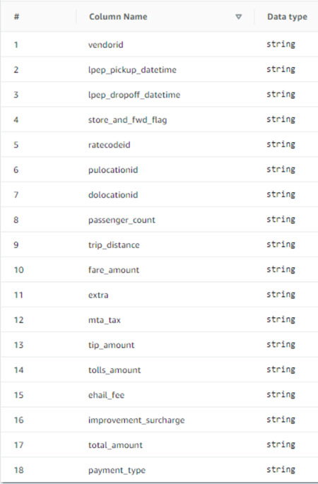

# Managing a data lake using Lake Formation tag-based

access control

Thousands of customers are building petabyte-scale data lakes on AWS. Many of these
customers use AWS Lake Formation to easily build and share their data lakes across the organization. As
the number of tables and users increase, data stewards and administrators are looking for ways
to manage permissions on data lakes easily at scale. Lake Formation Tag-based access control (LF-TBAC)
solves this problem by allowing data stewards to create _LF-tags_ (based on their data classification and ontology) that can then be
attached to resources.

LF-TBAC is an authorization strategy that defines permissions based on attributes. In Lake Formation,
these attributes are called LF-tags. You can attach LF-tags to Data Catalog resources and Lake Formation
principals. Data lake administrators can assign and revoke permissions on Lake Formation resources using
LF-tags. For more information about see, [Lake Formation tag-based access control](tag-based-access-control.md "tag-based-access-control.md").

This tutorial demonstrates how to create a Lake Formation tag-based access control policy using an AWS public dataset. In addition, it shows how to query tables, databases, and columns that have Lake Formation tag-based access policies associated with them.

You can use LF-TBAC for the following use cases:

- You have a large number of tables and principals that the data lake administrator has to grant access
- You want to classify your data based on an ontology and grant permissions based on classification
- The data lake administrator wants to assign permissions dynamically, in a loosely coupled way
  Following are the high-level steps for configuring permissions using LF-TBAC:

1. The data steward defines the tag ontology with two LF-tags: `Confidential`
   and `Sensitive`. Data with `Confidential=True` has tighter access
   controls. Data with `Sensitive=True` requires specific analysis from the
   analyst.
2. The data steward assigns different permission levels to the data engineer to build tables with different LF-tags.
3. The data engineer builds two databases: `tag_database` and `col_tag_database`.
   All tables in `tag_database` are configured with `Confidential=True`. All tables in the `col_tag_database` are
   configured with `Confidential=False`. Some columns of the table in `col_tag_database` are tagged with `Sensitive=True` for specific
   analysis needs.
4. The data engineer grants read permission to the analyst for tables with specific expression condition `Confidential=True`
   and `Confidential=False`,`Sensitive=True`.
5. With this configuration, the data analyst can focus on performing analysis with the right data.

###### Topics

- [Intended audience](#tut-manage-dl-roles "#tut-manage-dl-roles")
- [Prerequisites](#tut-manage-dl-prereqs "#tut-manage-dl-prereqs")
- [Step 1: Provision your resources](#tut-manage-dl-provision-resources "#tut-manage-dl-provision-resources")
- [Step 2: Register your data location, create an LF-Tag ontology, and grant permissions](#tut-manage-dl-register-datalocation-lftag "#tut-manage-dl-register-datalocation-lftag")
- [Step 3: Create Lake Formation databases](#tut-manage-dl-tbac-create-databases "#tut-manage-dl-tbac-create-databases")
- [Step 4: Grant table permissions](#tut-manage-dl-grant-table-permissions "#tut-manage-dl-grant-table-permissions")
- [Step 5: Run a query in Amazon Athena to verify the permissions](#tut-manage-dl-tbac-run-query "#tut-manage-dl-tbac-run-query")
- [Step 6: Clean up AWS resources](#tut-manage-dl-tbac-clean-up-db "#tut-manage-dl-tbac-clean-up-db")

## Intended audience

This tutorial is intended for data stewards, data engineers, and data analysts. When it comes to managing AWS Glue Data Catalog and administering permission in Lake Formation, data stewards within the producing accounts have functional ownership based on the functions they support, and can grant access
to various consumers, external organizations, and accounts.

The following table lists the roles that are used in this tutorial:

| Role                         | Description                                                                                                                                                                                                                                                                                                                                                           |
| ---------------------------- | --------------------------------------------------------------------------------------------------------------------------------------------------------------------------------------------------------------------------------------------------------------------------------------------------------------------------------------------------------------------- |
| Data steward (administrator) | The `lf-data-steward` user has the following access:<br>• Read access to all resources in the Data Catalog<br>• Can create LF-tags and associate to the data engineer role for grantable permission to other principals                                                                                                                                               |
| Data engineer                | `lf-data-engineer` user has the following access:<br>• Full read, write, and update access to all resources in the Data Catalog<br>• Data location permissions in the data lake<br>• Can associate LF-tags and associate to the Data Catalog<br>• Can attach LF-tags to resources, which provides access to principals based on any policies created by data stewards |
| Data analyst                 | The `lf-data-analyst` user has the following access:<br>• Fine-grained access to resources shared by Lake Formation tag-based access policies                                                                                                                                                                                                                         |

## Prerequisites

Before you start this tutorial, you must have an AWS account that you can use to sign in as an administrative user with correct permissions. For more information, see [Complete initial AWS configuration tasks](getting-started-setup.md#initial-aws-signup "getting-started-setup.md#initial-aws-signup").

The tutorial assumes that you are familiar with IAM. For information about IAM, see the [IAM User Guide](../../../IAM/latest/UserGuide/introduction.md "../../../IAM/latest/UserGuide/introduction.md").

## Step 1: Provision your resources

This tutorial includes an AWS CloudFormation template for a quick setup. You can review and customize it to suit your needs.
The template creates three different roles (listed in [Intended audience](#tut-manage-dl-roles "#tut-manage-dl-roles")) to perform this exercise and
copies the nyc-taxi-data dataset to your local Amazon S3 bucket.

- An Amazon S3 bucket
- The appropriate Lake Formation settings
- The appropriate Amazon EC2 resources
- Three IAM roles with credentials

###### Create your resources

1. Sign into the AWS CloudFormation console at [https://console.aws.amazon.com/cloudformation](https://console.aws.amazon.com/cloudformation/ "https://console.aws.amazon.com/cloudformation/") in the US East (N. Virginia) region.
2. Choose [Launch Stack](https://console.aws.amazon.com/cloudformation/home?region=us-east-1#/stacks/new?templateURL=https://aws-bigdata-blog.s3.amazonaws.com/artifacts/lakeformationtbac/cfn/tbac_permission.json "https://console.aws.amazon.com/cloudformation/home?region=us-east-1#/stacks/new?templateURL=https://aws-bigdata-blog.s3.amazonaws.com/artifacts/lakeformationtbac/cfn/tbac_permission.json").
3. Choose **Next**.
4. In the **User Configuration** section, enter password for three roles: `DataStewardUserPassword`, `DataEngineerUserPassword` and `DataAnalystUserPassword`.
5. Review the details on the final page and select **I acknowledge that AWS CloudFormation might create IAM resources**.
6. Choose **Create**.

The stack creation can take up to five minutes.

###### Note

After you complete the tutorial, you might want to delete the stack in AWS CloudFormation to avoid continuing to incur charges.
Verify that the resources are successfully deleted in the event status for the stack.

## Step 2: Register your data location, create an LF-Tag ontology, and grant permissions

In this step, the data steward user defines the tag ontology with two LF-Tags:
`Confidential` and `Sensitive`, and gives specific IAM principals
the ability to attach newly created LF-Tags to resources.

###### Register a data location and define LF-Tag ontology

1. Perform the first step as the data steward user (`lf-data-steward`) to verify the data in Amazon S3 and the Data Catalog in Lake Formation.
   1. Sign in to the Lake Formation console at [https://console.aws.amazon.com/lakeformation/](https://console.aws.amazon.com/lakeformation/ "https://console.aws.amazon.com/lakeformation/") as `lf-data-steward` with the
      password used while deploying the AWS CloudFormation stack.
   2. In the navigation pane, under **Permissions**¸ choose **Administrative roles and tasks**.
   3. Choose **Add** in the **Data lake administrators** section.
   4. On the **Add administrator** page, for **IAM users and roles**, choose the user `lf-data-steward`.
   5. Choose **Save** to add `lf-data-steward` as a Lake Formation administrator.

2. Next, update the Data Catalog settings to use Lake Formation permission to control catalog resources instead of IAM based access control.
   1. In the navigation pane, under **Administration**, choose **Data Catalog settings**.
   2. Uncheck **Use only IAM access control for new databases**.
   3. Uncheck **Use only IAM access control for new tables in new databases**.
   4. Click **Save**.

3. Next, register the data location for the data lake.
   1. In the navigation pane, under **Administration**, choose **Data lake locations**.
   2. Choose **Register location**.
   3. On the **Register location** page, for **Amazon S3 path**, enter `s3://lf-tagbased-demo-`Account-ID``.
   4. For **IAM** role¸ leave the default value `AWSServiceRoleForLakeFormationDataAccess` as it is.
   5. Choose **Lake Formation** as the permission mode.
   6. Choose **Register location**.

4. Next, create the ontology by defining an LF-tag.
   1. Under **Permissions** in the navigation pane, choose **LF-Tags and permissions.**.
   2. Choose **Add LF-Tag**.
   3. For **Key**, enter `Confidential`.
   4. For **Values**, add `True` and `False`.
   5. Choose **Add LF-tag**.
   6. Repeat the steps to create the **LF-Tag** `Sensitive` with the value `True`.You have created all the necessary LF-Tags for this exercise.

###### Grant permissions to IAM users

1. Next, give specific IAM principals the ability to attach newly created LF-tags to resources.
   1. Under **Permissions** in the navigation pane, choose **LF-Tags and permissions**.
   2. In the **LF-Tag permissions** section, choose **Grant permissions**.
   3. For **Permission type**, choose **LF-Tag key-value pair permissions**.
   4. Select **IAM users and roles**.
   5. For **IAM users and roles**, search for and choose the `lf-data-engineer` role.
   6. In the **LF-Tags** section, add the key `Confidential` with values `True` and `False`, and the `key` `Sensitive` with value `True`.
   7. Under **Permissions**, select **Describe** and **Associate** for **Permissions** and **Grantable permissions**.
   8. Choose **Grant**.

2. Next, grant permissions to `lf-data-engineer` to create databases in our Data Catalog and on the underlying Amazon S3 bucket created by AWS CloudFormation.
   1. Under **Administration** in the navigation pane, choose **Administrative roles and tasks**.
   2. In the **Database creators** section, choose **Grant**.
   3. For **IAM users and roles**, choose the `lf-data-engineer` role.
   4. For **Catalog permissions**, select **Create database**.
   5. Choose **Grant**.

3. Next, grant permissions on the Amazon S3 bucket `(s3://lf-tagbased-demo-`Account-ID`)` to the `lf-data-engineer` user.
   1. In the navigation pane, under **Permissions**, choose **Data locations**.
   2. Choose **Grant**.
   3. Select **My account**.
   4. For **IAM users and roles**, choose the `lf-data-engineer` role.
   5. For **Storage locations**, enter the Amazon S3 bucket created by the AWS CloudFormation template `(s3://lf-tagbased-demo-`Account-ID`)`.
   6. Choose **Grant**.

4. Next, grant `lf-data-engineer` grantable permissions on resources associated with the **LF-Tag** expression `Confidential=True`.
   1. In the navigation pane, under **Permissions**, choose **Data lake permissions**.
   2. Choose **Grant**.
   3. Select **IAM users and roles**.
   4. Choose the role `lf-data-engineer`.
   5. In the **LF-Tags or catalog resources** section, select **Resources matched by LF-Tags**.
   6. Choose **Add LF-Tag key-value pair**.
   7. Add the key `Confidential` with the values `True`.
   8. In the **Database permissions** section, select **Describe** for **Database permissions** and **Grantable permissions**.
   9. In the **Table permissions** section, select **Describe**, **Select**, and **Alter** for both **Table permissions** and **Grantable permissions**.
   10. Choose **Grant**.

5. Next, grant `lf-data-engineer` grantable permissions on resources associated with the LF-Tag expression `Confidential=False`.
   1. In the navigation pane, under **Permissions**, choose **Data lake permissions**.
   2. Choose **Grant**.
   3. Select **IAM users and roles**.
   4. Choose the role `lf-data-engineer`.
   5. Select **Resources matched by LF-tags**.
   6. Choose **Add LF-tag**.
   7. Add the key `Confidential` with the value `False`.
   8. In the **Database permissions** section, select **Describe** for **Database permissions** and **Grantable permissions**.
   9. In the **Table and column permissions** section, do not select anything.
   10. Choose **Grant**.

6. Next, we grant `lf-data-engineer` grantable permissions on resources associated with the **LF-Tag** key-value pairs `Confidential=False` and `Sensitive=True`.
   1. In the navigation pane, under **Permissions**, choose **Data permissions**.
   2. Choose **Grant**.
   3. Select **IAM users and roles**.
   4. Choose the role `lf-data-engineer`.
   5. Under **LF-Tags or catalog resources** section, select **Resources matched by LF-Tags**.
   6. Choose **Add LF-Tag**.
   7. Add the key `Confidential` with the value `False`.
   8. Choose **Add LF-Tag key-value pair**.
   9. Add the key `Sensitive` with the value `True`.
   10. In the **Database permissions** section, select **Describe** for **Database permissions** and **Grantable permissions**.
   11. In the **Table permissions** section, select **Describe**, **Select**, and **Alter** for both **Table permissions** and **Grantable permissions**.
   12. Choose **Grant**.

## Step 3: Create Lake Formation databases

In this step, you create two databases and attach LF-Tags to the databases and specific
columns for testing purposes.

###### Create your databases and table for database-level access

1. First, create the database `tag_database`, the table
   `source_data`, and attach appropriate LF-Tags.
   1. On the Lake Formation console ([https://console.aws.amazon.com/lakeformation/](https://console.aws.amazon.com/lakeformation/ "https://console.aws.amazon.com/lakeformation/")), under **Data Catalog**, choose **Databases**.
   2. Choose **Create database**.
   3. For **Name**, enter `tag_database`.
   4. For **Location**, enter the Amazon S3 location created by the AWS CloudFormation template `(s3://lf-tagbased-demo-`Account-ID`/tag_database/)`.
   5. Deselect **Use only IAM access control for new tables in this database**.
   6. Choose **Create database**.

2. Next, create a new table within `tag_database`.
   1. On the **Databases** page, select the database `tag_database`.
   2. Choose**View Tables** and click **Create table**.
   3. For **Name**, enter `source_data`.
   4. For **Database**, choose the database `tag_database`.
   5. For **Table format**, choose **Standard AWS Glue table**.
   6. For **Data is located in**, select **Specified path in my account**.
   7. For Include path, enter the path to `tag_database` created by the AWS CloudFormation template `(s3://lf-tagbased-demo`Account-ID`/tag_database/)`.
   8. For **Data format**, select **CSV**.
   9. Under **Upload schema**, enter the following JSON array of column structure to create a schema:

   ```
    [
                  {
                       "Name": "vendorid",
                       "Type": "string"
                  },
                  {
                       "Name": "lpep_pickup_datetime",
                       "Type": "string"
                  },
                  {
                       "Name": "lpep_dropoff_datetime",
                       "Type": "string"

                  },
                     {
                       "Name": "store_and_fwd_flag",
                       "Type": "string"
                  },
                     {
                       "Name": "ratecodeid",
                       "Type": "string"

                  },
                     {
                       "Name": "pulocationid",
                       "Type": "string"

                  },
                  {
                       "Name": "dolocationid",
                       "Type": "string"

                  },
                     {
                       "Name": "passenger_count",
                       "Type": "string"

                  },
                  {
                       "Name": "trip_distance",
                       "Type": "string"

                  },
                     {
                       "Name": "fare_amount",
                       "Type": "string"

                  },
                  {
                       "Name": "extra",
                       "Type": "string"

                  },
                     {
                       "Name": "mta_tax",
                       "Type": "string"

                  },
                  {
                       "Name": "tip_amount",
                       "Type": "string"

                  },
                     {
                       "Name": "tolls_amount",
                       "Type": "string"

                  },
                  {
                       "Name": "ehail_fee",
                       "Type": "string"

                  },
                  {
                       "Name": "improvement_surcharge",
                       "Type": "string"

                  },
                  {
                       "Name": "total_amount",
                       "Type": "string"

                  },
                  {
                       "Name": "payment_type",
                       "Type": "string"

                  }
    ]
   ```

   10. Choose **Upload**. After uploading the schema, the table schema should look
       like the following screenshot:

    11. Choose **Submit**.

3. Next, attach LF-Tags at the database level.
   1. On the **Databases** page, find and select `tag_database`.
   2. On the **Actions** menu, choose **Edit LF-Tags**.
   3. Choose **Assign new LF-tag**.
   4. For **Assigned keys**¸ choose the `Confidential` LF-Tag you created earlier.
   5. For **Values**, choose `True`.
   6. Choose **Save**.This completes the LF-Tag assignment to the tag_database database.

###### Create your database and table for column-level access

Repeat the following steps to create the database `col_tag_database` and table `source_data_col_lvl`, and attach LF-Tags at the column level.

1. On the **Databases** page, choose **Create database**.
2. For **Name**, enter `col_tag_database`.
3. For **Location**, enter the Amazon S3 location created by the AWS CloudFormation template `(s3://lf-tagbased-demo-`Account-ID`/col_tag_database/)`.
4. Deselect **Use only IAM access control for new tables in this database**.
5. Choose **Create database**.
6. On the **Databases** page, select your new database `(col_tag_database)`.
7. Choose **View tables** and click **Create table**.
8. For **Name**, enter `source_data_col_lvl`.
9. For **Database**, choose your new database `(col_tag_database)`.
10. For **Table format**, choose **Standard AWS Glue table**.
11. For **Data is located in**, select **Specified path in my account**.
12. Enter the Amazon S3 path for `col_tag_database` `(s3://lf-tagbased-demo-`Account-ID`/col_tag_database/)`.
13. For **Data format**, select `CSV`.
14. Under `Upload schema`, enter the following schema JSON:

```
[
               {
                    "Name": "vendorid",
                    "Type": "string"


               },
               {
                    "Name": "lpep_pickup_datetime",
                    "Type": "string"


               },
               {
                    "Name": "lpep_dropoff_datetime",
                    "Type": "string"


               },
                  {
                    "Name": "store_and_fwd_flag",
                    "Type": "string"


               },
                  {
                    "Name": "ratecodeid",
                    "Type": "string"


               },
                  {
                    "Name": "pulocationid",
                    "Type": "string"


               },
               {
                    "Name": "dolocationid",
                    "Type": "string"


               },
                  {
                    "Name": "passenger_count",
                    "Type": "string"


               },
               {
                    "Name": "trip_distance",
                    "Type": "string"


               },
                  {
                    "Name": "fare_amount",
                    "Type": "string"


               },
               {
                    "Name": "extra",
                    "Type": "string"


               },
                  {
                    "Name": "mta_tax",
                    "Type": "string"


               },
               {
                    "Name": "tip_amount",
                    "Type": "string"


               },
                  {
                    "Name": "tolls_amount",
                    "Type": "string"


               },
               {
                    "Name": "ehail_fee",
                    "Type": "string"


               },
               {
                    "Name": "improvement_surcharge",
                    "Type": "string"


               },
               {
                    "Name": "total_amount",
                    "Type": "string"


               },
               {
                    "Name": "payment_type",
                    "Type": "string"


               }
]
```

15. Choose `Upload`. After uploading the schema, the table schema should look like the
    following screenshot.

 16. Choose **Submit** to complete the creation of the table. 17. Now, associate the `Sensitive=True` LF-Tag to the columns `vendorid` and `fare_amount`.

    1. On the **Tables** page, select the table you created `(source_data_col_lvl)`.
    2. On the **Actions** menu, choose **Schema**.
    3. Select the column `vendorid` and choose **Edit LF-Tags**.
    4. For **Assigned keys**, choose **Sensitive**.
    5. For **Values**, choose **True**.
    6. Choose **Save**.

18. Next, associate the `Confidential=False` LF-Tag to `col_tag_database`. This is required for `lf-data-analyst` to be able to describe the database `col_tag_database` when logged in from Amazon Athena.
    1.  On the **Databases** page, find and select `col_tag_database`.
    2.  On the **Actions** menu, choose **Edit LF-Tags**.
    3.  Choose **Assign new LF-Tag**.
    4.  For **Assigned keys**, choose the `Confidential` LF-Tag you created earlier.
    5.  For **Values**, choose `False`.
    6.  Choose **Save**.

## Step 4: Grant table permissions

Grant permissions to data analysts for consumption of the databases `tag_database`
and the table `col_tag_database` using LF-tags `Confidential` and `Sensitive`.

1. Follow these steps to grant permissions to the `lf-data-analyst` user on the objects associated with the LF-Tag
   `Confidential=True` (Database:tag_database) to have `Describe` the database and `Select` permission on tables.
   1. Sign in to the Lake Formation console at [https://console.aws.amazon.com/lakeformation/](https://console.aws.amazon.com/lakeformation/ "https://console.aws.amazon.com/lakeformation/") as `lf-data-engineer`.
   2. Under **Permissions**, select **Data lake permissions**.
   3. Choose **Grant**.
   4. Under **Principals**, select **IAM users and roles**.
   5. For **IAM users and roles**, choose `lf-data-analyst`.
   6. Under **LF-Tags or catalog resources**, select **Resources matched by LF-Tags**.
   7. Choose **Add LF-tag**.
   8. For **Key**, choose `Confidential`.
   9. For **Values**, choose `True`.
   10. For **Database permissions**, select `Describe`.
   11. For **Table permissions**, choose **Select** and **Describe**.
   12. Choose **Grant**.

2. Next, repeat the steps to grant permissions to data analysts for LF-Tag expression for `Confidential=False`.
   This **LF-tag** is used for describing the `col_tag_database` and the table `source_data_col_lvl` when logged in as `lf-data-analyst` from Amazon Athena.
   1. Sign in to the Lake Formation console at [https://console.aws.amazon.com/lakeformation/](https://console.aws.amazon.com/lakeformation/ "https://console.aws.amazon.com/lakeformation/") as `lf-data-engineer`.
   2. On the **Databases** page, select the database `col_tag_database`.
   3. Choose **Action** and **Grant**.
   4. Under **Principals**, select **IAM users and roles**.
   5. For **IAM users and roles**, choose `lf-data-analyst`.
   6. Select **Resources matched by LF-Tags**.
   7. Choose **Add LF-Tag**.
   8. For **Key**, choose `Confidential`.
   9. For **Values**¸ choose `False`.
   10. For **Database permissions**, select `Describe`.
   11. For **Table permissions**, do not select anything.
   12. Choose **Grant**.

3. Next, repeat the steps to grant permissions to data analysts for LF-Tag expression for `Confidential=False` and `Sensitive=True`.
   This LF-tag is used for describing the `col_tag_database` and the table `source_data_col_lvl` (column-level) when logged in as `lf-data-analyst` from Amazon Athena.
   1. Sign into the Lake Formation console at [https://console.aws.amazon.com/lakeformation/](https://console.aws.amazon.com/lakeformation/ "https://console.aws.amazon.com/lakeformation/") as `lf-data-engineer`.
   2. On the Databases page, select the database `col_tag_database`.
   3. Choose **Action** and **Grant**.
   4. Under **Principals**, select **IAM users and roles**.
   5. For **IAM users and roles**, choose `lf-data-analyst`.
   6. Select **Resources matched by LF-Tags**.
   7. Choose **Add LF-tag**.
   8. For **Key**, choose `Confidential`.
   9. For **Values**¸ choose `False`.
   10. Choose **Add LF-tag**.
   11. For **Key**, choose `Sensitive`.
   12. For **Values**¸ choose `True`.
   13. For **Database permissions**, select `Describe`.
   14. For **Table permissions**, select `Select` and `Describe`.
   15. Choose **Grant**.

## Step 5: Run a query in Amazon Athena to verify the permissions

For this step, use Amazon Athena to run `SELECT` queries against the two tables `(source_data and source_data_col_lvl)`.
Use the Amazon S3 path as the query result location `(s3://lf-tagbased-demo-`Account-ID`/athena-results/)`.

1. Sign into the Athena console at [https://console.aws.amazon.com/athena/](https://console.aws.amazon.com/athena/home "https://console.aws.amazon.com/athena/home") as `lf-data-analyst`.
2. In the Athena query editor, choose `tag_database` in the left panel.
3. Choose the additional menu options icon (three vertical dots) next to `source_data` and choose **Preview table**.
4. Choose **Run query**.

The query should take a few minutes to run. The query displays all the columns in the output because the LF-tag is associated at the database level and the `source_data` table automatically inherited the `LF-tag` from the database `tag_database`. 5. Run another query using `col_tag_database` and `source_data_col_lvl`.

The second query returns the two columns that were tagged as `Non-Confidential` and `Sensitive`. 6. You can also check to see the Lake Formation tag-based access policy behavior on columns to which you do not have policy grants.
When an untagged column is selected from the table `source_data_col_lvl`, Athena returns an error. For example, you can run the following query to choose untagged columns `geolocationid`:

```
SELECT geolocationid FROM "col_tag_database"."source_data_col_lvl" limit 10;
```

## Step 6: Clean up AWS resources

To prevent unwanted charges to your AWS account, you can delete the AWS resources that you used for this tutorial.

1. Sign into Lake Formation console as `lf-data-engineer` and delete the databases `tag_database` and `col_tag_database`.
2. Next, sign in as `lf-data-steward` and clean up all the **LF-tag Permissions**,
   **Data Permissions** and **Data Location Permissions** that were granted above that were granted `lf-data-engineer` and `lf-data-analyst.`.
3. Sign into the Amazon S3 console as the account owner using the IAM credentials you used to deploy the AWS CloudFormation stack.
4. Delete the following buckets:
   - lf-tagbased-demo-accesslogs-`acct-id`
   - lf-tagbased-demo-`acct-id`

5. Sign into AWS CloudFormation console at [https://console.aws.amazon.com/cloudformation](https://console.aws.amazon.com/cloudformation/ "https://console.aws.amazon.com/cloudformation/"), and delete the stack you created. Wait for the stack status to change to `DELETE_COMPLETE`.
