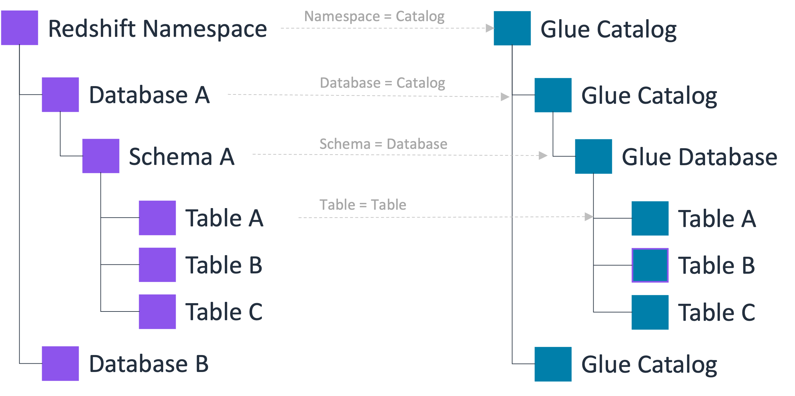

# Bringing Amazon Redshift data into the

AWS Glue Data Catalog

You can manage analytic data in Amazon Redshift data warehouses in the AWS Glue Data Catalog (Data Catalog), and unify Amazon S3 data
lakes and Amazon Redshift data warehouses. Amazon Redshift is a fully managed, petabyte-scale data warehouse service
in the AWS Cloud. An Amazon Redshift data warehouse is a collection of computing resources called
_nodes_, which are organized into a group called a _cluster_. Each cluster runs an Amazon Redshift engine and contains one or more
databases.

In Amazon Redshift, you can create Amazon Redshift provisioned clusters and serverless namespaces, and register
them with the Data Catalog. By doing this, you can unify data in Amazon Redshift managed storage (RMS) and Amazon S3
buckets, and access data from Apache Iceberg compatible analytical engines.

By registering namespaces and clusters, you can provide access to data without the need to
copy it or move it. For more information about registering clusters and namespaces in Amazon Redshift, see
[Registering Amazon Redshift clusters and namespaces to the AWS Glue Data Catalog](../../../redshift/latest/dg/iceberg-integration-register.md "../../../redshift/latest/dg/iceberg-integration-register.md").

In Amazon Redshift, you can perform data sharing through datashares or by registering namespaces and clusters with Data Catalog.
With datashares, which operate at the individual database object level, you have to enable sharing for each table or view.
In contrast, namespace publishing functions at the cluster or namespace level.
When you register a cluster or namespace with the Data Catalog, all databases and tables within it are automatically shared, without you having to configure sharing for individual objects.

In the Data Catalog, you can create a federated catalog for each namespace or cluster. A catalog
is referred to as a _federated catalog_ when it points to an
entity outside of the Data Catalog. Tables and views in the Amazon Redshift namespace are listed as individual
tables in the Data Catalog. You can share databases and tables in the federated catalog with selected
IAM principals and SAML users within the same account, or in another account with Lake Formation. You
can also include row and column filter expressions to restrict access to certain data. For more
information, see [Data filtering and cell-level security in Lake Formation](data-filtering.md "data-filtering.md").

The Data Catalog supports a three-level metadata hierarchy comprising catalogs, databases, and
tables (and views). When you register a namespace with the Data Catalog, the Amazon Redshift data hierarchy is
mapped to the Data Catalog's 3-level hierarchy as follows:

- The Amazon Redshift namespace becomes a multi-level catalog in the Data Catalog.
- The associated Amazon Redshift database is registered as a catalog in the
  Data Catalog.
- The Amazon Redshift schema becomes a database in the Data Catalog.
- The Amazon Redshift table becomes a table in the Data Catalog.

With this three-level metadata hierarchy, you can access Amazon Redshift tables by using the 3-part
notation - "catalog1/catalog2.database.table" in the Data Catalog. Also, data teams can maintain the
same organization that Amazon Redshift uses to organize tables within the Data Catalog account.

In Lake Formation, you can securely manage the data from Amazon Redshift using fine-grained access control for
the Data Catalog resources. With this integration, you can manage, secure, and query analytical data
from a single catalog with a common access control mechanism.

For limitations, see [Limitations for bringing Amazon Redshift data warehouse data into the AWS Glue Data Catalog](notes-ns-catalog.md "notes-ns-catalog.md").

###### Topics

- [Key benefits](#namespace-publish-benefits "#namespace-publish-benefits")
- [Roles and responsibilities](#namespace-roles-responsibilities "#namespace-roles-responsibilities")
- [Prerequisites for managing Amazon Redshift namespaces in the AWS Glue Data Catalog](redshift-ns-prereqs.md "redshift-ns-prereqs.md")
- [Creating Amazon Redshift federated catalogs](create-ns-catalog.md "create-ns-catalog.md")
- [Viewing catalog objects](view-ns-catalog-resources.md "view-ns-catalog-resources.md")
- [Updating a federated catalog](update-fed-catalog-steps.md "update-fed-catalog-steps.md")
- [Accessing a shared federated catalog](catalog-resource-link.md "catalog-resource-link.md")
- [Deleting a federated catalog](delete-rs-fed-catalog.md "delete-rs-fed-catalog.md")
- [Querying federated catalogs](query-redshift-fed-catalog.md "query-redshift-fed-catalog.md")
- [Additional resources](additional-resources-byod.md "additional-resources-byod.md")

## Key benefits

Registering Amazon Redshift clusters and namespaces with the AWS Glue Data Catalog and unifying data across Amazon S3 data lakes and Amazon Redshift data warehouses,
offers the following benefits:

- **Uniform querying experience** – Query your Amazon Redshift managed
  data and data in the Amazon S3 buckets using any query engine compatible with Apache Iceberg,
  such as Amazon EMR Serverless and Amazon Athena without having to move or copy data.
- **Consistent data access across services** – You don't
  need to update database and table names in your data pipelines when accessing the same
  federated data sources from different AWS analytics services, as the data sources are
  registered in the Data Catalog.
- **Fine-grained access control** – You can apply Lake Formation
  permissions to manage access to the federated data sources using fine-grained access
  control permissions.

## Roles and responsibilities

|                                                |                                                                                                                                              |
| ---------------------------------------------- | -------------------------------------------------------------------------------------------------------------------------------------------- |
| **Role**                                       | **Responsibility**                                                                                                                           |
| Amazon Redshift producer cluster administrator | Registers the cluster or namespace with the Data Catalog.                                                                                    |
| Lake Formation data lake administrator         | Accepts the cluster or namespace invitation, creates federated catalogs, and grants access on the federated catalogs to other principals. |
| Lake Formation read only administrator         | Discovers the federated catalog, queries Amazon Redshift tables in the federated catalog.                                                 |
| Data transfer role                             | Amazon Redshift assumes on your behalf to transfer data to and from the Amazon S3 bucket.                                                    |

The following are the high-level steps to provide users access to an Amazon Redshift namespace:

1. In Amazon Redshift, the producer cluster administrator registers a cluster or namespace with the Data Catalog.
2. The data lake administrator accepts the namespace invitation from the Amazon Redshift producer
   cluster administrator, and creates a federated catalog in the Data Catalog.

After completing this step, you can manage the Amazon Redshift namespace catalog within the Data Catalog. 3. Grant permissions to users on catalogs, databases and tables. You can share the entire
namespace catalog or a subset of tables with users in the same account or another account.
