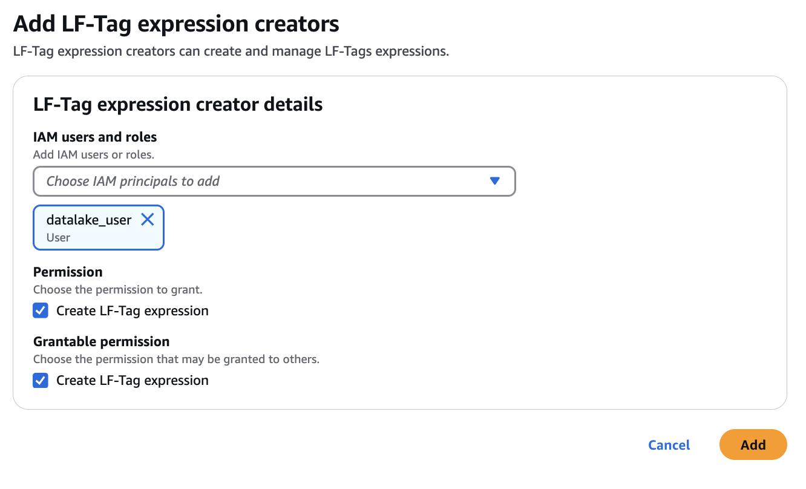

# Managing LF-Tag expressions for metadata access

control

LF-Tag expressions are logical expressions composed of one or more LF-Tags (key-value pairs) used to grant permissions on AWS Glue Data Catalog resources.
LF-Tag expressions allow you to define rules that govern access to your data resources based on their metadata tags.
You can save these expressions and reuse them across multiple permission grants, ensuring consistency and making it straight-forward to manage changes to the tag ontology over time.

Within a given LF-Tag expression, the tag keys are combined using the AND
operation, while the values are combined using the OR operation. For example, the tag expression
`content_type:Sales AND location:US` represents resources related to sales data in
the US.

You can create up to 1000 LF-Tag expressions in an AWS account. These expressions provide a
flexible and scalable way to manage permissions based on metadata tags, ensuring that only
authorized users or applications can access specific data resources based on the defined tag
rules.

LF-Tag expressions offer the following benefits:

- **Reusability** – By defining and saving
  LF-Tag expressions, you no longer need to manually replicate the same expressions
  when assigning permissions to other resources or principals.
- **Consistency** – Reusing LF-Tag expressions
  across multiple permission grants ensures consistency in how permissions are granted and
  managed.
- **Tag ontology management** – LF-Tag expressions
  help manage changes to the tag ontology over time, as you can update the saved expressions
  instead of modifying individual permission grants.
  For more information about tag-based access control, please refer to the [Lake Formation tag-based access control](tag-based-access-control.md "tag-based-access-control.md").

###### LF-Tag expression creators

LF-Tag expression creator is a principal who has permissions to create and manage LF-Tag
expressions. Data lake administrators can add LF-Tag expression creators using the Lake Formation
console, CLI, API, or SDK. LF-Tag expression creators have implicit Lake Formation permissions to
create, update, and delete LF-Tag expressions, and to grant LF-Tag expression
permissions to other principals.

LF-Tag expression creators that are not data lake administrators receive implicit `Alter`,
`Drop`, `Describe`, and `Grant with LF-Tag expression` permissions only for expressions they created.

Data lake administrators can also grant LF-Tag expression creators grantable `Create
 LF-Tag expression` permissions. Then, the LF-Tag expression creator can grant the
permission to create LF-Tag expressions to other principals.

###### Topics

- [IAM permissions required to create LF-Tag expressions](#tag-expression-creator-permissions "#tag-expression-creator-permissions")
- [Add LF-Tag expression creators](#add-lf-tag-expression-creator "#add-lf-tag-expression-creator")
- [Creating LF-Tag expressions](TBAC-creating-tag-expressions.md "TBAC-creating-tag-expressions.md")
- [Updating LF-Tag expressions](TBAC-updating-expressions.md "TBAC-updating-expressions.md")
- [Deleting LF-Tag expressions](TBAC-deleting-expressions.md "TBAC-deleting-expressions.md")
- [Listing LF-Tag expressions](TBAC-listing-expressions.md "TBAC-listing-expressions.md")

###### See also

- [Managing LF-Tag value
  permissions](TBAC-granting-tags.md "TBAC-granting-tags.md")
- [Granting data lake permissions using the
  LF-TBAC method](granting-catalog-perms-TBAC.md "granting-catalog-perms-TBAC.md")
- [Lake Formation tag-based access control](tag-based-access-control.md "tag-based-access-control.md")

## IAM permissions required to create LF-Tag expressions

You must configure permissions to allow a Lake Formation principal to create LF-Tag
expressions. Add the following statement to the permissions policy for the principal that
needs to be an LF-Tag expression creator.

###### Note

Although data lake administrators have implicit Lake Formation permissions to create, update,
and delete LF-Tags and LF-Tag expressions, to assign LF-Tags to resources, and to grant
LF-Tags and LF-Tag expression permission to principals, data lake administrators also need the following IAM permissions.

For more information, see [Lake Formation personas and IAM permissions reference](permissions-reference.md "permissions-reference.md").

```
{
"Sid": "Transformational",
"Effect": "Allow",
    "Action": [
        "lakeformation:AddLFTagsToResource",
        "lakeformation:RemoveLFTagsFromResource",
        "lakeformation:GetResourceLFTags",
        "lakeformation:ListLFTags",
        "lakeformation:CreateLFTag",
        "lakeformation:GetLFTag",
        "lakeformation:UpdateLFTag",
        "lakeformation:DeleteLFTag",
        "lakeformation:SearchTablesByLFTags",
        "lakeformation:SearchDatabasesByLFTags",
        "lakeformation:CreateLFTagExpression",
        "lakeformation:DeleteLFTagExpression",
        "lakeformation:UpdateLFTagExpression",
        "lakeformation:GetLFTagExpression",
        "lakeformation:ListLFTagExpressions",
        "lakeformation:GrantPermissions",
        "lakeformation:RevokePermissions",
        "lakeformation:BatchGrantPermissions",
        "lakeformation:BatchRevokePermissions"
     ]
 }

```

## Add LF-Tag expression creators

LF-Tag expression creators can create and save reusable LF-Tag expressions,
update tag key and values, delete expressions, and grant permissions on Data Catalog resources to
principals using LF-TBAC method. The LF-Tag expression creator can also grant these
permissions to principals.

You can create LF-Tag expression creator roles by using the AWS Lake Formation console, the API, or the
AWS Command Line Interface (AWS CLI).

console

###### To add an LF-Tag expression creator

1. Open the Lake Formation console at
   [https://console.aws.amazon.com/lakeformation/](https://console.aws.amazon.com/lakeformation/ "https://console.aws.amazon.com/lakeformation/").

Sign in as a data lake administrator. 2. In the navigation pane, under **Permissions**, choose
**LF-Tags and permissions**. 3. Choose the **LF-Tag expressions** tab. 4. In the **LF-Tag expression creators** section, choose **Add LF-Tag
expression creators**.

 5. On the **Add LF-Tag expression creators** page, choose an
IAM role or user who has the required permissions to create LF-Tag
expressions. 6. Select `Create LF-Tag expression` permission check box. 7. (Optional) To enable the selected principals to grant `Create LF-Tag
 expression` permission to principals, choose Grantable `Create LF-Tag
 expression` permission. 8. Choose **Add**.

AWS CLI

```
aws lakeformation grant-permissions --cli-input-json file://grantCreate
{
    "Principal": {
        "DataLakePrincipalIdentifier": "arn:aws:iam::123456789012:user/tag-manager"
    },
    "Resource": {
        "Catalog": {}
    },
    "Permissions": [
        "CreateLFTagExpression"
    ],
    "PermissionsWithGrantOption": [
        "CreateLFTagExpression"
    ]
}

```

The LF-Tag expression creator role gets the ability to create, update, or delete LF-Tag
expressions.

| Permission                     | Description                                                                                                                                                                                                   |
| ------------------------------ | ------------------------------------------------------------------------------------------------------------------------------------------------------------------------------------------------------------- |
| `Create`                       | A principal with this permission can add LF-Tag expressions in the data<br>lake.                                                                                                                              |
| `Drop`                         | A principal with this permission on an LF-Tag expression can delete an<br>LF-Tag expression from the data lake.                                                                                               |
| `Alter`                        | A principal with this permission on an LF-Tag expression can update<br>the expression body of an LF-Tag expression.                                                                                           |
| `Describe`                     | A principal with this permission on an LF-Tag expression can view the<br>contents of an LF-Tag expression.                                                                                                    |
| `Grant with LF-Tag expression` | This permission allows the recipient to use the tag expression as the resource<br>when granting data or metadata access permissions. Granting `Grant<br>with LF-Tag expression` implicitly grants `Describe`. |
| `Super`                        | For LF-Tag expressions,<br>the `Super` permission grants the ability to `Describe`,<br>`Alter`, `Drop`, and grant permissions on the tag expression to other principals.                                      |

These permissions are grantable. A principal who has been granted these permissions
with the grant option can grant them to other principals.
