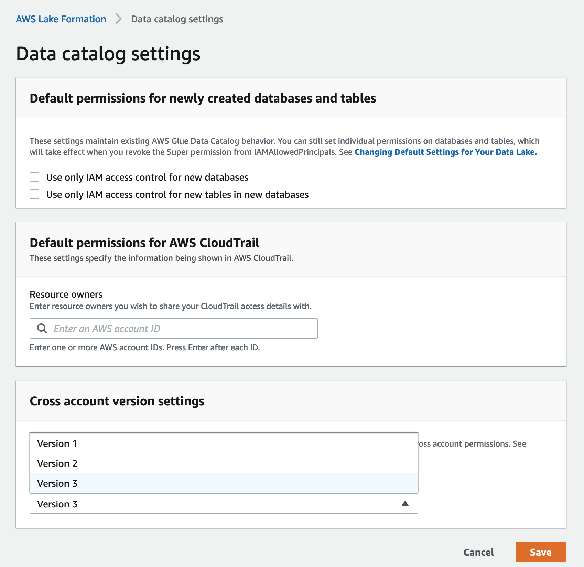

# Updating cross-account data sharing version settings

From time to time, AWS Lake Formation updates the cross-account data sharing settings to distinguish the
changes made to the AWS RAM usage and to support updates made to the cross-account data sharing feature. When Lake Formation does this, it creates a new version of the
**Cross account version settings**.

## Main differences between cross-account version settings

For more information about how cross-account data sharing works under different
**Cross account version settings**, see the following sections.

###### Note

To share data with another account, the grantor must have
`AWSLakeFormationCrossAccountManager` managed IAM policy permissions. This
is a prerequisite for all versions.

Updating the **Cross account version settings** does not impact the
permissions the recipient has on shared resources. This is applicable when updating from
version 1 to version 2, version 2 to version 3, and version 1 to version 3. See the considerations listed below when updating versions.

**Version 1**

_Named resource method:_ Maps each cross-account Lake Formation permission grant to one AWS RAM resource share.
User (grantor role or principal) does not require additional
permissions.

_LF-TBAC method:_ Cross-account Lake Formation permission grants don't use AWS RAM to share
data. User must have `glue:PutResourcePolicy` permission.

_Benefits from updating versions:_ Initial version - not
applicable.

_Considerations when updating versions:_ Initial version - not applicable

**Version 2**

_Named resource method:_ Optimizes the number of AWS RAM resource shares by mapping multiple
cross-account permission grants with one AWS RAM resource share. User does not require additional permissions.

_LF-TBAC method:_ Cross-account Lake Formation permission grants don't use AWS RAM to share
data. User must have `glue:PutResourcePolicy` permission.

_Benefits from updating versions:_ Scalable cross-account setup by optimal utilization of AWS RAM capacity.

_Considerations when updating versions:_ Users who want to grant cross-account Lake Formation permissions must have the
permissions in the `AWSLakeFormationCrossAccountManager` AWS
managed policy. Otherwise, you need to have
`ram:AssociateResourceShare` and
`ram:DisassociateResourceShare` permissions to successfully share
resources with another account.

**Version 3**

_Named resource method:_ Optimizes the number of AWS RAM resource shares by mapping multiple
cross-account permission grants with one AWS RAM resource share. User does not require additional permissions.

_LF-TBAC method:_ Lake Formation uses AWS RAM for cross-account
grants. User must add glue:ShareResource statement to the
`glue:PutResourcePolicy` permission. The recipient must accept resource
share invitations from AWS RAM.

_Benefits from updating versions:_ Supports the following capabilities:

- Allows sharing resources explicitly with an IAM principal in an
  external account.

For more information, see [Granting permissions on Data Catalog resources](granting-catalog-permissions.md "granting-catalog-permissions.md").

- Enables cross-account shares using LF-TBAC method to Organizations or
  organizational units (OUs).
- Removes the overhead of maintaining additional AWS Glue policies for
  cross-account grants.

_Considerations when updating versions:_ When you use
LF-TBAC method to share resources, if the grantor uses a version lower than version 3,
and the recipient is using version 3 or higher, the grantor receives the following
error message: "Invalid cross account grant request. Consumer account has opt-in to
cross account version: v3. Please update `CrossAccountVersion` in
`DataLakeSetting` to minimal version v3 (Service: AmazonDataCatalog;
Status Code: 400; Error Code: InvalidInputException)". However, if the grantor uses
version 3 and the recipient is using version 1 or version 2, the cross-account grants
using LF-Tags go through successfully.

Cross-account grants made using the named resource method are compatible across
different versions. Even if the grantor account is using an older version (version 1
or 2) and the recipient account is using a newer version (version 3 or higher), the
cross-account access functionality operates seamlessly without any compatibility
issues or errors.

To share resources directly with IAM principals in another account, only the
grantor needs to use version 3.

Cross-account grants made using LF-TBAC method require users to have an
AWS Glue Data Catalog resource policy in the account. When you update to version 3, LF-TBAC
grants uses AWS RAM. To allow AWS RAM based cross-account grants to succeed, you must
add the `glue:ShareResource` statement to your existing Data Catalog resource
policies as shown in the [Managing cross-account permissions using both
AWS Glue and Lake Formation](hybrid-cross-account.md "hybrid-cross-account.md") section.

**Version 4**

The grantor needs version 4 or higher to share Data Catalog resources in hybrid access mode or share objects in a federated catalog.

**Version 5**

Cross Account Version 5 enhances cross-account resource sharing enabling you to share unlimited number of tables to another account, eliminating previous resource association limits per resource type. To get started, upgrade to cross-account version 5 through the Lake Formation console or API. Any new cross-account permission grants will automatically use wildcard patterns in the resource share instead of individual resource associations. All existing cross-account shares continue to function, and all existing Lake Formation APIs remain compatible.

_Benefits from updating versions:_ Cross-account v5 enhances cross-account sharing, allowing you to share hundreds of thousands of tables across accounts.

_Considerations when updating versions:_ New grants after version 5 upgrade will add wildcard resource patterns to existing AWS Resource Manager resource shares or create new shares with wildcard patterns. Once upgraded to version 5, downgrade is not supported.

## Optimize AWS RAM resource shares

New versions (version 2 and above) of cross-account grants optimally utilize AWS RAM capacity to maximize cross account usage.
When you share a resource with an external AWS account or an IAM principal, Lake Formation may create a new resource share or associate the resource with an existing share.
By associating with existing shares, Lake Formation reduces the number of resource share invitations a consumer needs to
accept. Version 5 further optimizes RAM usage by using wildcard-based resource patterns instead of individual resource associations, thereby significantly reducing resource associations per resource share.

## Enable AWS RAM shares via TBAC or share resources directly to principals

To share resources directly with IAM principals in another account or to
enable TBAC cross-account shares to Organizations or organizational units, you need to update the
**Cross account version settings** to version 3. For more information
about AWS RAM resource limits, see [Cross-account data sharing best practices and considerations](cross-account-notes.md "cross-account-notes.md").

### Required permissions for updating cross-account version settings

If a cross-account permission grantor has `AWSLakeFormationCrossAccountManager` managed IAM policy permissions,
then there is no extra permission setup required for the cross-account permission grantor role or principal. However, if the cross-account grantor is not using the managed policy,
then the grantor role or principal should have following IAM permissions granted for the new version of the cross-account grant to be successful.

JSON

```
 `{
 "Version":"2012-10-17",
 "Statement": [
 {
 "Sid": "VisualEditor1",
 "Effect": "Allow",
 "Action": [
 "ram:AssociateResourceShare",
 "ram:DisassociateResourceShare",
 "ram:GetResourceShares"
 ],
 "Resource": "*",
 "Condition": {
 "StringLike": {
 "ram:ResourceShareName": "LakeFormation*"
 }
 }
 }
 ]
}`

```

## To enable the new version

Follow these steps to update **Cross account version settings**
through the AWS Lake Formation console or the AWS CLI.

Console

1. Choose **Version 2**, **Version 3**, **Version 4**, or **Version 5** under **Cross account version
   settings** on the **Data catalog settings** page. If you
   select **Version 1**, Lake Formation will use the default resource sharing mode.

 2. Choose **Save**.

AWS Command Line Interface (AWS CLI)
Use the `put-data-lake-settings` AWS CLI command to set the
`CROSS_ACCOUNT_VERSION` parameter. Accepted values are 1, 2, 3, 4, and 5.

```
aws lakeformation put-data-lake-settings --region us-east-1 --data-lake-settings file://settings
{
    "DataLakeAdmins": [
        {
            "DataLakePrincipalIdentifier": "arn:aws:iam::111122223333:user/test"
        }
    ],
    "CreateDatabaseDefaultPermissions": [],
    "CreateTableDefaultPermissions": [],
    "Parameters": {
        "CROSS_ACCOUNT_VERSION": "3"
    }
}

```

###### Important

Once you choose **Version 2** or **Version
3**, all new **named resource** grants will go
through the new cross-account grant mode. To optimally use AWS RAM capacity for your
existing cross-account shares, we recommend you to revoke the grants that were made with
the older version, and re-grant in the new mode.
