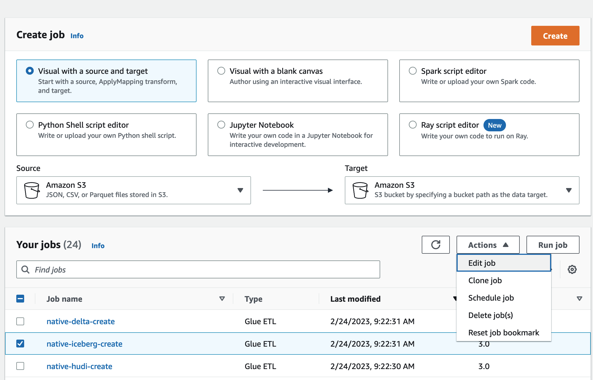
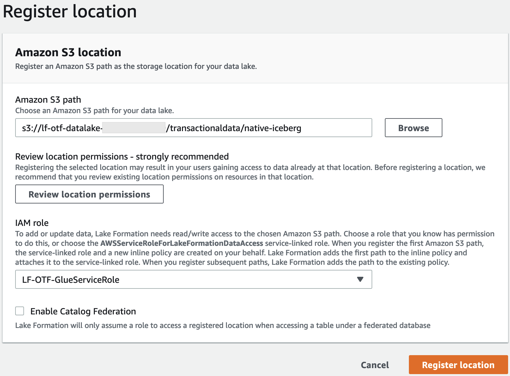
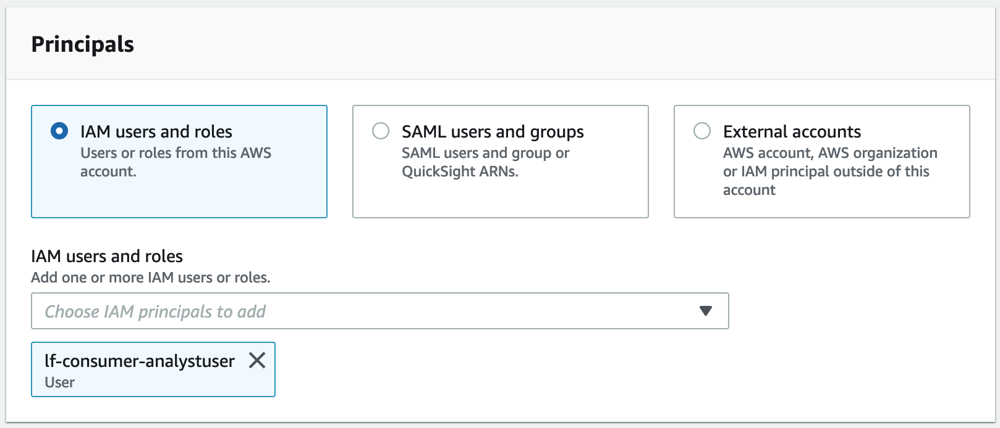
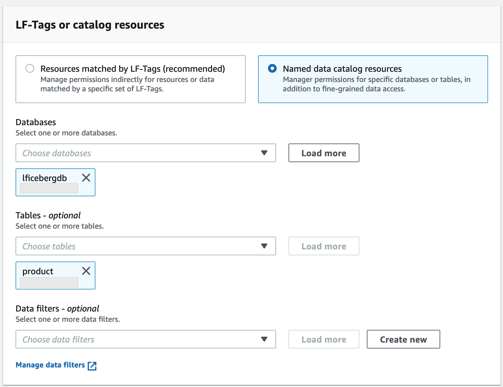
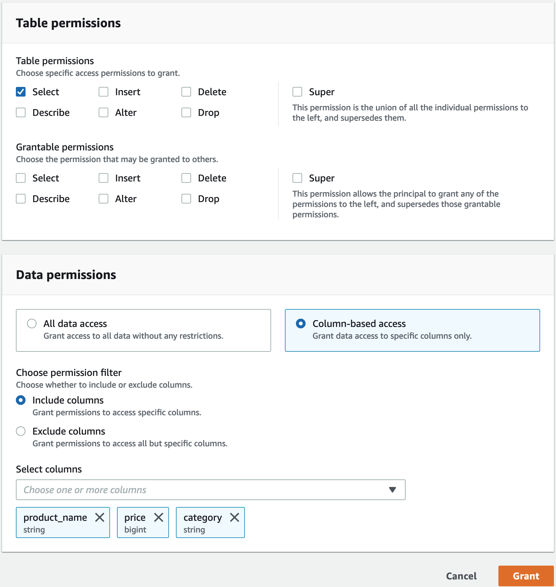

# Setting up permissions for open table storage formats in Lake Formation

AWS Lake Formation supports managing access permissions for _Open Table Formats_ (OTFs) such as [Apache Iceberg](https://iceberg.apache.org/ "https://iceberg.apache.org/"), [Apache Hudi](https://hudi.incubator.apache.org/ "https://hudi.incubator.apache.org/"), and [Linux foundation Delta Lake](https://delta.io/ "https://delta.io/").
In this tutorial, you'll learn how to create Iceberg, Hudi, and Delta Lake with symlink [manifest](https://docs.delta.io/latest/presto-integration.html "https://docs.delta.io/latest/presto-integration.html") tables in the AWS Glue Data Catalog using AWS Glue,
set up fine-grained permissions using Lake Formation, and query data using Amazon Athena.

###### Note

AWS analytics services don't support all transactional table formats. For more
information, see [Working with other AWS services](working-with-services.md "working-with-services.md"). This tutorial manually covers creating a new database and a table in the Data Catalog using
AWS Glue jobs only.

This tutorial includes an AWS CloudFormation template for quick setup. You can review and
customize it to suit your needs.

###### Topics

- [Intended audience](#tut-otf-roles "#tut-otf-roles")
- [Prerequisites](#tut-otf-prereqs "#tut-otf-prereqs")
- [Step 1: Provision your resources](#set-up-otf-resources "#set-up-otf-resources")
- [Step 2: Set up permissions for an Iceberg table](#set-up-iceberg-table "#set-up-iceberg-table")
- [Step 3: Set up permissions for a Hudi table](#set-up-hudi-table "#set-up-hudi-table")
- [Step 4: Set up permissions for a Delta Lake
  table](#set-up-delta-table "#set-up-delta-table")
- [Step 5: Clean up AWS resources](#otf-tut-clean-up "#otf-tut-clean-up")

## Intended audience

This tutorial is intended for IAM administrators, data lake administrators, and business analysts. The following table lists the roles used in this tutorial for creating a governed table using Lake Formation.

| Role                    | Description                                                                                                                                                                                                  |
| ----------------------- | ------------------------------------------------------------------------------------------------------------------------------------------------------------------------------------------------------------ | -------------------------------------------------------------------------------------------------------------------------------------------------------------------------------------------------------------------------------------------------------------------------------------------------------------------------------------------------------------------------------------------------------------------------------------------------------------------------------------------------------------------------------------------------------------------------------------------------------------------------------------------------------------------------------------------------------------------------------------------------------------------------------------------------------------------------------------------------------------------------------------------------------------------------------------------------------------------------------------------------------------------------------------------------------------------------------------------------------------------------------------------------------------------------------------------------------------------------------------------------------------------------------------------------------------------------------------------------------------------------------------------------------------------------------------------------------------------------------------------------------------------------------------------------------------------------------------------------------------------------------------------------------------------------------------------------------------------------------------------------------------------------------------------------------------------------------------------------------------------------------------------------------------------------------------------------------------------------------------------------------------------------------------------------------------------------------------------------------------------------------------------------------------------------------------------------------------------------------------------------------------------------------------------------------------------------------------------------------------------------------------------------------------------------------------------------------------------------------------------------------------------------------------------------------------------------------------------------------------------------------------------------------------------------------------------------------------------------------------------------------------------------------------------------------------------------------------------------------------------------------------------------------------------------------------------------------------------------------------------------------------------------------------------------------------------------------------------------------------------------------------------------------------------------------------------------------------------------------------------------------------------------------------------------------------------------------------------------------------------------------------------------------------------------------------------------------------------------------------------------------------------------------------------------------------------------------------------------------------------------------------------------------------------------------------------------------------------------------------------------------------------------------------------------------------------------------------------------------------------------------------------------------------------------------------------------------------------------------------------------------------------------------------------------------------------------------------------------------------------------------------------------------------------------------------------------------------------------------------------------------------------------------------------------------------------------------------------------------------------------------------------------------------------------------------------------------------------------------------------------------------------------------------------------------------------------------------------------------------------------------------------------------------------------------------------------------------------------------------------------------------------------------------------------------------------------------------------------------------------------------------------------------------------------------------------------------------------------------------------------------------------------------------------------------------------------------------------------------------------------------------------------------------------------------------------------------------------------------------------------------------------------------------------------------------------------------------------------------------------------------------------------------------------------------------------------------------------------------------------------------------------------------------------------------------------------------------------------------------------------------------------------------------------------------------------------------------------------------------------------------------------------------------------------------------------------------------------------------------------------------------------------------------------------------------------------------------------------------------------------------------------------------------------------------------------------------------------------------------------------------------------------------------------------------------------------------------------------------------------------------------------------------------------------------------------------------------------------------------------------------------------------------------------------------------------------------------------------------------------------------------------------------------------------------------------------------------------------------------------------------------------------------------------------------------------------------------------------------------------------------------------------------------------------------------------------------------------------------------------------------------------------------------------------------------------------------------------------------------------------------------------------------------------------------------------------------------------------------------------------------------------------------------------------------------------------------------------------------------------------------------------------------------------------------------------------------------------------------------------------------------------------------------------------------------------------------------------------------------------------------------------------------------------------------------------------------------------------------------------------------------------------------------------------------------------------------------------------------------------------------------------------------------------------------------------------------------------------------------------------------------------------------------------------------------------------------------------------------------------------------------------------------------------------------------------------------------------------------------------------------------------------------------------------------------------------------------------------------------------------------------------------------------------------------------------------------------------------------------------------------------------------------------------------------------------------------------------------------------------------------------------------------------------------------------------------------------------------------------------------------------------------------------------------------------------------------------------------------------------------------------------------------------------------------------------------------------------------------------------------------------------------------------------------------------------------------------------------------------------------------------------------------------------------------------------------------------------------------------------------------------------------------------------------------------------------------------------------------------------------------------------------------------------------------------------------------------------------------------------------------------------------------------------------------------------------------------------------------------------------------------------------------------------------------------------------------------------------------------------------------------------------------------------------------------------------------------------------------------------------------------------------------------------------------------------------------------------------------------------------------------------------------------------------------------------------------------------------------------------------------------------------------------------------------------------------------------------------------------------------------------------------------------------------------------------------------------------------------------------------------------------------------------------------------------------------------------------------------------------------------------------------------------------------------------------------------------------------------------------------------------------------------------------------------------------------------------------------------------------------------------------------------------------------------------------------------------------------------------------------------------------------------------------------------------------------------------------------------------------------------------------------------------------------------------------------------------------------------------------------------------------------------------------------------------------------------------------------------------------------------------------------------------------------------------------------------------------------------------------------------------------------------------------------------------------------------------------------------------------------------------------------------------------------------------------------------------------------------------------------------------------------------------------------------------------------------------------------------------------------------------------------------------------------------------------------------------------------------------------------------------------------------------------------------------------------------------------------------------------------------------------------------------------------------------------------------------------------------------------------------------------------------------------------------------------------------------------------------------------------------------------------------------------------------------------------------------------------------------------------------------------------------------------------------------------------------------------------------------------------------------------------------------------------------------------------------------------------------------------------------------------------------------------------------------------------------------------------------------------------------------------------------------------------------------------------------------------------------------------------------------------------------------------------------------------------------------------------------------------------------------------------------------------------------------------------------------------------------------------------------------------------------------------------------------------------------------------------------------------------------------------------------------------------------------------------------------------------------------------------------------------------------------------------------------------------------------------------------------------------------------------------------------------------------------------------------------------------------------------------------------------------------------------------------------------------------------------------------------------------------------------------------------------------------------------------------------------------------------------------------------------------------------------------------------------------------------------------------------------------------------------------------------------------------------------------------------------------------------------------------------------------------------------------------------------------------------------------------------------------------------------------------------------------------------------------------------------------------------------------------------------------------------------------------------------------------------------------------------------------------------------------------------------------------------------------------------------------------------------------------------------------------------------------------------------------------------------------------------------------------------------------------------------------------------------------------------------------------------------------------------------------------------------------------------------------------------------------------------------------------------------------------------------------------------------------------------------------------------------------------------------------------------------------------------------------------------------------------------------------------------------------------------------------------------------------------------------------------------------------------------------------------------------------------------------------------------------------------------------------------------------------------------------------------------------------------------------------------------------------------------------------------------------------------------------------------------------------------------------------------------------------------------------------------------------------------------------------------------------------------------------------------------------------------------------------------------------------------------------------------------------------------------------------------------------------------------------------------------------------------------------------------------------------------------------------------------------------------------------------------------------------------------------------------------------------------------------------------------------------------------------------------------------------------------------------------------------------------------------------------------------------------------------------------------------------------------------------------------------------------------------------------------------------------------------------------------------------------------------------------------------------------------------------------------------------------------------------------------------------------------------------------------------------------------------------------------------------------------------------------------------------------------------------------------------------------------------------------------------------------------------------------------------------------------------------------------------------------------------------------------------------------------------------------------------------------------------------------------------------------------------------------------------------------------------------------------------------------------------------------------------------------------------------------------------------------------------------------------------------------------------------------------------------------------------------------------------------------------------------------------------------------------------------------------------------------------------------------------------------------------------------------------------------------------------------------------------------------------------------------------------------------------------------------------------------------------------------------------------------------------------------------------------------------------------------------------------------------------------------------------------------------------------------------------------------------------------------------------------------------------------------------------------------------------------------------------------------------------------------------------------------------------------------------------------------------------------------------------------------------------------------------------------------------------------------------------------------------------------------------------------------------------------------------------------------------------------------------------------------------------------------------------------------------------------------------------------------------------------------------------------------------------------------------------------------------------------------------------------------------------------------------------------------------------------------------------------------------------------------------------------------------------------------------------------------------------------------------------------------------------------------------------------------------------------------------------------------------------------------------------------------------------------------------------------------------------------------------------------------------------------------------------------------------------------------------------------------------------------------------------------------------------------------------------------------------------------------------------------------------------------------------------------------------------------------------------------------------------------------------------------------------------------------------------------------------------------------------------------------------------------------------------------------------------------------------------------------------------------------------------------------------------------------------------------------------------------------------------------------------------------------------------------------------------------------------------------------------------------------------------------------------------------------------------------------------------------------------------------------------------------------------------------------------------------------------------------------------------------------------------------------------------------------------------------------------------------------------------------------------------------------------------------------------------------------------------------------------------------------------------------------------------------------------------------------------------------------------------------------------------------------------------------------------------------------------------------------------- |
| IAM Administrator       | A user who can create IAM users and roles and Amazon S3 buckets. Has the `AdministratorAccess` AWS managed policy.                                                                                           |
| Data lake administrator | A user who can access the Data Catalog, create databases, and grant Lake Formation permissions to other users. Has fewer IAM permissions than the IAM administrator, but enough to administer the data lake. |
| Business analyst        | A user who can run queries against the data lake. Has permissions to run queries.                                                                                                                            | ## Prerequisites Before you start this tutorial, you must have an AWS account that you can sign in as a user with the correct permissions. For more information, see [Sign up for an AWS account](getting-started-setup.md#sign-up-for-aws "getting-started-setup.md#sign-up-for-aws") and [Create a user with administrative access](getting-started-setup.md#create-an-admin "getting-started-setup.md#create-an-admin"). The tutorial assumes that you are familiar with IAM roles and policies. For information about IAM, see the [IAM User Guide](../../../IAM/latest/UserGuide/introduction.md "../../../IAM/latest/UserGuide/introduction.md"). You need to set up the following AWS resources to complete this tutorial:  • Data lake administrator user  • Lake Formation data lake settings  • Amazon Athena engine version 3 ###### To create a data lake administrator 1. Sign in to the Lake Formation console at [https://console.aws.amazon.com/lakeformation/](https://console.aws.amazon.com/lakeformation/ "https://console.aws.amazon.com/lakeformation/") as an administrator user. You will create resources in the US East (N. Virginia) Region for this tutorial. 2. On the Lake Formation console, in the navigation pane, under **Permissions**, choose **Administrative roles and tasks**. 3. Select **Choose Administrators** under **Data lake administrators**. 4. In the pop-up window, **Manage data lake administrators**, under **IAM users and roles**, choose **IAM admin user**. 5. Choose **Save**. ###### To enable data lake settings 1. Open the Lake Formation console at [https://console.aws.amazon.com/lakeformation/](https://console.aws.amazon.com/lakeformation/ "https://console.aws.amazon.com/lakeformation/"). In the navigation pane, under **Data catalog**, choose **Settings**. Uncheck the following:  • Use only IAM access control for new databases.  • Use only IAM access control for new tables in new databases. 2. Under **Cross account version settings**, choose **Version 3** as the cross account version. 3. Choose **Save**. ###### To upgrade Amazon Athena engine to version 3 1. Open Athena console at [https://console.aws.amazon.com/athena/](https://console.aws.amazon.com/athena/home "https://console.aws.amazon.com/athena/home"). 2. Select the **Workgroup** and select primary workgroup. 3. Ensure that the workgroup is at a minimum version of 3. If it is not, edit the workgroup, choose **Manual** for **Upgrade query engine**, and select version 3. 4. Choose **Save changes**. ## Step 1: Provision your resources This section shows you how to set up the AWS resources using an AWS CloudFormation template. ###### To create your resources using AWS CloudFormation template 1. Sign into the AWS CloudFormation console at [https://console.aws.amazon.com/cloudformation](https://console.aws.amazon.com/cloudformation/ "https://console.aws.amazon.com/cloudformation/") as an IAM administrator in the US East (N. Virginia) Region. 2. Choose [Launch Stack](https://us-east-1.console.aws.amazon.com/cloudformation/home?region=us-east-1#/stacks/new?templateURL=https://lf-public.s3.amazonaws.com/cfn/lfotfsetup.template "https://us-east-1.console.aws.amazon.com/cloudformation/home?region=us-east-1#/stacks/new?templateURL=https://lf-public.s3.amazonaws.com/cfn/lfotfsetup.template"). 3. Choose **Next** on the **Create stack** screen. 4. Enter a **Stack name**. 5. Choose **Next**. 6. On the next page, choose **Next**. 7. Review the details on the final page and select **I acknowledge that AWS CloudFormation might create IAM resources.** 8. Choose **Create**. The stack creation can take up to two minutes. Launching the cloud formation stack creates the following resources:  • lf-otf-datalake-123456789012 – Amazon S3 bucket to store data ###### Note The account id appended to the Amazon S3 bucket name is replaced with your account id.  • lf-otf-tutorial-123456789012 – Amazon S3 bucket to store query results and AWS Glue job scripts  • lficebergdb – AWS Glue Iceberg database  • lfhudidb – AWS Glue Hudi database  • lfdeltadb – AWS Glue Delta database  • native-iceberg-create – AWS Glue job that creates an Iceberg table in the Data Catalog  • native-hudi-create – AWS Glue job that creates a Hudi table in the Data Catalog  • native-delta-create – AWS Glue job that creates a Delta table in the Data Catalog  • LF-OTF-GlueServiceRole – IAM role that you pass to AWS Glue to run the jobs. This role has the required policies attached to access the resources like Data Catalog, Amazon S3 bucket etc.  • LF-OTF-RegisterRole – IAM role to register the Amazon S3 location with Lake Formation. This role has `LF-Data-Lake-Storage-Policy` attached to the role.  • lf-consumer-analystuser – IAM user to query the data using Athena  • lf-consumer-analystuser-credentials – Password for the data analyst user stored in AWS Secrets Manager After the stack creations is complete, navigate to the output tab and note down the values for:  • AthenaQueryResultLocation – Amazon S3 location for Athena query output  • BusinessAnalystUserCredentials – Password for the data analyst user To retrieve the password value: 1. Choose the `lf-consumer-analystuser-credentials` value by navigating to the Secrets Manager console. 2. In the **Secret value** section, choose **Retrieve secret value**. 3. Note down the secret value for the password. ## Step 2: Set up permissions for an Iceberg table In this section, you'll learn how to create an Iceberg table in the AWS Glue Data Catalog, set up data permissions in AWS Lake Formation, and query data using Amazon Athena. ###### To create an Iceberg table In this step, you’ll run an AWS Glue job that creates an Iceberg transactional table in the Data Catalog. 1. Open the AWS Glue console at [https://console.aws.amazon.com/glue/](https://console.aws.amazon.com/glue/ "https://console.aws.amazon.com/glue/") in the US East (N. Virginia) Region as the data lake administrator user. 2. Choose **jobs** from the left navigation pane. 3. Select `native-iceberg-create`.  4. Under **Actions**, choose **Edit job**. 5. Under **Job details**, expand **Advanced properties**, and check the box next to **Use AWS Glue Data Catalog as the Hive metastore** to add the table metadata in the AWS Glue Data Catalog. This specifies AWS Glue Data Catalog as the metastore for the Data Catalog resources used in the job and enables Lake Formation permissions to be applied later on the catalog resources. 6. Choose **Save**. 7. Choose **Run**. You can view the status of the job while it is running. For more information on AWS Glue jobs, see [Working with jobs on the AWS Glue console](../../../glue/latest/dg/console-jobs.md "../../../glue/latest/dg/console-jobs.md") in the _AWS Glue Developer Guide_. This job creates an Iceberg table named `product` in the `lficebergdb` database. Verify the product table in the Lake Formation console. ###### To register the data location with Lake Formation Next, register the Amazon S3 path as the location of your data lake. 1. Open the Lake Formation console at [https://console.aws.amazon.com/lakeformation/](https://console.aws.amazon.com/lakeformation/ "https://console.aws.amazon.com/lakeformation/") as the data lake administrator user. 2. In the navigation pane, under **Register and ingest**, choose **Data location**. 3. On the upper right of the console, choose **Register location**. 4. On the **Register location** page, enter the following:  • **Amazon S3 path** – Choose **Browse** and select `lf-otf-datalake-123456789012`. Click on the right arrow (>) next to the Amazon S3 root location to navigate to the `s3/buckets/lf-otf-datalake-123456789012/transactionaldata/native-iceberg` location.  • **IAM role** – Choose `LF-OTF-RegisterRole` as the IAM role.  • Choose **Register location**.  For more information on registering a data location with Lake Formation, see [Adding an Amazon S3 location to your data lake](register-data-lake.md "register-data-lake.md"). ###### To grant Lake Formation permissions on the Iceberg table In this step, we'll grant data lake permissions to the business analyst user. 1. Under **Data lake permissions**, choose **Grant**. 2. On the **Grant data permissions** screen, choose, **IAM users and roles**. 3. Choose `lf-consumer-analystuser` from the drop down.  4. Choose **Named data catalog resource**. 5. For **Databases** choose `lficebergdb`. 6. For **Tables**, choose `product`.  7. Next, you can grant column-based access by specifying columns. 1. Under **Table permissions**, choose **Select**. 2. Under **Data permissions**, choose **Column-based access**, choose **Include columns**. 3. Choose `product_name`, `price`, and `category` columns. 4. Choose **Grant**.  ###### To query the Iceberg table using Athena Now you can start querying the Iceberg table you created using Athena. If it is your first time running queries in Athena, you need to configure a query result location. For more information, see [Specifying a query result location](../../../athena/latest/ug/querying.md#query-results-specify-location "../../../athena/latest/ug/querying.md#query-results-specify-location"). 1. Sign out as the data lake administrator user and sign in as `lf-consumer-analystuser` in US East (N. Virginia) Region using the password noted earlier from the AWS CloudFormation output. 2. Open the Athena console at [https://console.aws.amazon.com/athena/](https://console.aws.amazon.com/athena/home "https://console.aws.amazon.com/athena/home"). 3. Choose **Settings** and select **Manage**. 4. In the **Location of query result** box, enter the path to the bucket that you created in AWS CloudFormation outputs. Copy the value of `AthenaQueryResultLocation` (s3://lf-otf-tutorial-123456789012/athena-results/) and choose **Save**. 5. Run the following query to preview 10 records stored in the Iceberg table: `select * from lficebergdb.product limit 10;` For more information on querying Iceberg tables using Athena, see [Querying Iceberg tables](../../../athena/latest/ug/querying-iceberg-table-data.md "../../../athena/latest/ug/querying-iceberg-table-data.md") in the _Amazon Athena User Guide_. ## Step 3: Set up permissions for a Hudi table In this section, you'll learn how to create a Hudi table in the AWS Glue Data Catalog, set up data permissions in AWS Lake Formation, and query data using Amazon Athena. ###### To create a Hudi table In this step, you’ll run an AWS Glue job that creates an Hudi transactional table in the Data Catalog. 1. Sign in to the AWS Glue console at [https://console.aws.amazon.com/glue/](https://console.aws.amazon.com/glue/ "https://console.aws.amazon.com/glue/") in the US East (N. Virginia) Region as the data lake administrator user. 2. Choose **jobs** from the left navigation pane. 3. Select `native-hudi-create`. 4. Under **Actions**, choose **Edit job**. 5. Under **Job details**, expand **Advanced properties**, and check the box next to **Use AWS Glue Data Catalog as the Hive metastore** to add the table metadata in the AWS Glue Data Catalog. This specifies AWS Glue Data Catalog as the metastore for the Data Catalog resources used in the job and enables Lake Formation permissions to be applied later on the catalog resources. 6. Choose **Save**. 7. Choose **Run**. You can view the status of the job while it is running. For more information on AWS Glue jobs, see [Working with jobs on the AWS Glue console](../../../glue/latest/dg/console-jobs.md "../../../glue/latest/dg/console-jobs.md") in the _AWS Glue Developer Guide_. This job creates a Hudi(cow) table in the database:lfhudidb. Verify the `product` table in the Lake Formation console. ###### To register the data location with Lake Formation Next, register an Amazon S3 path as the root location of your data lake. 1. Sign in to the Lake Formation console at [https://console.aws.amazon.com/lakeformation/](https://console.aws.amazon.com/lakeformation/ "https://console.aws.amazon.com/lakeformation/") as the data lake administrator user. 2. In the navigation pane, under **Register and ingest**, choose **Data location**. 3. On the upper right of the console, choose **Register location**. 4. On the **Register location** page, enter the following:  • **Amazon S3 path** – Choose **Browse** and select `lf-otf-datalake-123456789012`. Click on the right arrow (>) next to the Amazon S3 root location to navigate to the `s3/buckets/lf-otf-datalake-123456789012/transactionaldata/native-hudi` location.  • **IAM role** – Choose `LF-OTF-RegisterRole` as the IAM role.  • Choose **Register location**. ###### To grant data lake permissions on the Hudi table In this step, we'll grant data lake permissions to the business analyst user. 1. Under **Data lake permissions**, choose **Grant**. 2. On the **Grant data permissions** screen, choose, **IAM users and roles**. 3. `lf-consumer-analystuser` from the drop down. 4. Choose **Named data catalog resource**. 5. For **Databases** choose `lfhudidb`. 6. For **Tables**, choose `product`. 7. Next, you can grant column-based access by specifying columns. 1. Under **Table permissions**, choose **Select**. 2. Under **Data permissions**, choose **Column-based access**, choose **Include columns**. 3. Choose `product_name`, `price`, and `category` columns. 4. Choose **Grant**. ###### To query the Hudi table using Athena Now start querying the Hudi table you created using Athena. If it is your first time running queries in Athena, you need to configure a query result location. For more information, see [Specifying a query result location](../../../athena/latest/ug/querying.md#query-results-specify-location "../../../athena/latest/ug/querying.md#query-results-specify-location"). 1. Sign out as the data lake administrator user and sign in as `lf-consumer-analystuser` in US East (N. Virginia) Region using the password noted earlier from the AWS CloudFormation output. 2. Open the Athena console at [https://console.aws.amazon.com/athena/](https://console.aws.amazon.com/athena/home "https://console.aws.amazon.com/athena/home"). 3. Choose **Settings** and select **Manage**. 4. In the **Location of query result** box, enter the path to the bucket that you created in AWS CloudFormation outputs. Copy the value of `AthenaQueryResultLocation` (s3://lf-otf-tutorial-123456789012/athena-results/) and **Save**. 5. Run the following query to preview 10 records stored in the Hudi table: `select * from lfhudidb.product limit 10;` For more information on querying Hudi tables, see the [Querying Hudi tables](../../../athena/latest/ug/querying-hudi.md "../../../athena/latest/ug/querying-hudi.md") section in the _Amazon Athena User Guide_. ## Step 4: Set up permissions for a Delta Lake table In this section, you'll learn how to create a Delta Lake table with symlink manifest file in the AWS Glue Data Catalog, set up data permissions in AWS Lake Formation and query data using Amazon Athena. ###### To create a Delta Lake table In this step, you’ll run an AWS Glue job that creates a Delta Lake transactional table in the Data Catalog. 1. Sign in to the AWS Glue console at [https://console.aws.amazon.com/glue/](https://console.aws.amazon.com/glue/ "https://console.aws.amazon.com/glue/") in the US East (N. Virginia) Region as the data lake administrator user. 2. Choose **jobs** from the left navigation pane. 3. Select `native-delta-create`. 4. Under **Actions**, choose **Edit job**. 5. Under **Job details**, expand **Advanced properties**, and check the box next to **Use AWS Glue Data Catalog as the Hive metastore** to add the table metadata in the AWS Glue Data Catalog. This specifies AWS Glue Data Catalog as the metastore for the Data Catalog resources used in the job and enables Lake Formation permissions to be applied later on the catalog resources. 6. Choose **Save**. 7. Choose **Run** under **Actions**. This job creates a Delta Lake table named `product` in the `lfdeltadb` database. Verify the `product` table in the Lake Formation console. ###### To register the data location with Lake Formation Next, register the Amazon S3 path as the root location of your data lake. 1. Open the Lake Formation console at [https://console.aws.amazon.com/lakeformation/](https://console.aws.amazon.com/lakeformation/ "https://console.aws.amazon.com/lakeformation/") the data lake administrator user. 2. In the navigation pane, under **Register and ingest**, choose **Data location**. 3. On the upper right of the console, choose **Register location**. 4. On the **Register location** page, enter the following:  • **Amazon S3 path** – Choose **Browse** and select `lf-otf-datalake-123456789012`. Click on the right arrow (>) next to the Amazon S3 root location to navigate to the `s3/buckets/lf-otf-datalake-123456789012/transactionaldata/native-delta` location.  • **IAM role** – Choose `LF-OTF-RegisterRole` as the IAM role.  • Choose **Register location**. ###### To grant data lake permissions on the Delta Lake table In this step, we'll grant data lake permissions to the business analyst user. 1. Under **Data lake permissions**, choose **Grant**. 2. On the **Grant data permissions** screen, choose, **IAM users and roles**. 3. `lf-consumer-analystuser` from the drop down. 4. Choose **Named data catalog resource**. 5. For **Databases** choose `lfdeltadb`. 6. For **Tables**, choose `product`. 7. Next, you can grant column-based access by specifying columns. 1. Under **Table permissions**, choose **Select**. 2. Under **Data permissions**, choose **Column-based access**, choose **Include columns**. 3. Choose `product_name`, `price`, and `category` columns. 4. Choose **Grant**. ###### To query the Delta Lake table using Athena Now start querying the Delta Lake table you created using Athena. If it is your first time running queries in Athena, you need to configure a query result location. For more information, see [Specifying a query result location](../../../athena/latest/ug/querying.md#query-results-specify-location "../../../athena/latest/ug/querying.md#query-results-specify-location"). 1. Log out as the data lake administrator user and login as `BusinessAnalystUser` in US East (N. Virginia) Region using the password noted earlier from the AWS CloudFormation output. 2. Open the Athena console at [https://console.aws.amazon.com/athena/](https://console.aws.amazon.com/athena/home "https://console.aws.amazon.com/athena/home"). 3. Choose **Settings** and select **Manage**. 4. In the **Location of query result** box, enter the path to the bucket that you created in AWS CloudFormation outputs. Copy the value of `AthenaQueryResultLocation` (s3://lf-otf-tutorial-123456789012/athena-results/) and **Save**. 5. Run the following query to preview 10 records stored in the Delta Lake table: `select * from lfdeltadb.product limit 10;` For more information on querying Delta Lake tables, see the [Querying Delta Lake tables](../../../athena/latest/ug/delta-lake-tables.md "../../../athena/latest/ug/delta-lake-tables.md") section in the _Amazon Athena User Guide_. ## Step 5: Clean up AWS resources ###### To clean up resources To prevent unwanted charges to your AWS account, delete the AWS resources that you used for this tutorial. 1. Sign in to the AWS CloudFormation console at [https://console.aws.amazon.com/cloudformation](https://console.aws.amazon.com/cloudformation/ "https://console.aws.amazon.com/cloudformation/") as the IAM administrator. 2. [Delete the cloud formation stack](../../../AWSCloudFormation/latest/UserGuide/cfn-console-delete-stack.md "../../../AWSCloudFormation/latest/UserGuide/cfn-console-delete-stack.md"). The tables you created are automatically deleted with the stack. |
